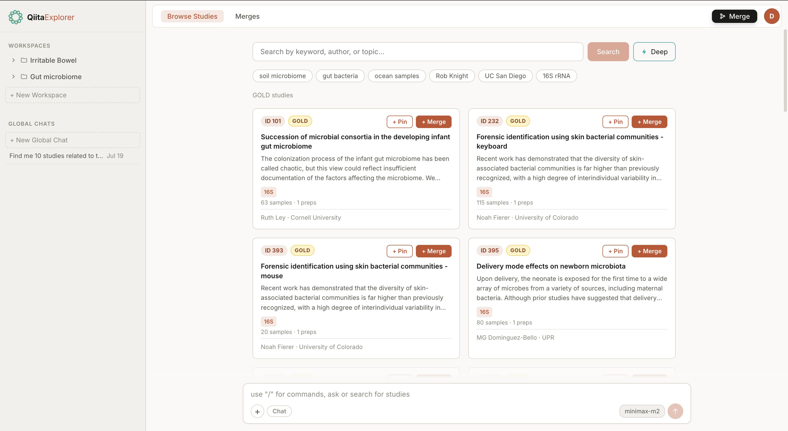
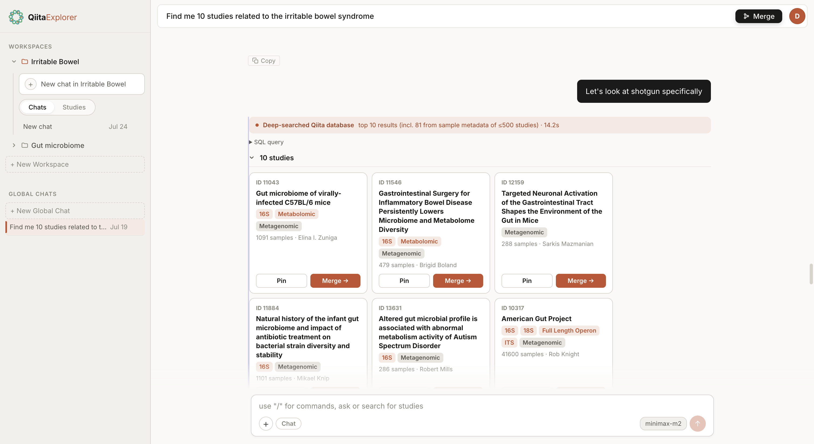
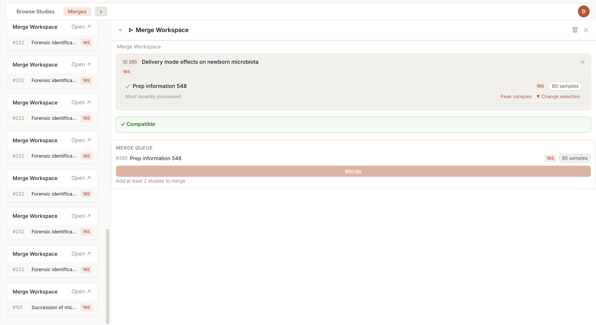
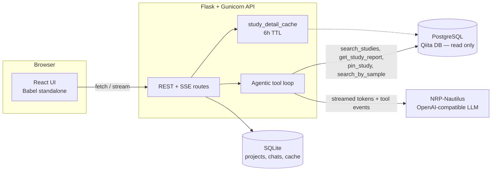

# QiitaExplore

**A local-first research console for the Qiita microbiome database — search, curate, and chat with an LLM agent that's grounded in real study data.**

[](#) [](LICENSE) [](#) [](#quick-start--installation)

---

## The Problem & The Solution

[Qiita](https://qiita.ucsd.edu/) hosts thousands of public microbiome studies, but the only way to work with them today is manual: click through the web UI one study at a time, download BIOM artifacts by hand, and cross-reference sample metadata in a spreadsheet before you can even tell whether a study is relevant to your question. There's no way to ask "which studies have stool samples from mice on a high-fat diet" and get an answer grounded in the actual per-sample metadata — and combining artifacts from multiple studies into one analysis-ready BIOM table means writing one-off scripts every time.

QiitaExplore replaces that manual loop with a local web console that sits in front of the read-only Qiita Postgres database. It gives you full-text *and* sample-metadata search in one query, lets you collect studies into projects and chat with an LLM agent that can call real search/report tools against the database instead of hallucinating, and ships a guided workspace for validating and merging BIOM artifacts across studies — all without needing to stand up a build pipeline or touch the production Qiita database.

## Key Features

- **Agentic study chat** — Tool-calling LLM loop (`search_studies`, `get_study_report`, `pin_study`, `search_by_sample`) streams results over SSE as the model works, so you see each tool call and its result rendered inline instead of waiting on a single opaque response. Falls back to a keyword-search planner for models without tool-calling support.
- **Combined text + sample-metadata search** — Queries expand keyword variants (`mouse` ↔ `mice`, `bacterium` ↔ `bacteria`), auto-detect data types (`shotgun`/`WGS` → `Metagenomic`), and fan out bounded, per-study EXISTS probes across each study's `sample_{id}` JSONB column — so metadata search never triggers a full-table scan.
- **Project-based curation** — Group studies into projects, hold a running chat scoped to each project's context, and pin individual studies into any chat. Every mutation (add study, new chat, pin) updates the UI from the response body directly — no page refresh, no re-fetch.
- **BIOM merge workspace** — Select studies and samples across a merge workspace, validate compatibility, and run a merge job that produces a single combined BIOM artifact you can download.
- **Bounded, cached data access** — Study detail (preps, artifacts, sample counts) is fetched lazily on first view and cached for 6 hours, so the read-only Qiita database only ever sees the queries you actually need.

## 📸 Screenshots & Demo
### Home Page


### Discovery Agent View


### BIOM Merges View


## Tech Stack

| Layer | Technology | Why |
|---|---|---|
| Backend API | Flask + Gunicorn (`gthread` workers) | Thin, synchronous REST + SSE streaming layer over a read-only data source; Gunicorn's threaded workers handle concurrent streaming chats without an async rewrite. |
| Frontend | React via Babel standalone (no build step) | Zero-install iteration for a local research tool — clone, open `index.html`, done. No webpack/Vite pipeline to maintain. |
| Local store | SQLite | Projects, chats, and cache tables live entirely on disk next to the app — no separate database service to run for local state. |
| Source of truth | PostgreSQL (Qiita production schema, read-only) | Studies, preps, and per-study sample metadata are queried directly via `qiita_db.sql_connection.TRN` — vendored, trimmed Qiita DB layer, never written to. |
| LLM | OpenAI-compatible client → NRP-Nautilus endpoint | Swappable model roster (`qwen3`, `deepseek-v4-flash`, `gemma`, `kimi`, `glm-5`, and others) behind one client interface; tool-calling support is detected per model. |
| Data processing | pandas, numpy, `biom-format`, `qiita-files` | Standard microbiome tooling for reading/writing BIOM artifacts during merge jobs. |

## Quick Start / Installation

### Prerequisites

- Python 3.9+ (pinned for the `numpy`/`pandas` versions used here)
- Access to a Qiita PostgreSQL database (read-only credentials are sufficient)
- Redis reachable (required by the vendored `qiita_core` config layer)
- A Qiita config file (`[main]`, `[postgres]`, `[redis]` sections)
- An NRP-Nautilus API key for the LLM endpoint

### Clone

```bash
git clone https://github.com/<your-org>/qiita-explore.git
cd qiita-explore
```

### Install dependencies

```bash
conda create -n qiita-explore python=3.9
conda activate qiita-explore
pip install -r qiita_explore/requirements.txt
```

### Configure environment

Copy the example below into a `.env` file (or export the variables directly):

```bash
# .env.example

# Path to your Qiita config file (postgres + redis credentials)
QIITA_CONFIG_FP=/path/to/your/qiita_config.cfg

# NRP-Nautilus LLM API key (either name is accepted)
OPENAI_API_KEY=your-nrp-nautilus-key

# Optional: override the local SQLite store location
QIITA_EXPERIMENT_DB_PATH=/path/to/projects.db
```

### Run the app

```bash
# Development (Flask dev server, http://localhost:5001)
python qiita_explore/backend/run.py

# Production-style (Gunicorn, 4 workers, 2 threads each)
bash qiita_explore/start_barnacle.sh
```

The frontend needs no build step — Gunicorn/Flask serves `qiita_explore/frontend/` directly, and React is transpiled at runtime via Babel standalone.

## Architecture / How It Works



```
qiita_explore/
  backend/
    routes/       REST + SSE endpoints (studies, projects, chats, merges)
    helpers/      Agent loop, tool definitions, search, BIOM merge logic
    store/        SQLite access (projects, chats, merge workspaces, cache)
  frontend/
    js/           React components, state, and rendering (no bundler)
qiita_db/         Vendored, trimmed Qiita DB connection layer (read-only)
qiita_core/       Vendored, trimmed Qiita config/exceptions
```

A request for study data always goes through `study_detail_cache` before hitting Postgres; a chat message either enters the agentic tool loop (models with tool-calling support) or the legacy keyword-search planner, and both paths stream results back to the browser over SSE as they're produced.

## Contributing & License

Issues and pull requests are welcome — if you're proposing a non-trivial change, please open an issue first so we can talk through the approach. Unplanned or exploratory work is tracked in [`TICKETS/tickets.md`](TICKETS/tickets.md) rather than shipped as speculative code.

This project is licensed under the **BSD 3-Clause License** (inherited from the upstream Qiita project) — see [LICENSE](LICENSE) for the full text.
