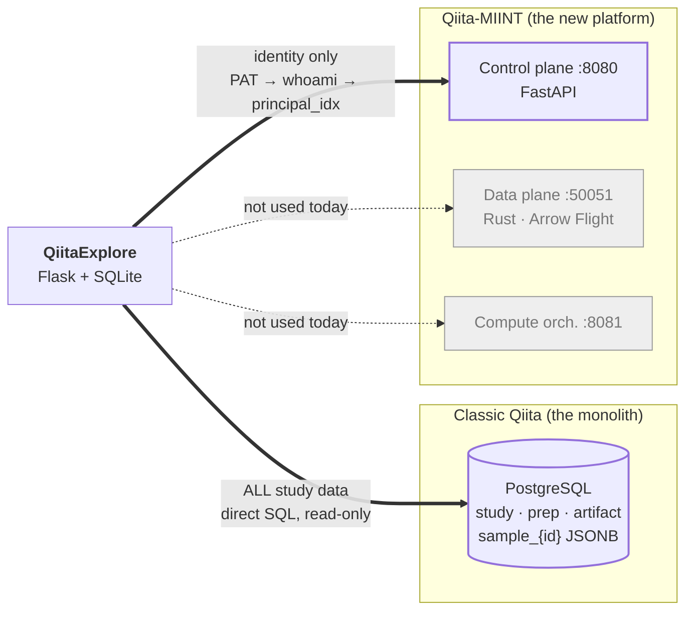

# 00 — Orientation

*What QiitaExplore is, the vocabulary the rest of these documents use, and the one distinction you must hold onto: there are two different systems called "Qiita".*

---

## What QiitaExplore is

[Qiita](https://qiita.ucsd.edu/) hosts one of the largest public microbiome datasets in the world — thousands of studies, including cohorts like the American Gut Project, with per-sample metadata running to millions of rows. The data is there. Finding the right subset of it is the problem.

Today that search is manual. You page through a web UI one study at a time, open each study to see what preps and artifacts it has, download BIOM files by hand, and cross-reference sample metadata in a spreadsheet before you can even tell whether a study is relevant. A question like *"which studies have stool samples from mice on a high-fat diet"* has no direct answer, because the thing you want to filter on — per-sample metadata — lives in a separate database table for every single study.

QiitaExplore is a research console that sits in front of the read-only Qiita database and closes that loop:

- **Search that reaches sample level.** One query runs full-text search over study titles/abstracts/PIs *and* fans out bounded existence probes across per-study sample metadata, then merges and re-ranks the two result sets.
- **A grounded LLM agent.** A tool-calling loop where the model calls real search and report functions against the database. Every study the model names came back from a query, not from its weights.
- **Curation.** Studies collect into projects; chats scope to a project or run globally; individual studies pin into a chat's context.
- **BIOM merging.** Select artifacts across studies, validate their compatibility, and run a job that produces one combined table.

For product framing, screenshots, and quick-start, see [`README.md`](../README.md). This document set covers the system **as built** — how it works, why it is shaped that way, and where it is going.

> **A note on the README.** It predates authentication and is stale in three specific ways: it lists four agent tools (there are five, one of them a stub), it does not mention the PAT/session auth system at all, and it says Flask serves the frontend when nginx does. Where this doc set and the README disagree, this doc set is current.

---

## The two Qiitas

**This is the single most important thing to understand before reading anything else.** Two different systems share the name "Qiita", and QiitaExplore talks to both — for different things, over different protocols.

**Classic Qiita** is the original monolith. QiitaExplore reads *all* of its scientific data — studies, preps, artifacts, sample metadata — by connecting directly to its PostgreSQL database, read-only, using a vendored and trimmed copy of Qiita's own DB layer (`qiita_db/`, `qiita_core/`). No HTTP is involved. QiitaExplore never writes to it.

**Qiita-MIINT** is the new platform: a FastAPI control plane that mints every identifier, a Rust data plane serving bulk data over Arrow Flight backed by DuckDB/DuckLake over Parquet, and a compute orchestrator for SLURM jobs. QiitaExplore uses exactly one thing from it: **identity**. A user's Personal Access Token is verified against the control plane's `whoami` endpoint, and the returned `principal_idx` becomes that user's identity throughout QiitaExplore.

So the seam is:

| Concern | Source |
|---|---|
| Who is this user? | Qiita-MIINT control plane, over HTTPS |
| What studies exist, and what's in them? | Classic Qiita, over direct SQL |

That split is not a design goal. It is where the migration currently stands, and it is the root of most of [`11-roadmap.md`](11-roadmap.md). Closing it means moving data reads onto the new platform — which is blocked today for two concrete reasons documented there.

### "MIINT" is not an auth realm

The name causes real confusion, so: **MIINT is not a security component, an auth provider, or a realm.** Two unrelated things carry the name.

1. **`qiita-miint`** is the deployment codename and hostname of this production instance (`qiita-miint.ucsd.edu`). The git branch `Qiita-miint-auth-integration` means "integrate auth against the qiita-miint deployment" — nothing more.
2. **`duckdb-miint`** is a separate DuckDB SQL extension providing bioinformatics functions inside the Rust data plane. Unrelated to authentication entirely.

The actual identity provider is **AuthRocket** (via its hosted LoginRocket UI), which the control plane wraps. QiitaExplore never speaks to AuthRocket directly — see [`02-authentication.md`](02-authentication.md).

---

## The four subsystems

**Search** ([`04-search.md`](04-search.md)) — Three entry points converge on one parameterized SQL builder. Full-text search scores studies by keyword hits weighted by field (title 3, alias 2, PI 2, abstract 1). Sample-metadata search fans out per-study `EXISTS` probes because Qiita stores each study's sample metadata in its own table, so there is no global index to query. The fanout is bounded, time-limited, and returns partial results rather than failing.

**Agentic chat** ([`05-agent.md`](05-agent.md), [`06-streaming-and-chat.md`](06-streaming-and-chat.md)) — For models that support tool-calling, a loop gives the model five tools and streams its work to the browser as it happens: each tool call and its result render as a card inline, before the final prose arrives. The loop is bounded at four iterations, and `search_studies` is *removed from the tool schema* after its first successful call — the model is mechanically prevented from re-searching, not merely instructed not to.

**Curation** ([`appendix-b-sqlite-schema.md`](appendix-b-sqlite-schema.md)) — Projects, chats, and pins live in a local SQLite database, keyed by the user's `principal_idx`. Nothing curational is written back to Qiita. Every mutation updates the UI from the response body rather than triggering a refetch.

**BIOM merge** ([`07-merge-and-biom.md`](07-merge-and-biom.md)) — A workspace holds up to five studies. For each, an artifact is auto-picked or chosen manually; the system validates compatibility, then runs a background job producing a combined BIOM table plus a merged sample-metadata TSV. Two significant caveats apply — see the chapter.

---

## What the LLM does, and does not do

Worth stating once, up front, because it is easy to assume otherwise:

**The LLM never writes SQL.** It fills in typed arguments on a fixed tool schema — `organism`, `body_site`, `condition_or_intervention`, `data_types`, and so on — and Python builders compose parameterized SQL from those arguments. Every value reaches PostgreSQL as a bound parameter.

This makes SQL injection structurally impossible rather than defended against, and it keeps every query bounded by construction (there is no way for the model to emit an unbounded scan). The cost is expressiveness: questions the fixed tool set cannot phrase — aggregates, cross-study joins, arbitrary grouping — cannot be asked. Letting the model author constrained SQL is discussed as future work in [`11-roadmap.md`](11-roadmap.md); it is not what ships today.

One related trap: the function named `llm_query_to_sql` in `backend/services/llm.py` contains **no LLM call at all**. It is pure regex keyword extraction. The name is a leftover.

---

## Glossary

Terms from the Qiita data model, plus terms this codebase invented.

### Qiita domain

| Term | Meaning |
|---|---|
| **Study** | The top-level unit of research in Qiita. Has a title, abstract, principal investigator, and a set of samples. Identified by an integer `study_id`. |
| **Sample** | One physical specimen within a study. Its metadata lives in a per-study table, `qiita.sample_{study_id}`, in a JSONB `sample_values` column. |
| **Sample template** | The uploaded metadata sheet defining a study's samples and their fields. Field names vary freely between studies — there is no enforced schema. |
| **Prep / prep template** | A preparation: a set of samples processed together with one protocol. Carries `platform`, `target_gene`, `target_subfragment`, `instrument_model`. One study can have many preps. |
| **`data_type`** | The assay type of a prep, from the `qiita.data_type` table. Reached by joining `study → study_prep_template → prep_template → data_type`. QiitaExplore's search layer recognises ten of these as filterable: `16S`, `18S`, `ITS`, `Metagenomic`, `Metatranscriptomic`, `Metabolomic`, `Proteomic`, `Multiomic`, `Genome Isolate`, `Full Length Operon` (see `DATA_TYPE_SYNONYMS` in `backend/services/study_service.py`). The table also contains non-assay values such as `Job Output Folder`, which the search layer ignores. |
| **`investigation_type`** | A finer-grained classification on a prep (e.g. `WGS`, `shotgun_metagenomics`). Populated far more sparsely than `data_type`, so QiitaExplore filters on it only when a user is explicit. |
| **Artifact** | A data file produced at some stage of processing — raw reads, demultiplexed reads, a BIOM table. Artifacts form a parent/child graph via processing jobs. |
| **BIOM** | Biological Observation Matrix — the HDF5 table format holding feature counts per sample. The merge subsystem's input and output. |
| **GOLD** | A curation tag (`qiita.per_study_tags`) marking high-quality studies. The default browse grid shows GOLD studies. |
| **Visibility** | Artifacts carry a visibility; QiitaExplore only ever returns studies with at least one `public` artifact. |
| **`principal_idx`** | The Qiita-MIINT control plane's stable integer identifier for a user. QiitaExplore's `user_id` is this number as a string. |
| **PAT** | Personal Access Token. Minted by the control plane, shown to the user once, pasted into QiitaExplore to authenticate. |

### QiitaExplore concepts

| Term | Meaning |
|---|---|
| **Project** | A user-owned collection of studies, with its own chats. Local to QiitaExplore; never written back to Qiita. Sometimes called a "workspace" in the UI. |
| **Project chat** | A conversation scoped to one project, with that project's studies as context. Uses the non-agentic path. |
| **Global chat** | A conversation not scoped to any project, searching all of Qiita. The **only** path that uses the agentic tool loop. |
| **Pin** | Attaching a study to a chat so its full sample-level detail enters the LLM's context. Capped at 10 per chat. |
| **Agentic path** | The tool-calling chat implementation, selected when `model_supports_tools(model)` is true. |
| **Legacy path** | The older implementation: a regex query planner, one keyword search, then a plain streamed completion. Used for models without tool support. |
| **Segment** | One unit of an agent's streamed response — either a run of text or a tool call with its result. A message's segments are what render as the interleaved text/tool-card timeline. |
| **`ui_payload`** | A structured render payload persisted alongside a chat message, so a reloaded conversation renders identically to the live stream. |
| **Merge workspace** | A staging area holding up to 5 studies and their chosen artifacts, pending validation and a merge job. |
| **Autopick** | The heuristic that selects a default artifact per study in a merge workspace. |
| **Deep search** | An opt-in mode raising the sample-search candidate cap from 40 studies to 500. Slower, higher recall. |
| **Enrichment** | The background pass that fills in a project study's sample counts, prep list, and data types after it is added. |
| **Legacy claim** | A one-time, opt-in migration adopting data created before authentication existed (owned by the literal user `"default"`). |
| **Barnacle** | The deployment host (`barnacle2.ucsd.edu`) where the backend runs. |

---

## Document map

| File | Covers |
|---|---|
| [`00-orientation.md`](00-orientation.md) | *This file* — framing, the two Qiitas, glossary |
| [`01-architecture.md`](01-architecture.md) | Process topology, request lifecycle, module map, the three Postgres access paths |
| [`02-authentication.md`](02-authentication.md) | Paste-PAT flow, sessions, CSRF, tenancy, legacy claim |
| [`03-data-access-and-caching.md`](03-data-access-and-caching.md) | Reading classic Qiita, the three cache layers, context budgeting |
| [`04-search.md`](04-search.md) | The three search paths and the SQL they build |
| [`05-agent.md`](05-agent.md) | The tool-calling loop and the five tools |
| [`06-streaming-and-chat.md`](06-streaming-and-chat.md) | SSE protocol and the segment contract |
| [`07-merge-and-biom.md`](07-merge-and-biom.md) | Merge workspaces, artifact graphs, jobs |
| [`08-frontend.md`](08-frontend.md) | The no-build-step React app |
| [`09-operations.md`](09-operations.md) | Running it, and how failures present |
| [`10-testing.md`](10-testing.md) | Test tiers and coverage gaps |
| [`11-roadmap.md`](11-roadmap.md) | Platform migration, blockers, known debt |
| [`appendix-a-api-reference.md`](appendix-a-api-reference.md) | All 53 endpoints |
| [`appendix-b-sqlite-schema.md`](appendix-b-sqlite-schema.md) | All 16 tables and 11 indexes |
| [`appendix-c-agent-tools-and-sse.md`](appendix-c-agent-tools-and-sse.md) | Tool schemas and the SSE event vocabulary |
| [`appendix-d-configuration.md`](appendix-d-configuration.md) | Every environment variable and tunable |

---

*See also: [`01-architecture.md`](01-architecture.md) for how a request physically flows · [`11-roadmap.md`](11-roadmap.md) for what closing the two-Qiitas seam requires.*
