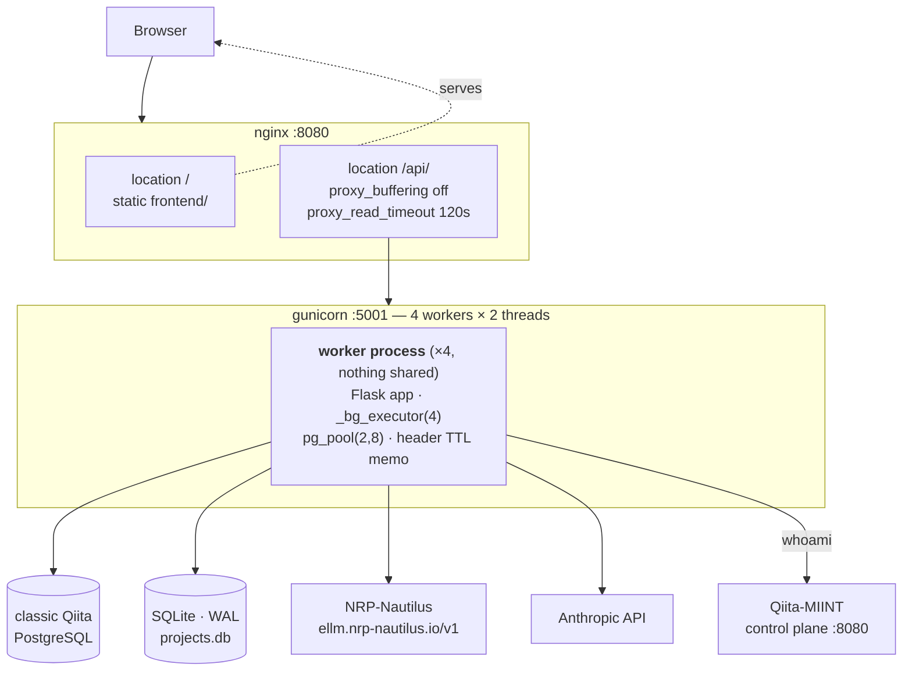
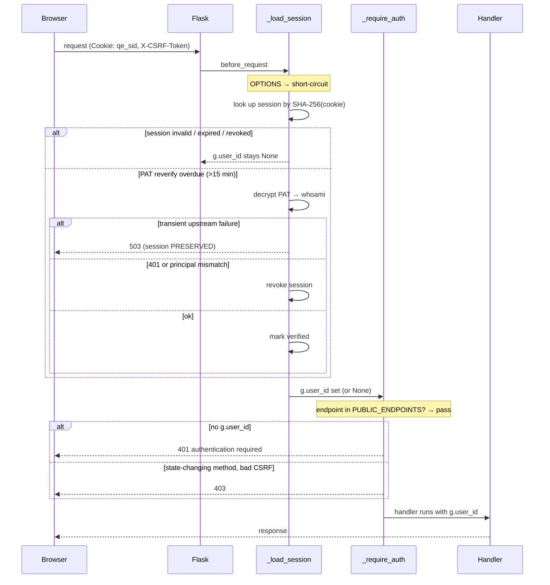

# 01 — Architecture

*How a request physically flows through QiitaExplore, what state lives where, and why there are three different ways to talk to PostgreSQL.*

Prerequisites: [`00-orientation.md`](00-orientation.md) — in particular the two-Qiitas distinction.

---

## Deployment topology

There are two topologies in play, and confusing them wastes a lot of time. Both are current; they serve different purposes.

### Production (barnacle)



`start_barnacle.sh` launches Gunicorn with `-w 4 --threads 2 --worker-class gthread --timeout 120 --graceful-timeout 30`. That is **4 processes × 2 threads = 8 concurrent requests**, and the `gthread` worker class is the reason several design decisions downstream look the way they do.

### Development (SSH tunnels)

The dev setup runs the backend on port **5002** on barnacle, forwarded to the developer's machine, with the frontend served locally. `frontend/index.html` ships with `<meta name="api-base" content="http://127.0.0.1:5002/api">` and a TODO to revert it to 5001 before merging to master — this is the CLAUDE.md port convention, not a bug. `Qiita/start_qiita_stack.sh` brings up the tunnels in both directions: a forward tunnel for the browser to reach the backend, and a **reverse** tunnel so the backend can reach a control plane running on the developer's laptop.

If you are reading a diagram in these docs and it says `:8080`, it is drawing production.

### The nginx settings that are load-bearing

`backend/../nginx.conf` is short, and almost every line in the `/api/` block exists for SSE:

- `proxy_buffering off` — without it nginx accumulates the response and the browser receives the entire chat answer at once, after it finishes. This is the single most common "streaming is broken" cause.
- `proxy_request_buffering off` — same, for the request direction.
- `proxy_pass_header X-Accel-Buffering` — lets the backend's own `X-Accel-Buffering: no` header survive.
- `proxy_http_version 1.1` + `proxy_set_header Connection ""` — required for upstream keepalive.
- `proxy_read_timeout 120s` — must exceed the longest agent turn. It matches Gunicorn's `--timeout 120`.

> **Suspected hazard, unverified.** `gzip_types` includes `text/event-stream` with `gzip_min_length 1024`. gzip is a response-body filter that operates independently of `proxy_buffering`, and `gzip_min_length` keys off `Content-Length`, which a chunked SSE stream does not send. Whether this delays frames in practice has not been measured. If streaming is observed to stutter in production while `proxy_buffering off` is confirmed set, remove `text/event-stream` from `gzip_types` first. Recorded here rather than fixed because it has not been reproduced.

---

## One app, no blueprints

`backend/run.py` is 49 lines and builds the entire application at module scope. There are **no Flask blueprints anywhere**. Routes register purely as import side-effects:

```python
app = Flask(__name__)
CORS(app, supports_credentials=True, origins=config.ALLOWED_ORIGINS)
register_auth_middleware(app)

_bg_executor = ThreadPoolExecutor(max_workers=4)
sys.modules.setdefault('run', sys.modules[__name__])

import routes.auth_routes    # noqa: F401 — registers @app.route decorators
import routes.study_routes
# ... five more
```

Three things here are non-obvious:

**Import order is load-bearing.** Route modules do `from run import app` and `from run import _bg_executor`, so `app` and `_bg_executor` must exist before any route module is imported. That is why the imports sit at the bottom of the file with `# noqa: E402`, and why reordering them breaks the app.

**`sys.modules.setdefault('run', ...)` prevents a double import.** When `run.py` executes as `__main__`, it is registered in `sys.modules` under `__main__` only. A route module's `from run import app` would then import the file a *second* time — producing two Flask apps, two thread pools, and duplicate route registrations. Aliasing the module under `run` up front makes the second import a cache hit. This only matters in the `python run.py` dev path; under Gunicorn (`run:app`) the module is named `run` from the start.

**`sys.path` is forced.** The backend directory is inserted at position 0 before any local import, because the vendored Qiita environment manipulates `sys.path` and would otherwise shadow local modules named `config` or `store`.

**What this design costs.** No `url_prefix`, so every route repeats `/api/` in its path. No per-blueprint middleware, so all cross-cutting concerns live in the two global `before_request` hooks. No lazy route loading. At 53 endpoints across 7 modules this is manageable; the seam to introduce blueprints, if it is ever wanted, is the existing one-module-per-domain split.

---

## Per-worker vs. shared state

This is the section most likely to explain a confusing production observation.

Gunicorn forks 4 worker processes. **Nothing in Python memory is shared between them.** Each worker independently holds:

| Per-worker (×4, isolated) | Shared (single instance) |
|---|---|
| The Flask `app` object | The SQLite file (WAL mode) |
| `_bg_executor` — its own `ThreadPoolExecutor(4)` | The classic Qiita PostgreSQL database |
| `pg_pool` — its own `ThreadedConnectionPool(2, 8)` | Anything persisted into SQLite cache tables |
| `_study_header_cache` — the in-process 1-hour TTL memo | |
| Any module-level state in `config`, `helpers`, `store` | |

The consequences are concrete:

- **The in-process header memo has an effective 4× miss rate.** A study header fetched and memoised while serving on worker 2 is still cold on workers 1, 3, and 4. Its 1-hour TTL is per-worker, and it is lost entirely on restart. This is why the SQLite-backed `study_detail_cache` exists alongside it — see [`03-data-access-and-caching.md`](03-data-access-and-caching.md).
- **Connection arithmetic is per-worker.** `PG_POOL_MAX_CONN=8` means up to **32** PostgreSQL connections across the four workers, before counting `sample_search`'s per-call pools. Raising the worker count multiplies this. See [`09-operations.md`](09-operations.md).
- **`_bg_executor` is 4 threads per worker, 16 total**, and background work submitted by one request is only ever visible to the worker that accepted that request.
- **Merge jobs run in the accepting worker's `_bg_executor`.** A worker restart mid-job orphans it; the job row stays `running` with nothing driving it.

---

## Request lifecycle

Every request passes through two `before_request` hooks before reaching a handler. Both are installed by `backend/helpers/auth_middleware.py :: register_auth_middleware`.



The details of each branch — why a transient failure returns 503 without logging the user out, why the public allowlist matches exact endpoint names rather than path prefixes — are in [`02-authentication.md`](02-authentication.md).

---

## Module map

```
backend/
  run.py            app construction, route registration, _bg_executor
  config.py         env loading, LLM clients, model roster, prompts, auth config
  agent_harness.py  offline CLI driver for the agent loop

  routes/     7 modules, 53 endpoints — thin; parse, authorize, delegate, serialize
  helpers/    subsystem logic — the agent loop, tools, search, BIOM, auth, SSE
  services/   study_service.py (SQL builders), llm.py (regex query planner)
  store/      SQLite access, one module per domain + a flat re-export facade
  tests/      unit · e2e · benchmarks
```

The intended layering is `routes → helpers/services → store`, and it mostly holds. Two observations worth knowing:

- **`store/__init__.py` is a flat re-export facade.** Consumers write `from store import get_project`, never `from store.crud import get_project`. This keeps the internal split (which has changed as files were divided to stay under the repo's 500-line cap) invisible to callers.
- **The 500-line-per-file cap is a repo convention**, stated in `CLAUDE.md`. Several modules exist purely because of it — `artifact_routes.py` was split out of `merge_routes.py`, `global_chat_crud.py` out of `crud.py`, `merge_helpers.py` out of `merge_routes.py`. Each carries a header comment saying so. If you are wondering why a module boundary looks arbitrary, this is usually why.

---

## Three ways to reach PostgreSQL

QiitaExplore reads classic Qiita's database through three distinct mechanisms. This is not redundancy — each exists for a specific reason, and one of them is being retired.

| Mechanism | Where | Why |
|---|---|---|
| **Vendored `qiita_db.sql_connection.TRN`** | 2 call sites only | Legacy. A single shared psycopg2 connection wrapped in a transaction singleton. **Not thread-safe.** |
| **Shared pool — `pooled_fetchall`** | The majority of reads | `ThreadedConnectionPool(2, 8)`, lazily constructed. The default path. |
| **Per-call pools / dedicated connections** | `sample_search`, `artifact_graph` | Needs its own `statement_timeout`, or fans out across many threads at once. |

### Why `TRN` is a problem

`TRN` is Qiita's own transaction object: one process-wide connection, mutated by `TRN.add()` / `TRN.execute()`. Under `gthread`, two threads in the same worker handling two requests will interleave statements on that one connection. The failure mode is not a clean exception — it is one request receiving another's rows.

Exactly **two live call sites remain**:

- `backend/routes/study_routes.py` — the single-sample metadata fetch
- `backend/helpers/sample_search.py :: _get_candidate_ids` — the candidate-study lookup

Every other mention of `TRN` in the backend is a docstring in `pg_pool.py`, `artifact_graph.py`, or `sample_search.py` explaining why *that* module deliberately avoids it. Removing these two is the real scope of TKT-007 — see [`11-roadmap.md`](11-roadmap.md).

### The shared pool, and why it is lazy

`backend/helpers/pg_pool.py :: get_pool` builds its `ThreadedConnectionPool` behind double-checked locking, on first use. The laziness is deliberate and important: **Gunicorn forks its workers after importing the application.** A pool constructed at import time would be created in the parent process, and every forked child would inherit copies of the same file descriptors — multiple processes writing to one socket. Building on first use guarantees each worker opens its own connections post-fork.

`pooled_fetchall(sql, params)` runs in autocommit and always returns the connection in a `finally` block.

### Per-call pools

`sample_search` opens a **fresh `ThreadedConnectionPool` per call**, with `options="-c statement_timeout=8000"` baked into the connection string, and closes it in a `finally`. That looks wasteful until you consider what it does: fan out up to 16 concurrent per-study probes, each of which must be individually killable at 8 seconds without affecting anything else in the worker. A shared pool cannot carry a per-call statement timeout, and borrowing 16 connections from a pool sized 2–8 would deadlock.

`artifact_graph` opens a single dedicated connection because it issues five dependent queries that want a consistent view, and it is called from background threads.

---

## Concurrency hazards

Worth holding in mind when changing anything in this area:

- **SSE generators must not hold a pooled connection across a `yield`.** A chat stream can stay open for a minute or more; a connection held for its duration is a connection removed from a pool of 8. The current code fetches, releases, then streams — preserve that ordering.
- **`ThreadPoolExecutor(≤16)` inside a `gthread` worker thread.** A sample search running on one of a worker's 2 request threads spawns up to 16 more. With both request threads searching, that worker holds ~34 threads. The bound that keeps this survivable is the per-call pool plus the overall `as_completed` budget, not the OS.
- **Background work is fire-and-forget and unobserved.** Project enrichment and preload are submitted to `_bg_executor` and their futures are usually dropped. Exceptions inside them surface only in logs.
- **`store` bootstraps at import.** Importing anything from `store` creates and migrates the SQLite database as a side effect. This runs once per worker at startup, which is benign, but it means schema migration is not an explicit step anyone invokes.

---

*See also: [`02-authentication.md`](02-authentication.md) for the middleware in detail · [`03-data-access-and-caching.md`](03-data-access-and-caching.md) for what sits on top of the connection layer · [`09-operations.md`](09-operations.md) for capacity arithmetic and failure modes · [`appendix-d-configuration.md`](appendix-d-configuration.md) for pool and timeout settings.*
