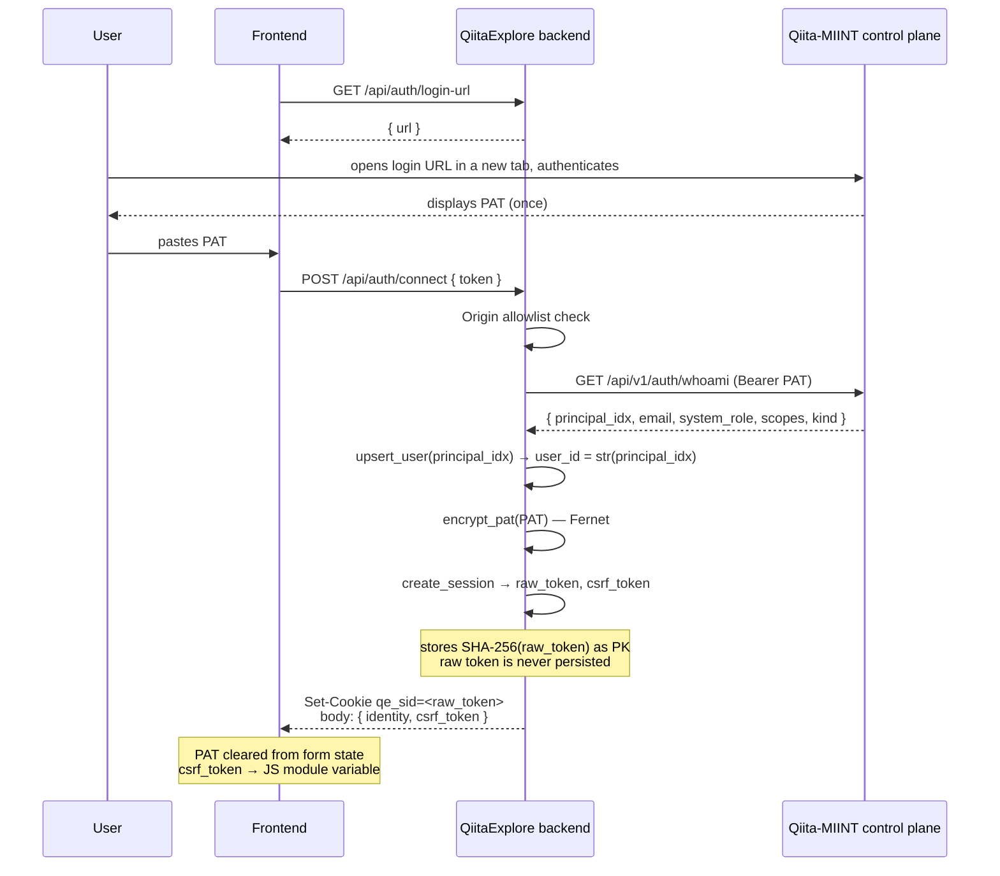
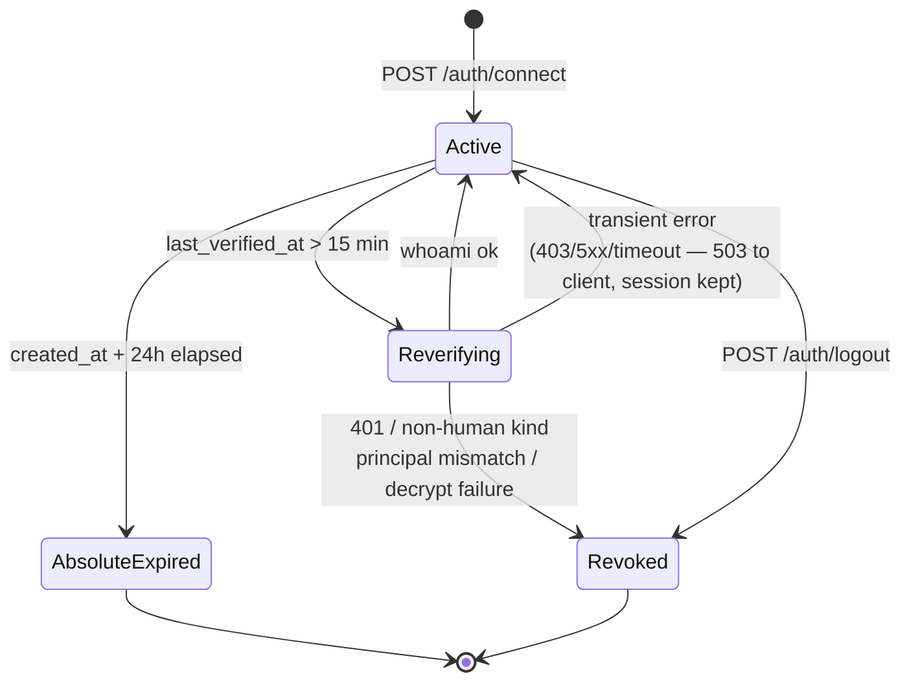
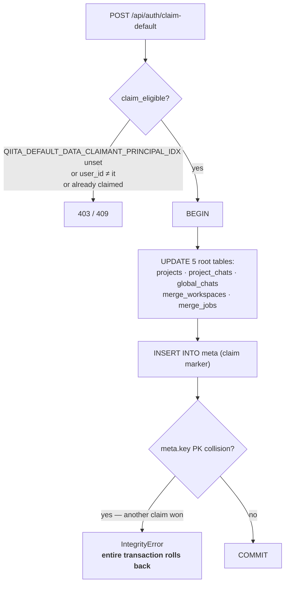

# 02 — Authentication

*How a browser becomes an authenticated `g.user_id`, why the design is shaped this way, and every way it can fail.*

Prerequisites: [`01-architecture.md`](01-architecture.md) — the request lifecycle and the two `before_request` hooks.

---

## Why paste-PAT, and not a redirect flow

QiitaExplore authenticates by having the user **paste a Personal Access Token** obtained from the Qiita-MIINT control plane. There is no OAuth callback, no redirect handling, and no password ever reaches this application.

This was not the original plan. `TICKETS/qiita-auth-integration.md` designs a full OIDC proxy flow — QiitaExplore would sit in the redirect chain, handle the callback, and exchange codes server-side.

> **That document describes a design that was never built.** It remains in the repo as design history. If you are reading it looking for how auth works today, stop and read this file instead. Nothing in the OIDC proxy design shipped.

What shipped instead is simpler, and the simplicity is the point:

- **No redirect surface to secure.** No callback endpoint, no state parameter, no code-exchange step — none of the places OIDC integrations typically go wrong.
- **The control plane stays the sole identity authority.** QiitaExplore never talks to AuthRocket. It holds a token and asks the control plane "who is this?" — nothing more.
- **The token is a credential the user already has.** PATs exist for CLI use; reusing them added no new credential type.

The cost is UX: the user visits a login page in another tab, copies a token, and pastes it. That is a real friction, and it is the tradeoff that was accepted.

### The AuthRocket logout-first problem

One deployment detail explains an otherwise baffling piece of configuration. AuthRocket's hosted LoginRocket UI keeps its own session. If a user with a cached LoginRocket session clicks "Need a login" to switch accounts, AuthRocket short-circuits the navigation — *including* `/signup` — into "already signed in", and mints a PAT **for the wrong account**. Adding `prompt=login` does not fix it: that forces the login form, not a session clear.

The fix is to wrap the login URL in LoginRocket's `/logout` endpoint first. This is applied to the control plane at runtime by `Qiita/run_patched_control_plane.py`, which monkeypatches the URL builder before launching uvicorn, so the Qiita repo itself stays unmodified at master.

QiitaExplore has its own opt-in version of this wrap behind `QIITA_LOGINROCKET_URL`. **It does not work and must stay unset** — LoginRocket refuses to forward `/logout` to an external control-plane URL. The barnacle environment script actively deletes the variable. See [`appendix-d-configuration.md`](appendix-d-configuration.md#env-QIITA_LOGINROCKET_URL).

---

## The connect flow



Three properties of this flow are worth stating explicitly.

**The PAT never persists client-side.** It lives only in the React form's `useState`, is POSTed once, and is cleared immediately on both success *and* failure. It is never placed in `localStorage`, `sessionStorage`, or a URL parameter.

**The session PK is a hash, not the token.** `create_session` generates a 32-byte URL-safe token, stores `SHA-256(token)` as the primary key, and returns the plaintext exactly once for the cookie. Anyone with read access to the SQLite file — a backup, a stray copy, a log of a query — cannot replay a session. This is the same reasoning as password hashing, applied to session tokens.

**The user's identity is the control plane's.** `user_id` is `str(principal_idx)`. There is no local account, no local password, and no local user record that can drift from Qiita's.

### The Origin check

`POST /api/auth/connect` is one of only three public endpoints, so it needs its own protection against a cross-site page silently posting a token on the user's behalf. `_origin_allowed` compares the `Origin` header against the configured allowlist exactly.

Note its default: when `ALLOWED_ORIGINS` is **empty, the check passes**. That is correct for the production deployment, where the frontend and API are same-origin behind nginx and no `Origin` header is sent for same-origin requests. It does mean the check provides no protection in a misconfigured deployment that is cross-origin but has an empty allowlist. See `backend/routes/auth_routes.py :: _origin_allowed`.

### PAT encryption at rest

`backend/helpers/pat_crypto.py` wraps Fernet. Two design choices matter:

- The PAT must be retained, not discarded, because the session re-verifies it periodically (below). Storing it is a requirement, not an oversight.
- The key lives in the environment, outside SQLite, so a leaked database file or backup does not also leak long-lived Qiita bearer credentials.
- **There is no insecure fallback.** If `QIITA_EXPLORE_PAT_ENCRYPTION_KEY` is unset, `_get_fernet` raises `PatCryptoError` with key-generation instructions rather than storing plaintext.

> **Failure timing is deferred, not at boot.** `config.py` reads the key with `os.getenv` and does not validate it, and `_get_fernet` raises only when first called. A backend with no encryption key configured therefore **starts cleanly** and then fails every authentication attempt — the first `POST /auth/connect` and every subsequent PAT re-verification. If logins fail on a fresh deployment while the process looks healthy, check this variable first.

---

## The middleware

Two `before_request` hooks in `backend/helpers/auth_middleware.py`. Flask short-circuits the chain the moment one returns a non-`None` value.

### Hook 1 — `_load_session`

Resolves the cookie to an identity, and re-verifies the underlying PAT on a schedule.

`get_session_by_token` rejects a session that is missing, revoked, past its absolute expiry, or idle beyond the idle TTL. Only if it survives all four checks does `g.user_id` get set.

The re-verification branch is the subtle part. If `last_verified_at` is older than `AUTH_PAT_REVERIFY_INTERVAL_SECONDS` (default 15 minutes), the stored PAT is decrypted and re-checked against the control plane, with four distinct outcomes:

| Outcome | Action | Reasoning |
|---|---|---|
| Decryption fails | **Revoke** | The stored ciphertext is unusable; the session cannot be maintained. |
| `transient_error` | **503, session preserved** | Qiita is unreachable *right now*. Do not trust an unverified credential — but do not destroy a valid session over an upstream outage. |
| Not ok (401) | **Revoke** | The PAT was revoked or expired upstream. |
| `principal_idx` ≠ session's `user_id` | **Revoke** | The token now resolves to a *different person*. Treated as rotation or compromise. |

The transient case is the one worth dwelling on. The naive implementation — treat "can't verify" as "not authenticated" — would log out every user in the building the moment the control plane restarted, and each would have to re-obtain and re-paste a PAT. Instead the request fails with 503, the session row is untouched, and the next successful re-verification resumes it with no user action. The frontend's matching `unavailable` state exists for exactly this (see [`08-frontend.md`](08-frontend.md)).

Finally, `touch_session` updates `last_seen_at` **only**. Its docstring says it must never extend `absolute_expires_at`, and that is the sliding-window-vs-hard-cap distinction: activity extends the idle window, nothing extends the 30-day ceiling.

### Hook 2 — `_require_auth`

Default deny, in four checks:

```python
if request.endpoint in PUBLIC_ENDPOINTS:      return None   # allowlisted
if request.endpoint is None:                  return None   # unknown route → Flask 404
if g.get("user_id") is None:                  return 401
if request.method in _STATE_CHANGING_METHODS:               # POST/PUT/PATCH/DELETE
    if not hmac.compare_digest(csrf_header, expected): return 403
```

**The allowlist matches exact Flask endpoint names, never path prefixes.** It contains exactly three entries: `api_auth_login_url`, `api_auth_connect`, `api_auth_me`. The code comment is explicit that prefix matching is the hole this guard exists to close — a prefix like `/api/auth/` would silently make every future route under that path public, including ones nobody intended to expose. With exact names, **a newly added route is denied by default**, and making it public requires a deliberate edit to this set.

Of 52 endpoints, 3 are public and 49 require a session.

CSRF uses `hmac.compare_digest` rather than `==`, so the comparison is constant-time. The token travels in the connect response *body* (not a second cookie) into a JavaScript module-scope variable, and is attached as `X-CSRF-Token` by the shared fetch wrapper on state-changing methods only. A cross-site attacker can cause the browser to send the `SameSite=Lax` cookie on a top-level POST but cannot read the response body of the connect call, so cannot obtain the token.

---

## Session lifetime



| Bound | Default | Variable | Extended by activity? |
|---|---|---|---|
| PAT re-verification | 15 min | `AUTH_PAT_REVERIFY_INTERVAL_SECONDS` | n/a |
| Absolute expiry | 24 hours | `AUTH_SESSION_ABSOLUTE_TTL_SECONDS` | **No** — hard ceiling |

There is no idle expiry: a session ends at the absolute ceiling, at logout, or when Qiita definitively rejects the PAT — never because the app sat unused. Re-verification only revokes on a **401** or a `kind` that isn't `human`; every other upstream outcome is transient and yields a `503` with the session intact.

> **Known gap.** `backend/store/auth_store.py :: purge_expired_sessions` hard-deletes rows past absolute expiry (deliberately keeping revoked rows for audit). **It is never called** — no route, no scheduler, no startup hook invokes it. Expired session rows therefore accumulate indefinitely. This is a storage-growth issue rather than a security one: `get_session_by_token` correctly rejects expired sessions regardless of whether their rows still exist. Worth wiring up, and worth a ticket.

---

## Tenancy: `g.user_id` is the only identity

This is the guarantee that keeps users' data separate, and it is worth stating precisely.

`g.user_id` is set once, by the middleware, from the session row. Handlers read it directly and pass it into store functions that filter on it **in the WHERE clause** — `get_project(project_id, g.user_id)`, `get_global_chat(g.user_id, chat_id)`, `get_workspace(workspace_id, g.user_id)`, `get_merge_job(job_id, g.user_id)`.

**No endpoint accepts a client-supplied `user_id`** — not in a body, a query parameter, a path segment, or a header. There is no code path where the browser can assert who it is. Ownership is enforced by scoping the query, not by fetching a row and checking it afterward, so a wrong-owner request returns "not found" rather than leaking existence.

Two caveats to be aware of:

- `backend/store/crud.py :: get_project_studies_only` is **not owner-scoped**. It is used in the hot chat-streaming path, where the caller has already authorized the project. It is safe as currently called and would be an IDOR if called from a new route without a prior ownership check.
- `backend/store/db.py :: _resolve_user` maps an empty or `None` user to the literal string `"default"`. This is the pre-authentication tenancy fallback that the legacy claim exists to clean up. It should never trigger on a request path, because the middleware guarantees `g.user_id` is set — but the fallback remains reachable from any caller that passes nothing.

### Two places where tenancy does not hold

The guarantee above describes the *curational* surface — projects, chats, workspaces, jobs. Two endpoints fall outside it. Both were verified against the code while writing this document, and are now tracked as **TKT-042** and **TKT-043**.

> **TKT-042 — settings are global, not per-user.** `GET`/`POST /api/settings` route through `backend/store/crud.py :: get_setting` / `set_setting`, which read and write the shared `meta` table and **take no `user_id`**. Any authenticated user who saves an Anthropic API key overwrites the key for every other user, and the key is then used to bill that user's requests. This is pre-authentication code that was not re-scoped when multi-user auth landed. A per-user settings table, or a `user_id`-keyed `meta`, is the fix.

> **TKT-043 — artifact file download performs no study-level authorization.** `backend/routes/artifact_routes.py :: download_artifact_file` requires a session, then takes `study_id`, `artifact_id`, and `filepath_id` from the request and streams the resolved file. It does **not** call `is_study_public`, unlike `api_study_detail`, which gates on exactly that — and it has no ownership check, because artifacts are not owned by QiitaExplore users. Any authenticated user can therefore download any file reachable through any study's artifact graph, including studies that are not public.
>
> Its path safety is real but narrow: `_resolve_artifact_file` resolves paths from the artifact graph rather than from user input, calls `os.path.realpath`, and rejects a **blocklist** of roots (`/etc/`, `/proc/`, `/sys/`, `/dev/`, `/root/`). That prevents directory traversal out of the data tree. It does not, and is not intended to, decide *which studies this user may read* — that check is simply absent. An allowlist of permitted data roots plus an `is_study_public` gate would close it.

---

## Legacy claim

Before authentication existed, everything QiitaExplore stored was owned by the literal user `"default"`. That data is still there. The legacy claim is a **one-time, opt-in** migration that reassigns it to a real account.



Three deliberate properties:

**It never auto-claims.** Eligibility requires `QIITA_DEFAULT_DATA_CLAIMANT_PRINCIPAL_IDX` to be explicitly configured *and* to match the requesting user exactly. Absent that variable, the endpoint always refuses. Legacy data is never silently absorbed by whoever logs in first.

**Only the five root ownership tables are updated.** Child rows — chat messages, project studies, workspace studies — carry no `user_id` and follow their parent via foreign key. Reassigning the roots reassigns everything.

**Concurrency is handled by the schema, not by a lock.** The claim marker is a plain `INSERT` into `meta`, whose `key` column is a primary key. Two racing claims both attempt it; the loser raises `IntegrityError`, and because all five `UPDATE`s and the `INSERT` are in one transaction, the loser's reassignments **roll back entirely**. There is no window in which a partial reassignment can persist.

---

## What this design does and does not defend against

Stated plainly, without overclaiming.

**Defends against:**

- Session token theft from the database at rest — only hashes are stored.
- PAT disclosure from the database at rest — Fernet-encrypted, and the key is not in the database.
- CSRF on state-changing requests — a constant-time-compared header token that a cross-site page cannot read.
- A new endpoint accidentally shipping unauthenticated — default deny by exact endpoint name.
- Horizontal privilege escalation on curational data (projects, chats, workspaces, jobs) — every ownership query filters on `g.user_id`.
- A revoked or rotated upstream PAT continuing to grant access — bounded to the 15-minute re-verification window.
- Silent account takeover via a cross-site token post — the Origin check on connect, where an allowlist is configured.

**Does not defend against:**

- An attacker who can read process memory or the encryption key.
- XSS. The CSRF token lives in a JS variable; script execution in the page defeats the protection. Model output is sanitized with DOMPurify (see [`08-frontend.md`](08-frontend.md)), which is the relevant mitigation, not an absolute one.
- Anything within the 15-minute re-verification window after an upstream revocation.
- A cross-origin deployment that leaves `ALLOWED_ORIGINS` empty — the Origin check passes by default.
- Session fixation beyond what a fresh random token per connect provides; there is no rotation on privilege change, because there are no privilege changes.
- **One user reading another's LLM API key setting, or overwriting it** — see the settings gap above.
- **One user downloading artifact files from studies they should not see** — see the download gap above.

The last two are open defects, not accepted tradeoffs. They are listed here so the section is honest about the current state rather than the intended one.

---

*See also: [`appendix-a-api-reference.md`](appendix-a-api-reference.md) for the 6 auth endpoints · [`appendix-b-sqlite-schema.md`](appendix-b-sqlite-schema.md#table-auth_sessions) for the `users` and `auth_sessions` tables · [`appendix-d-configuration.md`](appendix-d-configuration.md) for the `AUTH_*` variables · [`08-frontend.md`](08-frontend.md) for the browser-side state machine.*
