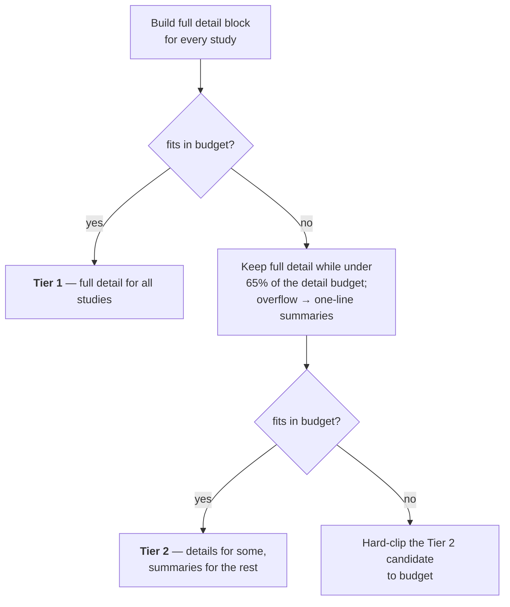

# 03 — Data Access and Caching

*Where study data comes from, why the same fact is stored in three places, and how a conversation's context is budgeted when it does not fit.*

Prerequisites: [`01-architecture.md`](01-architecture.md) — in particular the per-worker isolation model and the three PostgreSQL access mechanisms.

---

## `qiita_fetch` is the read surface

Nearly every read of classic Qiita's PostgreSQL database goes through one module: `backend/helpers/qiita_fetch.py`. It owns study headers, sample metadata, prep metadata, artifact/filepath resolution, and the formatting of all of it into the compact text blocks that reach the LLM.

That consolidation is worth preserving, for a reason beyond tidiness. The roadmap's largest item is replacing direct PostgreSQL access with calls to the Qiita-MIINT platform. `qiita_fetch` is the chokepoint where that swap happens: reimplement its functions against REST and Arrow Flight, and most of the application does not notice. Every read that bypasses it is a second place that migration will have to touch. See [`11-roadmap.md`](11-roadmap.md).

The bypasses that exist today are deliberate and few: `sample_search` and `artifact_graph` (which need their own connections and timeouts — see below), and the two remaining `TRN` call sites.

### The failure posture

`qiita_fetch :: _qiita_fetch` swallows exceptions and returns a caller-supplied default. `artifact_graph :: fetch_artifact_graph` logs and returns `[]` rather than raising. his is consistent across the data layer, and it is a deliberate choice: **a Qiita read failure degrades the response rather than failing the request.** A study card renders without its data types; a chat answers without prep detail.

The cost is that a persistent upstream problem is invisible from the UI — it looks like missing data, not like an error. Diagnosis goes through the logs. This tension is tracked as TKT-002.

---


## Connection management


### The shared pool

`backend/helpers/pg_pool.py :: get_pool` builds a `ThreadedConnectionPool(PG_POOL_MIN_CONN, PG_POOL_MAX_CONN)` — default 2 to 8 — behind double-checked locking, on first use.

**The laziness is the point.** Gunicorn imports the application and *then* forks its workers. A pool built at import time would exist in the parent, and every child would inherit duplicate file descriptors pointing at the same PostgreSQL sockets — two processes reading one connection's response stream. Deferring construction to first use guarantees each worker opens its own.

`pooled_fetchall(sql, params)` runs in autocommit and returns the connection in a `finally` block. It is the default read path.

Remember from [`01-architecture.md`](01-architecture.md) that the pool is **per worker**: `PG_POOL_MAX_CONN=8` across 4 workers is a ceiling of 32 connections, not 8.

### The two remaining `TRN` call sites

`TRN` is Qiita's own transaction singleton — one process-wide psycopg2 connection. Under `gthread` workers it is **not thread-safe**, and the failure mode is silent: two threads interleaving statements on one connection, with one request receiving another's rows.

Two live call sites remain:

- `backend/routes/study_routes.py` — the single-sample metadata fetch
- `backend/helpers/sample_search.py :: _get_candidate_ids` — the candidate-study lookup

Every other mention of `TRN` in the backend is a docstring explaining why that module avoids it. Removing these two is the real scope of TKT-007.

### Per-call pools

`sample_search` constructs a **fresh pool per call**, with `options="-c statement_timeout=8000"` in the connection string, and closes it in a `finally`. Two things make this necessary rather than wasteful: a per-statement timeout cannot be attached to a borrowed shared connection, and borrowing 16 connections at once from a pool sized 2–8 would deadlock. Full detail in [`04-search.md`](04-search.md).

`artifact_graph` opens one dedicated connection for its five dependent queries.

---


## Three cache layers

The same study header can exist in three places at once, with three different lifetimes. Each layer solves a problem the others cannot.


| Layer                  | Where                       | Scope               | TTL                  | Invalidation                 | Survives restart? |
| ---------------------- | --------------------------- | ------------------- | -------------------- | ---------------------------- | ----------------- |
| **1. Header memo**     | `_study_header_cache` dict  | One gunicorn worker | 3600 s               | Time only                    | No                |
| **2. Study detail**    | SQLite `study_detail_cache` | All workers         | 6 h (hardcoded)      | Time, plus a staleness probe | Yes               |
| **3. BIOM sample IDs** | SQLite `biom_sample_cache`  | All workers         | **None — permanent** | Never                        | Yes               |


### Layer 1 — the in-process memo

`qiita_fetch :: _fetch_study_header_cached` memoises study headers in a module-level dict with a one-hour TTL. It exists because a single search result page can request the same header repeatedly, and a dictionary lookup is free.

Its limits follow directly from being per-worker (see [`01-architecture.md`](01-architecture.md)): a header memoised on worker 2 is cold on the other three, so the **effective miss rate across a 4-worker deployment is roughly 4×** what a single-process reading would suggest. It is also unbounded — nothing evicts entries before their TTL, and a worker serving many distinct studies grows it monotonically. At the current scale this is not a problem; it would become one under a workload that touched tens of thousands of studies per worker lifetime.

### Layer 2 — `study_detail_cache`

The heavy layer. One row per study, holding preps, artifacts, the artifact graph, prep metadata, sample lists, a sample-context text block, and a total sample count. Six-hour TTL, hardcoded as `_STUDY_DETAIL_CACHE_TTL_HOURS` in `backend/store/cache.py` — it is **not** environment-tunable.

Beyond the TTL there is a **staleness probe**: `backend/routes/study_routes.py` re-fetches the artifact graph if cached artifact nodes lack `filepaths` or job nodes lack `command_params`. This catches rows written by an older version of the code whose shape has since gained fields, without requiring a cache-wide invalidation or a migration.

> **Known defect — the TTL check fails open.** `backend/store/cache.py :: get_study_detail_cache` wraps its age comparison in a bare `except Exception: pass`, so an unparseable `cached_at` yields a **cache hit** on an arbitrarily stale row rather than a miss. Compare `backend/store/auth_store.py :: get_session_by_token`, which fails *closed* on a malformed timestamp. The auth path gets this right; the cache path does not. Low impact today, but it is the wrong default.


### Layer 3 — `biom_sample_cache`

Sample IDs read out of a BIOM file, cached **forever**, with no TTL and no invalidation path.

This is correct, and worth understanding rather than treating as an oversight: **Qiita artifacts are immutable.** An artifact is the output of a processing job; reprocessing produces a *new* artifact with a new id. The sample IDs inside artifact 4821 cannot change, so a cache keyed on `artifact_id` can never go stale. Reading them is expensive (opening an HDF5 file), so caching permanently is strictly better than any TTL.

`backend/helpers/biom_samples.py :: read_biom_sample_ids` reads `f["sample/ids"]` directly via h5py, falling back to a full `biom.load_table` only if that fails — the direct read avoids parsing the entire count matrix to get a list of names.

---


## The COALESCE upsert pattern

This is the most reusable idea in the store layer, and it explains a shape you will see repeatedly.

The problem: `study_detail_cache` has nine payload columns, filled by **different callers at different times**. The study-detail route writes preps and artifacts. Project enrichment writes `full_samples_json`. Chat context building writes `samples_context`. A naive `INSERT ... ON CONFLICT DO UPDATE SET col = excluded.col` would have each caller null out the columns it does not know about.

The fix is to COALESCE every field against its existing value:

```sql
INSERT INTO study_detail_cache(study_id, preps_json, samples_context, cached_at)
VALUES(?, ?, ?, ?)
ON CONFLICT(study_id) DO UPDATE SET
    preps_json      = COALESCE(excluded.preps_json,      study_detail_cache.preps_json),
    samples_context = COALESCE(excluded.samples_context, study_detail_cache.samples_context),
    cached_at       = excluded.cached_at
```

Now **passing** `None` **preserves whatever is already stored.** Any caller can write the one or two columns it computed, in any order, without coordinating with the others and without a read-modify-write cycle. `backend/store/cache.py :: upsert_study_detail_cache` applies this to every payload column.

> **The pattern has a limit, and this row hits it.** `cached_at` is assigned **unconditionally** while the payload columns COALESCE. So writing one fresh column resets the six-hour clock for **all nine**. A row can therefore read as a valid cache hit while some of its payload is arbitrarily older than the TTL nominally permits — for example, a `samples_context` refresh silently extends the life of preps and artifacts fetched five hours earlier. Per-column freshness would require per-column timestamps, which is the real fix if this ever matters. Worth knowing before trusting the TTL as a correctness bound.

---


## Context budgeting

Everything the LLM sees is assembled under a character budget. Three mechanisms bound it.

### The budget itself

`backend/config.py :: context_budget_chars` derives a per-model budget:

```
budget = max(8000, (context_window_tokens - 8000) * 3.5)
```

The 8000-token reserve is a literal, held back for the response and the system prompt. The 3.5 characters-per-token figure is a heuristic, not a measurement — it is deliberately conservative for English prose, and it will be wrong in both directions for text heavy with identifiers or numbers, which sample metadata certainly is.

There are no fixed context constants any more; every budget derives from the selected model's declared window. A 1M-token model gets a budget three orders of magnitude larger than a 131k one, and the degradation ladder below therefore engages at very different collection sizes depending on the model in use.

### The history window

`backend/helpers/llm_helpers.py :: _normalize_messages` truncates conversation history to the **last 10 messages**, unconditionally, before any context assembly. This is a hard cap, not a budget-aware one — it applies identically to a 1M-token model and a 131k one.

The consequence is worth stating plainly: **a conversation forgets anything said more than ten messages ago**, regardless of how much budget remains. In the agentic path this is partly compensated by the model being able to re-derive facts by calling tools, but a user-supplied constraint from turn one is genuinely gone by turn twelve. This is the substance of TKT-005.

### The two-tier degradation ladder

`backend/helpers/llm_helpers.py :: _build_project_study_context` assembles a project's studies into context, degrading in two stages as the collection grows, with a plain truncate as the last resort:




What a user loses at each step:

- **Tier 1 → 2.** Studies past the 65% mark lose their sample-metadata context, prep detail, and PI information; they keep an ID, a truncated title, and a ~480-character summary. The model can still name them correctly but can no longer reason about their contents. Which studies survive is **order-dependent, not relevance-dependent** — it is whichever ones the project happens to list first.

The 65% figure reserves the remaining 35% for the summary lines that the overflow generates — without it, Tier 2 could produce output larger than Tier 1.

A project is capped at `store/crud.py :: PROJECT_STUDIES_CAP` (20 studies), enforced when a study is added (`routes/project_routes.py :: api_add_study`). This is what keeps Tier 2 from needing a further cache-based fallback: there used to be a Tier 3 here — study IDs only (first 60) plus a project summary cached in a `project_context_summaries` table keyed on the project's `updated_at`. That cache was never actually written by anything, so Tier 3 always rendered "No cached summary available." — it was removed along with the table, and replaced by the size cap above.

Pinned studies are budgeted separately by `_build_pinned_reports_context` (`backend/helpers/pinned_context.py`), which gives each inlined study a flat `PINNED_CHARS_PER_STUDY` clamped by the model's window, fetches them across a small thread pool, and — when the caller has tools — inlines only the first `PINNED_INLINE_STUDIES`, listing the rest as manifest lines the model can expand with `get_study_report` or `get_project_study_report` (passed via `report_tool_name`). Callers without tools (`/pin` acknowledgement) inline every pinned study and share the budget across all of them, since a manifest line would name a function they cannot call. Project-scope pin reads join current `project_studies` membership; removing a study from a project purges its pins from every chat in that project.

---


## The local store


### Shape and setup

SQLite, at `QIITA_EXPERIMENT_DB_PATH` (default `backend/data/projects.db`), opened with `journal_mode=WAL`, `synchronous=NORMAL`, and `foreign_keys=ON`. WAL matters here: it allows concurrent readers alongside a writer, which is what four Gunicorn workers against one file requires.

`_bootstrap()` **runs at import time.** Importing anything from `store` creates and migrates the database as a side effect. This happens once per worker at startup. It is convenient and it means schema migration is never an explicit step anyone runs or can observe failing.

Full schema in [`appendix-b-sqlite-schema.md`](appendix-b-sqlite-schema.md).

### Migration philosophy

Forward-only and additive. New columns arrive as `ALTER TABLE ... ADD COLUMN` statements wrapped in `try/except`, which makes them idempotent — the second run raises "duplicate column" and is ignored. There is no version table; `meta` holds one-off markers such as the TinyDB import flag and the legacy-claim marker.

For a single-file local store this is a reasonable trade. Two consequences are worth naming:

> **The bare** `except Exception: pass` **around each ALTER cannot distinguish "column already exists" from a real failure** — a locked database, a full disk, a corrupt file. In the failure case the application boots with a **silently incomplete schema** and fails later, somewhere unrelated. Catching only `sqlite3.OperationalError` and matching on the duplicate-column message would preserve idempotency without swallowing genuine errors. This is TKT-002 territory.

One migration is not additive. `backend/store/db.py :: _reconcile_legacy_users_table` handles a pre-authentication `users` table whose shape (`username`, `password_hash`, no `principal_idx`) `CREATE TABLE IF NOT EXISTS` cannot upgrade — the symptom was every `POST /auth/connect` failing with "no column named principal_idx". It guards on `auth_sessions` being empty, then renames the old table aside and drops `auth_sessions` so the schema script can recreate both correctly. It is non-destructive by rename rather than by drop, but it does execute DDL at import time on every boot.

### The facade

`store/__init__.py` re-exports everything flat. Consumers write `from store import get_project`, never `from store.crud import get_project`. The internal split has changed repeatedly as files were divided to stay under the repo's 500-line cap; the facade is what keeps those splits from rippling into every call site.

---

*See also:* [`04-search.md`](04-search.md) *for the queries built on top of this layer ·* [`appendix-b-sqlite-schema.md`](appendix-b-sqlite-schema.md) *for the full schema ·* [`appendix-d-configuration.md`](appendix-d-configuration.md) *for pool sizes, TTLs, and budget variables ·* [`11-roadmap.md`](11-roadmap.md) *for the migration off direct PostgreSQL.*