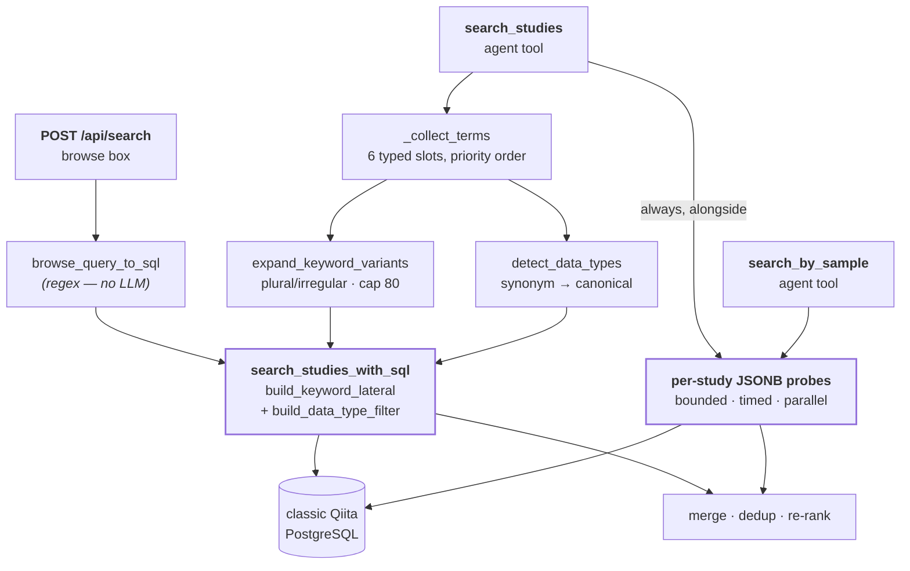
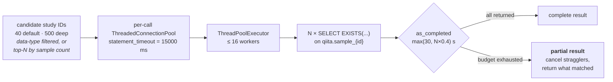

# 04 — Search

*Three query planners, one SQL builder, and a fanout across several hundred tables — because Qiita gives each study its own.*

Prerequisites: [`03-data-access-and-caching.md`](03-data-access-and-caching.md) — connection pooling and statement timeouts.

---

## The shape of the problem

Qiita's schema makes two kinds of search structurally different.

**Study-level facts** — title, abstract, alias, principal investigator — live in `qiita.study`, one row per study. Searching them is an ordinary WHERE clause.

**Sample-level facts** — host organism, body site, treatment, collection date, and several hundred other free-form fields — live in **`qiita.sample_{study_id}`, a separate physical table for every study**, in a JSONB `sample_values` column. There is no global sample table and no cross-study index. There is no schema: two studies describing the same thing may name the field `host_scientific_name` and `scientific_name`, or spell the value `Mus musculus` and `mouse`.

So "find studies about mice" and "find studies whose *samples* are from mice" are not variations of one query. The first is a scan of one table. The second requires touching a different table per candidate study, and cannot be answered by any single SQL statement.

QiitaExplore answers both, and merges the results. That is what this chapter describes.

---


## Three paths, one builder




Three entry points, three different ways of turning intent into terms, and then everything text-shaped converges on one parameterized builder.

---


## Path 1 — the browse box

`POST /api/search` runs `backend/services/llm.py :: browse_query_to_sql`.

> **There is no LLM in this function** — it was called `llm_query_to_sql` until 2026-09, and the module name `llm.py` is the last leftover of that design. It is pure regex and set arithmetic: no model call, no network.

What it actually does:

1. Tokenize the query, lowercase, drop a stop-word list (`find`, `show`, `studies`, `about`, `with`, …) and anything under 3 characters.
2. **Bare integers are study-ID candidates, never text keywords.** `550`, `study 550`, `study id 550`, `#550` all reduce to `study_ids = [550]`; with no text keywords left the plan is `id_only`, the WHERE is exactly `s.study_id = ANY(%s)` — no `ILIKE`, no relevance LATERAL — and the route skips the sample-metadata fan-out. (Before 2026-09 "550" was *also* `ILIKE`'d across every abstract, so studies mentioning "5500 samples" scored 10 while study 550 scored 0 on its own text and sorted below them.) A mixed query such as `550 mouse gut` keeps the OR'd exact match and boosts it — see the weights table below.
3. Decide **broad vs. narrow**. A `_BREADTH_RE` match (`many`, `all`, `several`, `overview`, `comprehensive`, `survey`, `explore`, …) **or** four or more surviving keywords means broad.
4. Broad → the 6 most informative keywords (`_pick_keywords`), joined with `OR`, limit `GLOBAL_SEARCH_SQL_LIMIT_BROAD` (120). Narrow → the best 2, joined with `AND`, limit `..._NARROW` (50).
5. A `by <Capitalized Name>` pattern adds a PI name/affiliation clause.
6. The whole cleaned query (before the narrow trim) is returned as `phrase`, for the title-phrase bonus.

The heuristic is crude and it is honest about being crude; `_pick_keywords` at least prefers long, non-modifier tokens over "high"/"low" when it trims.

### Browse facet filters (added 2026-09)

The request body may carry `filters: {pis, data_types, year_min, year_max}` (shapes in [appendix A](appendix-a-api-reference.md#search)). `backend/services/browse_filters.py` turns PI names and the year range into one AND-fragment (`sp_pi.name = ANY(%s)`, `EXTRACT(YEAR FROM s.first_contact) >= / <= %s`) that the route ANDs into the planner's custom WHERE — so it binds in the **topic slot** and the builder's param order below gains no new slot. Data types go through the existing `data_types=` kwarg. Deep-search rows are hydrated by id and never see that WHERE, so `study_passes_browse_filters` re-applies all three filters in Python over the merged list, and `_get_candidate_ids` narrows the probe set by data type, PI and year up front. An empty query with filters is allowed (filter-only browsing): no keywords → no LATERAL → `ORDER BY num_samples DESC NULLS LAST, s.study_id`, LIMIT 120. `GET /api/search/facets` serves the picker lists — PI counts, data-type counts, year range over public studies — from a 6 h per-worker cache.

"Year" is `qiita.study.first_contact`: when the study was created in Qiita. Qiita stores no publication date (`study_publication` holds DOI/PubMed IDs only), so the UI says **"Year added"**. Every study-header row now carries `year` (`_STUDY_COUNT_COLUMNS`).

---


## Path 2 — the canonical SQL builder

`backend/services/study_service.py :: search_studies_with_sql` is where every text search lands, from both the browse box and the agent.

### The base query

```sql
SELECT s.study_id, s.study_title, ...
FROM qiita.study s
LEFT JOIN qiita.study_person sp_pi  ON s.principal_investigator_id = sp_pi.study_person_id
LEFT JOIN qiita.study_person sp_lab ON s.lab_person_id             = sp_lab.study_person_id
{keyword LATERAL, when keywords are given — see below}
WHERE EXISTS (SELECT 1 FROM qiita.study_artifact sa
              JOIN qiita.artifact a   ON sa.artifact_id  = a.artifact_id
              JOIN qiita.visibility v ON a.visibility_id = v.visibility_id
              WHERE sa.study_id = s.study_id AND v.visibility = 'public')
  AND (<topic_where>)
```

Plus four correlated subqueries in the SELECT list: `num_samples`, `data_types`, `num_preps`, and `is_gold`.

Public visibility is a correlated `EXISTS` (`_PUBLIC_ARTIFACT_EXISTS` in `helpers/qiita_fetch.py`, shared with `_build_study_header_query`), so there is no artifact fan-out and no `DISTINCT`. Before 2026-08-30 this was a 3-way artifact/visibility `LEFT JOIN` + `SELECT DISTINCT`, which re-evaluated every SELECT subquery once *per artifact* before deduping.

### Relevance scoring (two layers)

**Layer 1 — SQL** (`build_keyword_lateral` in `study_service.py`): one `CROSS JOIN LATERAL` over a single `unnest(%s::text[])` computes two columns per study row:

- `rel.relevance` — per-keyword weights summed over 4 fields:

| Field | Weight |
| ----- | ------ |
| `study_title` | 30 |
| `study_abstract` | 10 |
| `study_alias` | 15 |
| PI name | 20 |
| exact study-ID match (`boost_study_ids`) | +1000, once per study, **outside** the per-keyword sum |
| whole cleaned query in the title (`title_phrase`) | +25 |

- `rel.aux_match` — `BOOL_OR` over the 2 extra fields (PI affiliation, lab-contact name).

The two bonuses are browse-only (the agent path passes neither) and bind inside the LATERAL, ahead of the keyword array, so they live in the `kw_params` slot. `finalize_search_results` recomputes relevance in Python and would silently undo them, so it mirrors both.

The agent path passes `match_keywords`, which both scores and **filters** with `(rel.relevance > 0 OR rel.aux_match)`; the browse path passes `relevance_keywords` (score-only, keeping its own custom WHERE). One array bind serves both roles — previously the same keyword block rendered twice (a 6-field `EXISTS` filter from `build_where_from_plan` plus a 4-field relevance subquery from `build_relevance_score`, both since deleted) and bound the array twice.

**Layer 2 — sample metadata** (`score_studies_sample_layer` in `sample_search.py`): after text + sample hits merge, each merged study is probed once. Full `sample_values::text` is searched; **+1 per keyword** with at least one sample match — over the first `_MAX_KEYWORDS_PER_PROBE` (10) terms of the expanded list only (direct user terms lead that list, so the cap sheds synonym padding). The sample layer's maximum contribution is therefore +10, not +80; pinned by `tests/test_sample_search_caps.py`.

Final ordering: `relevance DESC, num_samples DESC NULLS LAST, s.study_id`. Without keywords (ID-only or filter-only browse) there is no LATERAL and the order is `num_samples DESC NULLS LAST, s.study_id`.

Note the asymmetry survives the rewrite: **scoring** looks at 4 fields, while **matching** covers 6 (`relevance > 0` covers the 4 scored fields exactly, since all weights are positive; `aux_match` adds PI affiliation and lab contact name). A study matched solely on lab-contact name therefore scores zero and sorts last.

### PI veto (resolve before filter)

When the user names a specific PI (`entities` with `type: "pi"` on the agent path, or `by <Name>` / `PI <Name>` on browse), `resolve_pi` looks up `qiita.study_person` by deterministic SQL ILIKE — **never an LLM call**.

**Veto applies only when resolution succeeds.** If extraction names a PI but nothing matches in `study_person`, results stay unfiltered (no empty-result trap from a bad regex).

When veto is active, enforcement happens at three points: SQL WHERE (`build_pi_required_filter`), sample candidate lookup (`_get_candidate_ids`), and a post-merge Python guard (`study_matches_pi`).

`project` / `cohort` / `institution` entities are keyword-scored only — there is no DB entity to resolve.

`applied_filters.pi` is returned in search responses and rendered in the UI (`input`, `resolved`, `veto_applied`).

### The data-type filter

`build_data_type_filter` emits a correlated EXISTS over the three-hop join that connects a study to its assay types:

```sql
EXISTS (SELECT 1 FROM qiita.study_prep_template spt
        JOIN qiita.prep_template pt ON spt.prep_template_id = pt.prep_template_id
        JOIN qiita.data_type dt     ON pt.data_type_id      = dt.data_type_id
        WHERE spt.study_id = s.study_id
          AND dt.data_type IN (...))
```

`study → study_prep_template → prep_template → data_type` is the canonical chain, reused in the `data_types` SELECT subquery, in study-detail fetching, and in the artifact graph. It is worth memorising.

This filter is **AND**-ed onto the topic WHERE — it narrows, never broadens. `investigation_type` can narrow further but is applied only when the caller is explicit, because it is sparsely populated (roughly 521 studies tagged `WGS`, 18 tagged `shotgun_metagenomics`) and defaulting to it silently drops most of the corpus.

### Parameter binding order is load-bearing

psycopg2 substitutes `%s` strictly left to right, so the parameter list must match the order the fragments appear in the assembled SQL:

```python
full_params = kw_params + list(params) + dt_params + tag_params + list(pi_filter_params or [])
#              ↑ FROM      ↑ WHERE        ↑ WHERE     ↑ WHERE      ↑ WHERE
#              keyword     topic          data-type   study_tag    PI
#              LATERAL     clause         EXISTS      EXISTS       EXISTS
```

`kw_params` is *every* `%s` inside the LATERAL, in rendered order — `[boost study ids]` → `'%phrase%'` → the keyword array — exactly as `build_keyword_lateral` returns them. Keyword parameters come first because the LATERAL sits in the **FROM clause**, ahead of the WHERE; the topic clause's own placeholders come next because `topic_where` renders as `"(custom_sql_where) AND dt_sql AND tag_sql AND (pi_filter_sql)"` (the match condition prepended for `match_keywords` binds nothing). Get this order wrong and — best case — Postgres rejects the query; worst case it returns confidently wrong results. The docstring on `search_studies_with_sql` states the order; keep it accurate if you touch the assembly.

**Resolved (2026-08-30, was flagged 2026-08-17 as an open question):** the
original order bound `dt_params` *before* the topic params, misaligned with
the rendered WHERE text. Confirmed live: every search combining keywords
with a `data_types` filter (routine for `_tool_search_studies`, since
"shotgun" auto-detects `Metagenomic`) fed the bare data-type string into
the keyword clause's `unnest(%s::text[])` and failed with
`malformed array literal: "Metagenomic"`. The order above is the corrected
one; `tests/test_search_studies_with_sql.py ::
test_params_bind_in_rendered_sql_order` pins the WHERE-side order and
`test_match_keywords_bind_first_in_full_order` pins the keyword slot.

`LIMIT` is f-string interpolated rather than bound. That is safe **because** it is `int()`-cast and clamped first (1–150), so no caller-controlled string reaches the SQL. It stops being safe the moment someone adds a code path that skips the clamp — binding it as a parameter would remove the hazard entirely, at no cost. (`OFFSET` was removed 2026-08-31 — dead: no caller ever passed it.)

### Keyword expansion

`expand_keyword_variants` runs **once per search, at the caller** (`agent_tools._tool_search_studies` and the `/api/search` route); `build_keyword_lateral` binds the list as given and never re-expands (previously the builders re-expanded, so an agent search expanded up to 3×). Three tiers, each completed in full before the next runs:

1. **Direct terms** — every cleaned input term, verbatim.
2. **Morphological** — an irregular map handles `mouse ↔ mice`, `bacterium ↔ bacteria`; otherwise a naive `+s` plural. Dedup is case-insensitive (ILIKE makes case duplicates pure waste).
3. **Domain synonyms** — `DOMAIN_SYNONYM_GROUPS` (bidirectional concept groups: gut/intestine/stool/…, microbiome/microbiota, soil/rhizosphere/sediment, FMT, antibiotic, human, infant, obesity, IBD, cancer). Each keyword is looked up as a whole phrase AND per token, so `"gut microbiome"` pulls in `intestine` and `microbiota`. Group members get no plural expansion (substring ILIKE already matches "tumors"), and every member must be ≥ 3 chars — bare `GI` as `ILIKE '%gi%'` would match "fungi"/"aging" (pinned by `test_no_member_shorter_than_3_chars`).

**The result is capped at 80 terms**, applied after all three tiers. Tiering (not just ordering within one pass) is load-bearing: an earlier version interleaved each direct term with its own morphological variant in a single loop, so more than ~40 direct terms could push a *later* direct term past the cap before its own variants or any synonyms were even considered (fixed 2026-08-31, pinned by `test_direct_terms_survive_cap` with 45 direct terms). Now tier 1 alone occupies the first N slots unconditionally, so direct user terms can never be pushed out by their own variants or by synonyms. The whole list binds as **one** `text[]` parameter, so SQL text and param count don't grow with keyword count.

---


## Path 3 — sample-metadata search

This is what makes QiitaExplore able to answer questions the Qiita web UI cannot.

### Why it fans out

There is no global sample table. Answering "which studies have samples from mice" means asking each study's own table. `backend/helpers/sample_search.py` therefore does something that looks alarming and is in fact carefully bounded:




### The probe

For each candidate study, one existence query — no rows are returned, only a boolean:

```sql
SELECT EXISTS(
  SELECT 1 FROM qiita.study_sample ss
  JOIN qiita.sample_{sid} sm ON ss.sample_id = sm.sample_id
  WHERE ss.study_id = %s
    AND ss.sample_id <> 'qiita_sample_column_names'
    AND ( sm.sample_values->>'host_scientific_name' ILIKE %s OR ... ))
```

The OR matrix is **7 host fields × up to 10 keywords** (`_MAX_KEYWORDS_PER_PROBE`): `scientific_name`, `common_name`, `host_scientific_name`, `host_common_name`, `env_feature`, `taxon_id`, `host_taxid`. These are the fields that actually carry organism identity across studies with inconsistent schemas.

Two details:

- **The table name is f-string interpolated**, because a table name cannot be a bound parameter. It is `int()`-cast immediately before interpolation, so it cannot carry injection. Values are always parameterized.
- `'qiita_sample_column_names'` **is a sentinel row** Qiita stores in every per-study table, holding column names rather than sample data. Every probe and every full-metadata query excludes it. Forgetting to is a recurring source of phantom matches.

`search_studies_by_field_filters` uses the same machinery for structured `field=value` filters, mixing `sample_values->>'{field}' ILIKE %s` for named fields with `sample_values::text ILIKE %s` for free-text.

### Three layers of bounding

Unbounded, this design would scan every study in Qiita. Three limits prevent that:

1. **Candidate cap.** 40 studies by default, 500 in deep-search mode. Candidates are the data-type-filtered set when a filter is active, otherwise the largest studies by sample count — a recall bias that is stated plainly here because it is invisible in the UI: **a small study that matches perfectly may never be probed.**
2. **Per-statement timeout.** 15000 ms (default), set in the connection string, so a pathological study cannot hold a connection.
3. **Overall budget.** `as_completed(timeout=max(30, N × 0.4))`. On expiry, stragglers are cancelled and **whatever matched is returned**.

That last point is the important one. **A timeout degrades recall; it never fails the request.** The user gets fewer studies, not an error. This is the right trade for exploratory search and the wrong one for anything requiring completeness — and nothing in the response currently indicates that truncation occurred, which is worth fixing.

### Merging with text results

`backend/helpers/agent_tools.py :: _tool_search_studies` runs both searches on every call. Text search over-fetches at `limit × 2`; sample search probes `sample_values::text` with the first `_MAX_KEYWORDS_PER_PROBE` (10) expanded keywords per study (the whole list used to be bound, which let a synonym-expanded query blow through the per-study probe timeout and silently drop recall). Results merge, receive unified relevance scoring (text + sample layer), PI veto when resolved, then trim to `limit`. Each study is tagged `via: "text"` or `via: "sample_metadata"`.

---


## Known performance problem

> **TKT-024 —** `/api/search` **latency ranges from 86 ms to 13.5 s** across the benchmark suite in `backend/tests/benchmarks/`. These are measured numbers, not estimates.

Three compounding causes (one now partly resolved):

1. **Leading-wildcard** `ILIKE` **with no supporting index.** Every clause is `ILIKE '%term%'`, which no B-tree can serve. Each is a sequential scan over `qiita.study`.
2. **Term count multiplies the work.** At the 80-term cap that is 480 comparisons per row (6 fields × 80 terms) — down from 800 before the single-LATERAL rewrite, which folded the separate WHERE filter (6×80) and relevance expression (4×80) into one 6-field pass.
3. ~~`SELECT DISTINCT` with `ORDER BY relevance` defeats LIMIT pushdown.~~ **Partly resolved 2026-08-30:** the artifact fan-out + `DISTINCT` is gone (visibility is a correlated `EXISTS`), so the SELECT subqueries and relevance are no longer re-evaluated per artifact. What remains: `ORDER BY relevance` still forces relevance and `num_samples` evaluation for the full matching set before `LIMIT` can discard anything, plus the other correlated subqueries per matching row.

The indicated fix is `pg_trgm` GIN trigram indexes on `study_title` and `study_abstract`, which are what make leading-wildcard matching indexable. That is the highest-leverage change available. Restructuring the query to select IDs first and hydrate afterward would shave the remaining per-matching-row subqueries — deliberately deferred (only `data_types`/`num_preps`/`is_gold` are deferrable, the un-indexable scan dominates, and it would re-expand the param-order surface right after TKT-055); it stays under TKT-024.

> **On the cited precedent.** TKT-024 points at `patches/93.sql` as in-repo precedent for the trigram approach. **That file does not exist in this repository** and never has — `git log --all -- patches/93.sql` returns nothing, and there is no `patches/` directory. The reference is to classic Qiita's own migration history, not to anything here. The technique is sound; the citation is not actionable from this repo, and applying it means writing a new migration against a database QiitaExplore only reads.
>
> That last point is the real constraint, and it is easy to miss: **QiitaExplore has read-only access to classic Qiita.** It cannot create these indexes itself. The fix requires a change on the Qiita side, by whoever owns that database.

---


## Where this is going

- **TKT-018 — stream sample-search results incrementally.** Today the fanout completes (or times out) before anything reaches the user. Streaming each match as it arrives would make deep search feel far faster without being faster, and would give the UI somewhere to report truncation. It requires new SSE events — see [`06-streaming-and-chat.md`](06-streaming-and-chat.md).
- **TKT-022 — cross-study metadata field-overlap matrix.** Which studies share which metadata fields, built on the same JSONB probing. The precondition for meaningful cross-study cohort assembly.
- **TKT-021 — cohort builder.** Select samples across studies by metadata predicate, then hand the selection to the merge workspace.
- **TKT-024 — the indexing work above.**

---

*See also:* [`05-agent.md`](05-agent.md) *for how the model chooses search arguments ·* [`appendix-c-agent-tools-and-sse.md`](appendix-c-agent-tools-and-sse.md#search_studies) *for the tool schemas ·* [`appendix-d-configuration.md`](appendix-d-configuration.md) *for candidate caps and timeouts ·* [`03-data-access-and-caching.md`](03-data-access-and-caching.md) *for the connection model.*