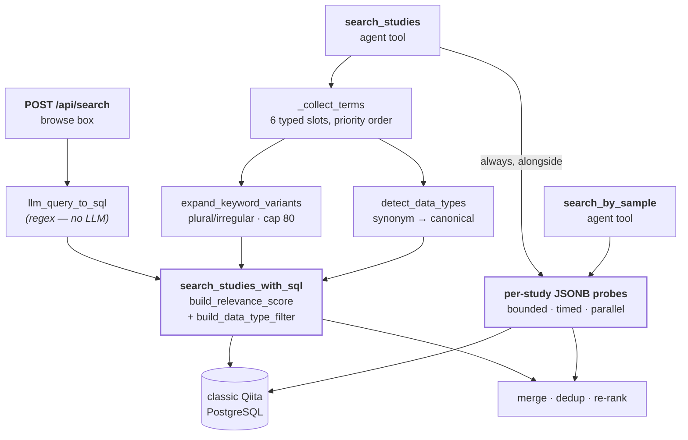
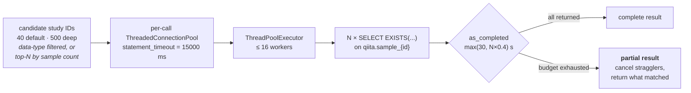

# 04 — Search

*Three query planners, one SQL builder, and a fanout across several hundred tables — because Qiita gives each study its own.*

Prerequisites: [`03-data-access-and-caching.md`](03-data-access-and-caching.md) — connection pooling and statement timeouts.

---

## The shape of the problem

Qiita's schema makes two kinds of search structurally different.

**Study-level facts** — title, abstract, alias, principal investigator — live in `qiita.study`, one row per study. Searching them is an ordinary WHERE clause.

**Sample-level facts** — host organism, body site, treatment, collection date, and several hundred other free-form fields — live in **`qiita.sample_{study_id}`, a separate physical table for every study**, in a JSONB `sample_values` column. There is no global sample table and no cross-study index. There is no schema: two studies describing the same thing may name the field `host_scientific_name` and `scientific_name`, or spell the value `Mus musculus` and `mouse`.

So "find studies about mice" and "find studies whose *samples* are from mice" are not variations of one query. The first is a scan of one table. The second requires touching a different table per candidate study, and cannot be answered by any single SQL statement.

QiitaExplore answers both, and merges the results. That is what this chapter describes.

---


## Three paths, one builder




Three entry points, three different ways of turning intent into terms, and then everything text-shaped converges on one parameterized builder.

---


## Path 1 — the browse box

`POST /api/search` runs `backend/services/llm.py :: llm_query_to_sql`.

> **The name is a trap. There is no LLM in this function.** It is pure regex and set arithmetic — no model call, no network. The name is a leftover from an earlier design. Renaming it is a small, worthwhile cleanup.

What it actually does:

1. Tokenize the query, lowercase, drop a stop-word list (`find`, `show`, `studies`, `about`, `with`, …) and anything under 3 characters.
2. Decide **broad vs. narrow**. A `_BREADTH_RE` match (`many`, `all`, `several`, `overview`, `comprehensive`, `survey`, `explore`, …) **or** four or more surviving keywords means broad.
3. Broad → first 6 keywords, joined with `OR`, limit `GLOBAL_SEARCH_SQL_LIMIT_BROAD` (120). Narrow → first 2 keywords, joined with `AND`, limit `..._NARROW` (50).
4. A `by <Capitalized Name>` pattern adds a PI name/affiliation clause.
5. Bare integers become `s.study_id = ANY(%s)`, OR'd with the text clause — so pasting a study ID finds it directly.

The heuristic is crude and it is honest about being crude. Its weakness is the keyword truncation: a narrow query keeps only the **first two** surviving tokens in input order, with no notion of which are informative. "high fat diet mouse gut" narrows to `high AND fat`.

---


## Path 2 — the canonical SQL builder

`backend/services/study_service.py :: search_studies_with_sql` is where every text search lands, from both the browse box and the agent.

### The base query

```sql
SELECT DISTINCT s.study_id, s.study_title, ...
FROM qiita.study s
LEFT JOIN qiita.study_person sp_pi  ON s.principal_investigator_id = sp_pi.study_person_id
LEFT JOIN qiita.study_person sp_lab ON s.lab_person_id             = sp_lab.study_person_id
LEFT JOIN qiita.study_artifact sa   ON s.study_id      = sa.study_id
LEFT JOIN qiita.artifact a          ON sa.artifact_id  = a.artifact_id
LEFT JOIN qiita.visibility v        ON a.visibility_id = v.visibility_id
WHERE v.visibility = 'public' AND (<topic_where>)
```

Plus four correlated subqueries in the SELECT list: `num_samples`, `data_types`, `num_preps`, and `is_gold`.

`SELECT DISTINCT` is **required**, not stylistic: the artifact/visibility join fans a study out to one row per artifact. Note that `qiita_fetch` expresses the same public-visibility constraint as a correlated `WHERE EXISTS` instead, which avoids the fan-out and therefore needs no `DISTINCT`. The two forms are semantically equivalent; the difference is historical, and the `EXISTS` form is the better pattern.

### Relevance scoring (two layers)

**Layer 1 — SQL** (`build_relevance_score` in `study_service.py`): one `unnest(%s::text[])` block sums per-keyword weights:

| Field | Weight |
| ----- | ------ |
| `study_title` | 30 |
| `study_abstract` | 10 |
| `study_alias` | 15 |
| PI name | 20 |

**Layer 2 — sample metadata** (`score_studies_sample_layer` in `sample_search.py`): after text + sample hits merge, each merged study is probed once. Full `sample_values::text` is searched; **+1 per keyword** with at least one sample match.

Final ordering: `relevance DESC, num_samples DESC NULLS LAST, s.study_id`.

`build_where_from_plan` uses the same `unnest(%s::text[])` pattern (one array param) instead of repeating a 6-column OR per keyword.

Note the asymmetry: **scoring** looks at 4 fields, while **matching** in `build_where_from_plan` looks at 6 (adding PI affiliation and lab contact name). A study matched solely on lab-contact name therefore scores zero and sorts last.

### PI veto (resolve before filter)

When the user names a specific PI (`entities` with `type: "pi"` on the agent path, or `by <Name>` / `PI <Name>` on browse), `resolve_pi` looks up `qiita.study_person` by deterministic SQL ILIKE — **never an LLM call**.

**Veto applies only when resolution succeeds.** If extraction names a PI but nothing matches in `study_person`, results stay unfiltered (no empty-result trap from a bad regex).

When veto is active, enforcement happens at three points: SQL WHERE (`build_pi_required_filter`), sample candidate lookup (`_get_candidate_ids`), and a post-merge Python guard (`study_matches_pi`).

`project` / `cohort` / `institution` entities are keyword-scored only — there is no DB entity to resolve.

`applied_filters.pi` is returned in search responses and rendered in the UI (`input`, `resolved`, `veto_applied`).

### The data-type filter

`build_data_type_filter` emits a correlated EXISTS over the three-hop join that connects a study to its assay types:

```sql
EXISTS (SELECT 1 FROM qiita.study_prep_template spt
        JOIN qiita.prep_template pt ON spt.prep_template_id = pt.prep_template_id
        JOIN qiita.data_type dt     ON pt.data_type_id      = dt.data_type_id
        WHERE spt.study_id = s.study_id
          AND dt.data_type IN (...))
```

`study → study_prep_template → prep_template → data_type` is the canonical chain, reused in the `data_types` SELECT subquery, in study-detail fetching, and in the artifact graph. It is worth memorising.

This filter is **AND**-ed onto the topic WHERE — it narrows, never broadens. `investigation_type` can narrow further but is applied only when the caller is explicit, because it is sparsely populated (roughly 521 studies tagged `WGS`, 18 tagged `shotgun_metagenomics`) and defaulting to it silently drops most of the corpus.

### Parameter binding order is load-bearing

psycopg2 substitutes `%s` strictly left to right, so the parameter list must match the order the fragments appear in the assembled SQL:

```python
full_params = score_params + dt_params + list(params)
#              ↑ SELECT       ↑ WHERE     ↑ WHERE
#              relevance      data-type   topic
#              expression     EXISTS      clause
```

Score parameters come first because the relevance expression sits in the **SELECT list**, ahead of the WHERE clause. Get this order wrong and there is no error — keywords bind into the data-type filter and vice versa, and the query returns confidently wrong results. The docstring on `search_studies_with_sql` states the order; keep it accurate if you touch the assembly.

`LIMIT` and `OFFSET` are f-string interpolated rather than bound. That is safe **because** both are `int()`-cast and clamped first (limit to 1–150, offset to ≥ 0), so no caller-controlled string reaches the SQL. It stops being safe the moment someone adds a code path that skips the clamp — binding them as parameters would remove the hazard entirely, at no cost.

### Keyword expansion

`expand_keyword_variants` adds morphological variants before either builder runs: an irregular map handles `mouse ↔ mice`, `bacterium ↔ bacteria`; otherwise a naive `+s` plural is appended. **The result is capped at 80 terms.**

Two things to note. The cap applies *after* expansion, so it corresponds to roughly 40 input terms. Both `build_where_from_plan` and `build_relevance_score` bind **one** `text[]` parameter each (via `unnest`), so SQL text and param count no longer grow linearly with keyword count.

---


## Path 3 — sample-metadata search

This is what makes QiitaExplore able to answer questions the Qiita web UI cannot.

### Why it fans out

There is no global sample table. Answering "which studies have samples from mice" means asking each study's own table. `backend/helpers/sample_search.py` therefore does something that looks alarming and is in fact carefully bounded:




### The probe

For each candidate study, one existence query — no rows are returned, only a boolean:

```sql
SELECT EXISTS(
  SELECT 1 FROM qiita.study_sample ss
  JOIN qiita.sample_{sid} sm ON ss.sample_id = sm.sample_id
  WHERE ss.study_id = %s
    AND ss.sample_id <> 'qiita_sample_column_names'
    AND ( sm.sample_values->>'host_scientific_name' ILIKE %s OR ... ))
```

The OR matrix is **7 host fields × up to 10 keywords** (`_MAX_KEYWORDS_PER_PROBE`): `scientific_name`, `common_name`, `host_scientific_name`, `host_common_name`, `env_feature`, `taxon_id`, `host_taxid`. These are the fields that actually carry organism identity across studies with inconsistent schemas.

Two details:

- **The table name is f-string interpolated**, because a table name cannot be a bound parameter. It is `int()`-cast immediately before interpolation, so it cannot carry injection. Values are always parameterized.
- `'qiita_sample_column_names'` **is a sentinel row** Qiita stores in every per-study table, holding column names rather than sample data. Every probe and every full-metadata query excludes it. Forgetting to is a recurring source of phantom matches.

`search_studies_by_field_filters` uses the same machinery for structured `field=value` filters, mixing `sample_values->>'{field}' ILIKE %s` for named fields with `sample_values::text ILIKE %s` for free-text.

### Three layers of bounding

Unbounded, this design would scan every study in Qiita. Three limits prevent that:

1. **Candidate cap.** 40 studies by default, 500 in deep-search mode. Candidates are the data-type-filtered set when a filter is active, otherwise the largest studies by sample count — a recall bias that is stated plainly here because it is invisible in the UI: **a small study that matches perfectly may never be probed.**
2. **Per-statement timeout.** 15000 ms (default), set in the connection string, so a pathological study cannot hold a connection.
3. **Overall budget.** `as_completed(timeout=max(30, N × 0.4))`. On expiry, stragglers are cancelled and **whatever matched is returned**.

That last point is the important one. **A timeout degrades recall; it never fails the request.** The user gets fewer studies, not an error. This is the right trade for exploratory search and the wrong one for anything requiring completeness — and nothing in the response currently indicates that truncation occurred, which is worth fixing.

### Merging with text results

`backend/helpers/agent_tools.py :: _tool_search_studies` runs both searches on every call. Text search over-fetches at `limit × 2`; sample search uses full expanded keywords against `sample_values::text`. Results merge, receive unified relevance scoring (text + sample layer), PI veto when resolved, then trim to `limit`. Each study is tagged `via: "text"` or `via: "sample_metadata"`.

---


## Known performance problem

> **TKT-024 —** `/api/search` **latency ranges from 86 ms to 13.5 s** across the benchmark suite in `backend/tests/benchmarks/`. These are measured numbers, not estimates.

Three compounding causes:

1. **Leading-wildcard** `ILIKE` **with no supporting index.** Every clause is `ILIKE '%term%'`, which no B-tree can serve. Each is a sequential scan over `qiita.study`.
2. **Term count multiplies the work.** 80 expanded terms × 6 fields = 480 comparisons per row in the WHERE, plus 320 more in the relevance expression.
3. `SELECT DISTINCT` **with** `ORDER BY relevance` **defeats LIMIT pushdown.** Both the relevance expression and the deduplication must be evaluated for the full matching set before any row can be discarded, so `LIMIT 8` does not reduce the work — it only reduces what is returned. The four correlated subqueries per surviving row add to that.

The indicated fix is `pg_trgm` GIN trigram indexes on `study_title` and `study_abstract`, which are what make leading-wildcard matching indexable. That is the highest-leverage change available. Restructuring the query to select IDs first and hydrate afterward would address the pushdown issue separately.

> **On the cited precedent.** TKT-024 points at `patches/93.sql` as in-repo precedent for the trigram approach. **That file does not exist in this repository** and never has — `git log --all -- patches/93.sql` returns nothing, and there is no `patches/` directory. The reference is to classic Qiita's own migration history, not to anything here. The technique is sound; the citation is not actionable from this repo, and applying it means writing a new migration against a database QiitaExplore only reads.
>
> That last point is the real constraint, and it is easy to miss: **QiitaExplore has read-only access to classic Qiita.** It cannot create these indexes itself. The fix requires a change on the Qiita side, by whoever owns that database.

---


## Where this is going

- **TKT-018 — stream sample-search results incrementally.** Today the fanout completes (or times out) before anything reaches the user. Streaming each match as it arrives would make deep search feel far faster without being faster, and would give the UI somewhere to report truncation. It requires new SSE events — see [`06-streaming-and-chat.md`](06-streaming-and-chat.md).
- **TKT-022 — cross-study metadata field-overlap matrix.** Which studies share which metadata fields, built on the same JSONB probing. The precondition for meaningful cross-study cohort assembly.
- **TKT-021 — cohort builder.** Select samples across studies by metadata predicate, then hand the selection to the merge workspace.
- **TKT-024 — the indexing work above.**

---

*See also:* [`05-agent.md`](05-agent.md) *for how the model chooses search arguments ·* [`appendix-c-agent-tools-and-sse.md`](appendix-c-agent-tools-and-sse.md#search_studies) *for the tool schemas ·* [`appendix-d-configuration.md`](appendix-d-configuration.md) *for candidate caps and timeouts ·* [`03-data-access-and-caching.md`](03-data-access-and-caching.md) *for the connection model.*