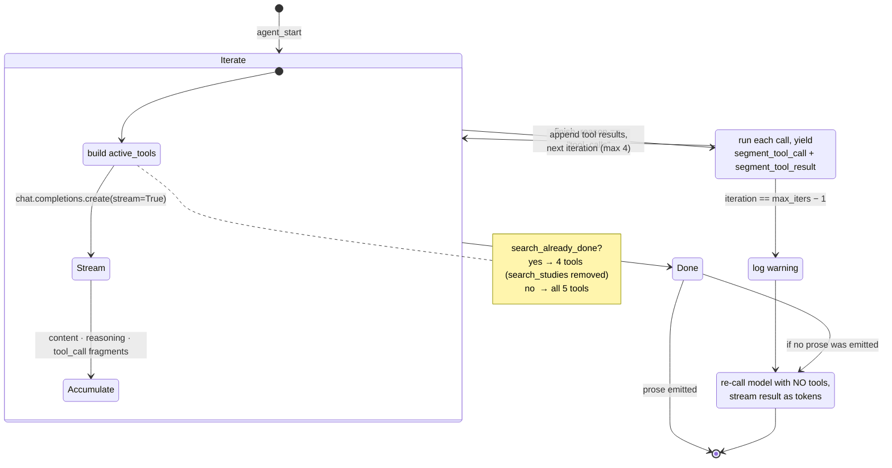
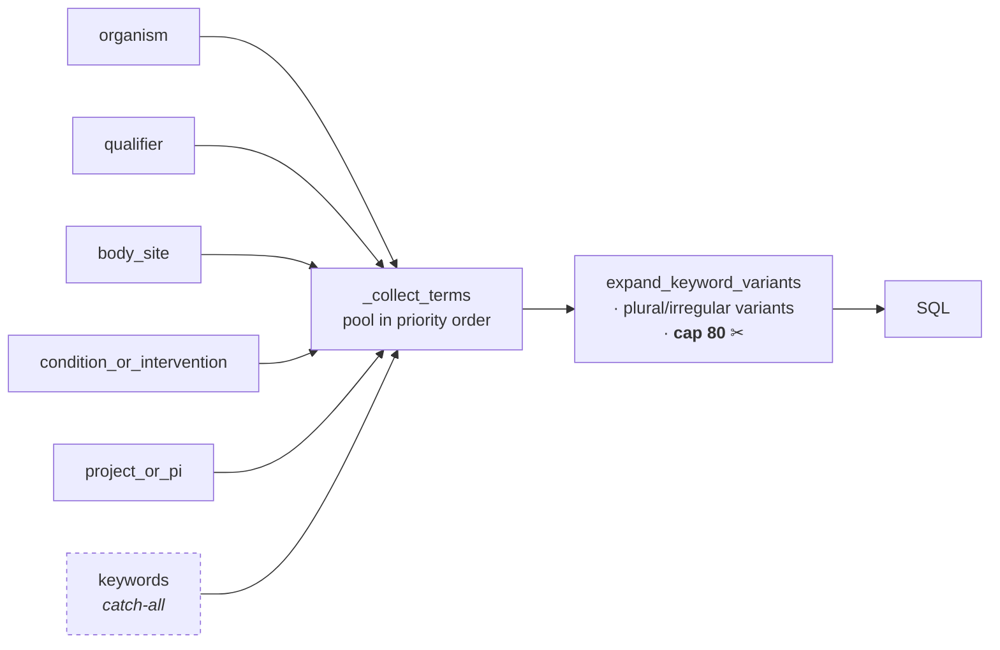

# 05 — The Agent

*How the model is constrained into producing grounded answers, and why the most important constraint is a mutation to the tool schema rather than a sentence in the prompt.*

Prerequisites: [`04-search.md`](04-search.md) — the tools call into the search layer.

---

## The switch

Everything in chat forks on one predicate:

```python
if model_supports_tools(model):   # agentic path — this chapter
else:                             # legacy path — regex planner, one search, plain stream
```

`backend/config.py :: model_supports_tools` reads `supports_tools` from `MODEL_METADATA`. Ten of the eleven configured models return `True`; `gemma-small` is the only one that does not, because it cannot emit streaming tool calls.

There is a second fork, and it surprises people:

> **Only global chats use the agentic path.** `backend/routes/chat_routes.py` never imports `stream_agent`. Project chats — the ones scoped to a saved collection of studies — use a plain token accumulator with pre-built context, regardless of which model is selected. Tool cards appear in global chat only.

This is historical: project chat predates the tool loop and already had its context-building path. The asymmetry is not principled, and unifying the two is a natural cleanup. It is documented here because a reader comparing the two chat implementations will otherwise assume they missed something.

---


## What `stream_agent` is

`backend/helpers/agent.py :: stream_agent` is a **generator that yields typed dictionaries, not SSE strings**:

```python
stream_agent(messages, *, system_prompt, model, study_context_text,
             scope, chat_id, max_iters=4, deep_search=False)
    -> Generator[dict, None, None]
```

Keeping SSE formatting out of the agent is what allows `backend/agent_harness.py` — an offline CLI driver — to consume the same generator and print to a terminal. The route is the only place that knows about the wire format.

Five yield types: `agent_start`, `token`, `reasoning`, `segment_tool_call`, `segment_tool_result`.

> `reasoning` **never reaches the browser.** Reasoning-capable models emit `delta.reasoning_content`, and `stream_agent` faithfully yields it as `{"type": "reasoning", ...}`. **No route translates it into an SSE event, and no browser handler exists for it.** The web path silently discards every reasoning token; only `agent_harness.py` consumes them. This is a gap, not a design choice — the plumbing exists on one end and stops halfway. Surfacing it would give users visibility into the model's deliberation at no backend cost.

---

## The loop




Up to four iterations. Each one streams a completion, accumulating three things in parallel: prose content, reasoning content, and tool-call fragments — the last reassembled from streamed deltas into `tool_call_map[index] = {id, name, arguments}` by string-concatenating name and argument fragments as they arrive.

The loop exits when `finish_reason != "tool_calls"` or no tool calls were requested. Otherwise it appends the assistant message with its `tool_calls`, executes each call in index order, appends a `{"role": "tool", ...}` message per result, and iterates.

### The one-search invariant

This is the best idea in the codebase, and it is worth understanding as a general technique.

The system prompt tells the model to call `search_studies` exactly once. Prompts are advisory — a model that gets disappointing results will happily search again with different terms, burning iterations and latency while producing a worse answer than synthesising what it already has.

So the constraint is not left to the prompt:

```python
if search_already_done:
    active_tools = [t for t in TOOL_SCHEMAS if t["function"]["name"] != "search_studies"]
else:
    active_tools = TOOL_SCHEMAS
```

**Once a search completes, the tool ceases to exist.** The model is not refused, not scolded, not corrected — the capability is simply absent from the schema it is given on the next turn. There is no failure mode to recover from because there is no failure. The same gating is implemented in the Anthropic path.

The general principle: *when a constraint matters, encode it in the interface rather than the instructions.* A prompt rule is a request; a schema mutation is a fact. Everything the model cannot do, it cannot attempt.

The bound this buys is concrete: at most one expensive search per turn, so a turn's latency is bounded by one search plus at most four completions.

### Forced synthesis

A tool-calling loop has an ugly failure mode: the model calls a tool, receives the result, and stops — producing a turn whose visible output is a tool card and nothing else. The user sees results with no answer.

```python
if not final_had_synthesis and api_msgs and api_msgs[-1].get("role") == "tool":
    # re-call the model with NO tools and stream the result
```

If the loop ended on a tool message with no prose, the model is called once more **with no tools at all**, and that response streams as tokens. With no tools available, the only thing it can do is answer. The user never sees an empty turn.

Note the interaction with `max_iters`: hitting the ceiling while still requesting tools logs a warning *and* falls into forced synthesis, so exhaustion also degrades into an answer rather than silence.

---


## Two providers, one loop

`get_client(model)` returns `(client, provider)`, and `stream_agent` dispatches to `_stream_anthropic_agent` when the provider is Anthropic. The two implementations are parallel, not shared, because the streaming protocols differ structurally:


| Concern         | OpenAI / NRP-Nautilus                                          | Anthropic                                                     |
| --------------- | -------------------------------------------------------------- | ------------------------------------------------------------- |
| Tool schema     | `{"type":"function","function":{name,description,parameters}}` | `{name, description, input_schema}`                           |
| System prompt   | A message with `role: "system"`                                | A separate `system=` parameter                                |
| Tool arguments  | `delta.tool_calls[].function.arguments` fragments              | `input_json_delta` accumulating `partial_json`                |
| Continue signal | `finish_reason == "tool_calls"`                                | `stop_reason == "tool_use"`                                   |
| Tool results    | `{"role": "tool", "tool_call_id": ...}`                        | A **user** message containing `[{"type":"tool_result", ...}]` |
| Reasoning       | `delta.reasoning_content`                                      | not handled                                                   |


`_openai_tools_to_anthropic` performs the schema translation, so tools are declared once in OpenAI format and rewritten on demand.

A third provider would need: schema translation, system-prompt placement, a streaming accumulator for tool arguments, the stop-signal mapping, the tool-result message shape — and both the search-gating and forced-synthesis behaviours, which are currently duplicated rather than factored out. That duplication is the maintenance cost of this design, and it is real: a fix applied to one path can silently miss the other. TKT-032 tracks consolidating it.

---


## The five tools

Full schemas in [`appendix-c-agent-tools-and-sse.md`](appendix-c-agent-tools-and-sse.md). What follows is why each is shaped the way it is.

### `search_studies` — typed slots, not a query string

The obvious design is one `query` string. This tool instead offers **six typed arrays**:

`organism` · `qualifier` · `body_site` · `condition_or_intervention` · `project_or_pi` · `keywords`

Two concrete problems drove that.

**Problem one: which terms get dropped.** Terms are pooled by `_collect_terms` in a fixed priority order — the order listed above — deduplicated preserving first occurrence. Downstream, `expand_keyword_variants` caps the result at 80 terms. Because `keywords` is pooled **last**, it is what gets truncated first:




A search for a mouse study cannot lose the word "mouse" to a flood of incidental terms. With one flat list, truncation order would be arbitrary.

**Problem two: accidental filtering.** `_collect_terms` returns two lists. `raw_kws` is everything, used for matching. `detect_kws` is **the `keywords` slot only**, and it alone feeds `detect_data_types`, which maps synonyms like "shotgun" onto canonical data types and applies them as an **AND filter**.

The scoping prevents a specific bug. A user asking about *"metagenomics research in captive primates"* has "metagenomics" land in `condition_or_intervention`. If every slot fed type detection, that word would silently add `data_type = 'Metagenomic'` as a hard filter — quietly excluding every 16S study the user wanted. Restricting detection to the explicit catch-all slot means an assay filter is applied only when the user's phrasing put the term there.

`data_types` may also be passed explicitly. `investigation_types` exists but is discouraged in the schema description, because it is sparsely populated (see [`04-search.md`](04-search.md)).

### `get_study_report`

Loads full sample-level metadata for one study and **pins it as a side effect** — the model asking for a report is taken as intent to keep that study in context.

The pin routes through `_pin_studies_validated`, so it respects the cap of 10. But the call is wrapped in a bare `except Exception: pass`: **if the cap rejects the pin, nothing is reported.** The report still renders, the study is silently not pinned, and neither the model nor the user learns why. Worth surfacing.

### `pin_study`

Explicit pinning, capped at 10 per chat. Reports back which IDs were pinned, which were invalid, and which were rejected — unlike the auto-pin path above.

### `search_by_sample`

Structured `{field, value}` filters against sample metadata, for when the user names a field explicitly. Its schema description contrasts it with `search_studies` to steer selection, since the two overlap: `search_studies` always runs a sample probe alongside its text search, so `search_by_sample` is for the case where the *field* is known, not merely the value.

### `compute_diversity`

> **Stub.** `_tool_compute_diversity` always returns a message stating that diversity computation is unavailable pending BIOM/OTU ingestion (TKT-010). **It is present in the live tool schema**, so the model can and does call it — consuming an iteration to receive an apology. Removing it from the schema until it is implemented would be strictly better. Tracked in [`11-roadmap.md`](11-roadmap.md).

---


## What the LLM does not do

Stated plainly, because the opposite is a reasonable assumption:

**The model never writes SQL.** It emits JSON conforming to a fixed schema. Python reads that JSON and composes parameterized SQL, with every value bound rather than interpolated.

Two properties follow, and the second matters more:

- **Injection is structurally impossible**, not defended against. There is no path from model output to SQL text. The only interpolated values anywhere are table names and `LIMIT`/`OFFSET`, all `int()`-cast first (see [`04-search.md`](04-search.md)).
- **Every query is bounded by construction.** The tool schema caps `limit` at 20; candidate sets are capped at 40 or 500; statement timeouts are attached at the connection. The model cannot express an unbounded query because the vocabulary contains no way to say it.

The cost is expressiveness. Questions the tool set cannot phrase cannot be asked: *"what is the average sample count per data type"*, *"which PIs publish across the most body sites"*, anything requiring aggregation, grouping, or a join the builders do not implement. Users hit this wall, and the answer today is "that query isn't available."

Letting the model author constrained SQL is genuine future work, with a real threat model attached — see [`11-roadmap.md`](11-roadmap.md).

---


## Observability

Each iteration logs time-to-first-token, total elapsed time, content and reasoning lengths, finish reason, and tool-call count. Each tool execution logs its name, elapsed time, and result size, and appends a `· {n}s` suffix to the label the user sees — so tool timing is visible in the UI without opening logs.

**Tool failures do not kill the stream.** `_execute_tool_call` catches exceptions, yields a `"{name} failed"` result segment, and returns the error text *as the tool's content* — so the model receives the failure as an observation and can recover, apologise, or try a different tool. A crashed tool degrades one step rather than the turn.

`backend/agent_harness.py` runs the whole loop from the command line, which is the fastest way to iterate on prompts or tool schemas without a browser — and the only way to observe `reasoning` output.

> `AGENT_DEBUG` **does not affect the server.** Its only reader is `agent_harness.py`. Setting it in the backend's `.env` has no effect on the Gunicorn process — a natural assumption that is wrong, and an easy few minutes lost. Server-side agent logging is whatever `logging.basicConfig(level=INFO)` in `run.py` produces.

---

*See also:* [`06-streaming-and-chat.md`](06-streaming-and-chat.md) *for how these yields become browser state ·* [`appendix-c-agent-tools-and-sse.md`](appendix-c-agent-tools-and-sse.md) *for the full schemas ·* [`04-search.md`](04-search.md) *for what the tools query ·* [`appendix-d-configuration.md`](appendix-d-configuration.md) *for the model roster.*