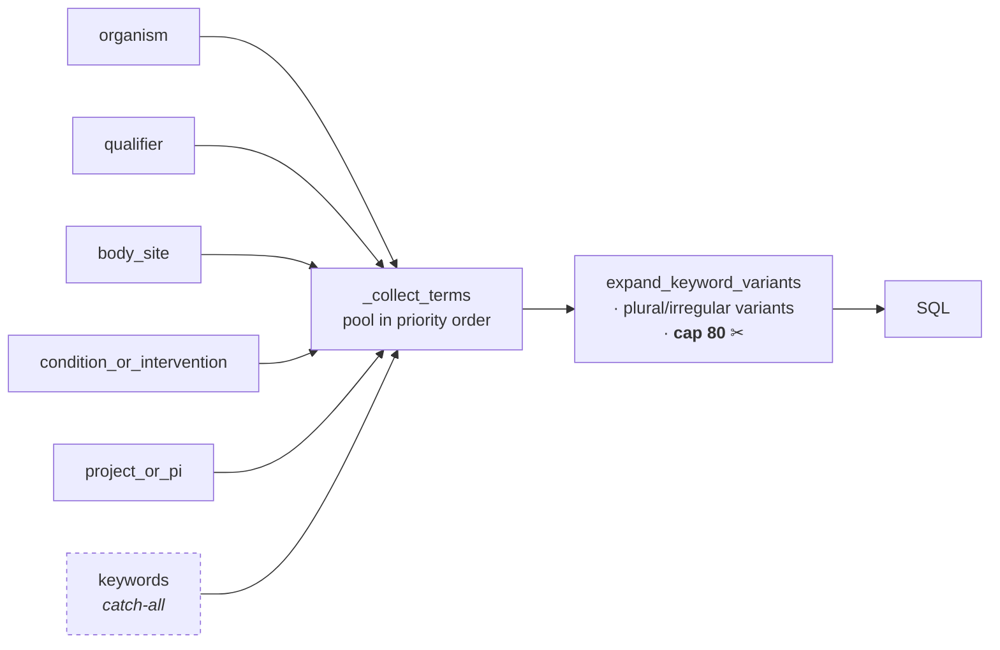

# 05 — The Agent

*How the model is constrained into producing grounded answers, and why the most important constraint is a mutation to the tool schema rather than a sentence in the prompt.*

Prerequisites: [`04-search.md`](04-search.md) — the tools call into the search layer.

---

## The runtime: pi, and only pi

Chat runs on **pi** — [`@earendil-works/pi-coding-agent`](https://github.com/earendil-works/pi), a standalone Node agent runtime living in `qiita_explore/pi_sidecar/` — for **both** project chat and global chat, unconditionally. There used to be an in-process Python loop (`backend/helpers/agent.py :: stream_agent`) plus a non-agentic, prompt-context-only project-chat path, selected by the feature flags `PI_BACKEND_GLOBAL` / `PI_BACKEND_PROJECT`. Once pi reached parity, the flags, the loop, and the non-agentic path were all deleted together — there is no rollback switch any more. `backend/config.py :: pi_config_errors()` reflects that: it now refuses to boot without a working pi configuration (`PI_SIDECAR_SECRET`, `PI_SCOPE_TOKEN_KEY`) rather than degrading to a Python fallback when either is missing.

Both streaming routes (`backend/routes/chat_routes.py :: api_chat_message_stream`, `backend/routes/global_chat_routes.py :: api_global_chat_message_stream`) drive the identical sub-generator:

```python
assistant_parts, ui_payload = yield from stream_pi_turn(
    scope=..., chat_id=..., user_id=..., model=...,
    session_file=..., system_prompt=..., message=..., context_block=..., tool_token=...,
)
```

`backend/helpers/pi_turn.py :: stream_pi_turn` is where the turn-handling logic that used to be duplicated across the two routes now lives once: mint a scope token, call the sidecar, translate its events to SSE, accumulate segments, and (on `GeneratorExit`, i.e. the browser disconnecting mid-turn) abort the sidecar's in-flight turn rather than leaving it running unattended. Only what genuinely differs between the two chat types — how `context_block` is built — stays in the routes: project chat assembles a workspace manifest (`helpers/llm_helpers.py :: _build_workspace_manifest`) plus deep-fetched context for mentioned/pinned studies; global chat assembles selected-browse-chip context plus pinned-study reports.

Both routes still emit an SSE `runtime` event (`{"runtime": "pi"}`) immediately before calling `stream_pi_turn` — a debugging signal the frontend surfaces in the composer, not a fork point. Nothing reads its value to choose a code path; it exists purely so a developer watching the wire (or a user glancing at the composer subtext) can see which runtime actually served a turn.

The tool set, the search layer, and the scope rules described in this chapter are unchanged and still live in Python. What moved into the sidecar is the loop itself — deciding when to call a tool, when to stop, and holding conversation history — which this codebase no longer implements or controls; it is pi's.

---

## Why a separate process, not a rewrite in Python

pi is a TypeScript agent runtime with no Python bindings and no HTTP server of its own — `qiita_explore/pi_sidecar/server.mjs` is a small `node:http` service that wraps it. The sidecar:

- **Owns conversation history and context management.** One pi session (JSONL, tree-structured) per chat — opened via `SessionManager.open()` against the path Flask persisted from a previous turn (`store :: set_pi_session_file` / `get_pi_session_file`), or created fresh — with pi's own auto-compaction (surfaced as `compaction_start`/`compaction_end`, translated below) replacing the old fixed 10-message truncation and the multi-tier char-budget cascade project chat used to build its own context with.
- **Holds no Postgres access and no built-in tools.** `bash`/`read`/`edit`/`write` are explicitly disabled (`noTools: "builtin"` in `pi_sidecar/sessions.mjs :: buildSession`) — pi ships no permission sandbox of its own, so this is what stops the agent from acting as the Flask user on the host filesystem. Its four tools (`search_studies`, `get_study_report`, `pin_study`, `search_by_sample`) are thin `fetch` wrappers (`pi_sidecar/tools.mjs`) that call back into Flask.
- **Fetches its tool schemas from `GET /api/internal/tools/schemas`** at session-creation time rather than hardcoding them, so `agent_tools.TOOL_SCHEMAS` stays the single source of truth — a schema change on the Python side needs no sidecar edit (`routes/internal_tool_routes.py :: api_internal_tool_schemas`).
- **Registers its own model roster the same way**, from `GET /api/internal/models` (`routes/internal_tool_routes.py :: api_internal_models`) — the NRP models whose `MODEL_METADATA` entry has `supports_tools: True`. Anthropic models are never in that roster; `helpers/pi_client.py :: stream_chat` instead prefixes them (e.g. `"anthropic/claude-sonnet-4-6"`) so pi resolves them against its own built-in Anthropic provider.

---

## The hard scope boundary

The sidecar runs on the intermediate node while Flask runs on barnacle, so `/api/internal/tools/*` is a genuine cross-machine surface and is guarded as one (`routes/internal_tool_routes.py`). Every request — schema reads and tool calls alike — passes `_guard()`: a source-IP allowlist (`PI_ALLOWED_TOOL_CALLERS`) plus the `X-Pi-Secret` shared secret, failing closed if the secret is unset. Tool calls need a third, independent credential on top of that, so no single leaked value is enough: a stolen secret is unusable from an unlisted host, and a captured scope token is unusable without the secret.

`POST /api/internal/tools/<name>` authenticates each call with a short-lived HMAC-signed **scope token** (`helpers/scope_token.py :: verify_scope_token`, default 600s TTL), minted per-turn by the chat route (`mint_scope_token`) — the sidecar never sees a database credential or a raw `user_id`/`project_id` it could forge. The token also carries `deep_search` (global chat only) and, for project chat, `project_id`; `internal_tool_routes.py` reads both off the *verified* token rather than trusting anything the sidecar's request body claims.

When the token's `scope` is `"project"`, `_run_project_scoped` (`routes/internal_tool_routes.py`) routes `search_studies`/`search_by_sample` to `helpers/project_scope.py :: project_scoped_search_studies` / `project_scoped_search_by_sample` — ranked entirely over the project's own SQLite-mirrored `project_studies` rows, never a fresh Postgres query — and routes `get_study_report`/`pin_study` through `enforce_project_get_report` / `enforce_project_pin`, which refuse any `study_id` that isn't a project member *before* `execute_tool()` ever runs. Project ownership is independently re-verified at this route (`get_project(project_id, claims['user_id'])`), since `get_project_studies_only()` itself performs no such check — the route must not simply trust the token's claims.

---

## Translation: pi's events onto the fixed SSE contract

`backend/helpers/pi_translate.py :: TurnTranslator` is a pure reducer: one walk over pi's native NDJSON event stream, driving both the live SSE frames and the persisted segment list from the same pass. An earlier version built segments in a second pass over a buffered copy of the stream, and its elapsed-time clock then measured the replay instead of the call — every persisted tool card rendered `"· 0.0s"`. `TurnTranslator` measures each tool's duration itself, live, which is why both server-authored copies of the segment array now come from the same clock (see [`06-streaming-and-chat.md`](06-streaming-and-chat.md) for the dual-authoring hazard this closes half of).

`agent_start` is synthesized on the *first* of several "the model actually started doing something" pi events (`agent_start`, `turn_start`, `message_start`, `message_update`, `tool_execution_start`, `compaction_start`, `auto_retry_start`) rather than on the very first event of any kind — a sidecar that dies before the model speaks emits only `sidecar_error`, and announcing `agent_start` for that would flip the frontend into segments mode and hide the error text inside an empty bubble.

The mapping that matters day to day:

| pi event | SSE event | Notes |
|---|---|---|
| `message_update` (`assistantMessageEvent.type == "text_delta"`) | `token` | One chunk of assistant text. |
| `message_update` (`assistantMessageEvent.type == "error"`) | `error` | Terminal for the turn. |
| `tool_execution_start` | `segment_tool_call` | Already-assembled `{toolName, toolCallId, args}` — no fragment accumulation on the Python side, unlike the deleted OpenAI/Anthropic streaming-delta accumulators that used to reassemble a tool call from `delta.tool_calls[]`/`input_json_delta` pieces. |
| `tool_execution_end` | `segment_tool_result` | `isError` selects the failure shape; success reads `result.details.{label,detail,ui_payload}` — the same `ToolResult` fields `agent_tools.py` has always produced. |
| `compaction_start` / `compaction_end` | `step_start` / `step_done` | pi's own history compaction, surfaced the same way the old context-building steps were. |
| `auto_retry_start` / `auto_retry_end` | `step_start` / `step_done` | pi retrying a failed provider call. |
| `sidecar_error` | `error` | The sidecar process itself failed, not the model. |
| `agent_end` | *(none — logged only)* | `_log_usage` logs token/cost accounting server-side; never put on the wire. |

Everything else — `turn_start`/`turn_end`, `message_start`/`message_end`, `agent_settled`, `queue_update`, `thinking_level_changed`, `session_info_changed`, `bash_execution_update`, `entry_appended`, `summarization_retry_*`, `toolcall_delta`, and **`thinking_delta`** — has no SSE equivalent and is deliberately dropped rather than invented (see `pi_translate.py`'s closing comment; pinned by `tests/test_pi_translate.py :: test_toolcall_and_thinking_deltas_produce_no_sse`).

> **The reasoning gap, in its current form.** The deleted Python loop had a `reasoning` yield type that no route ever translated onto the wire — a documented, dead-end gap, consumed only by the deleted CLI harness. Its equivalent today is `thinking_delta`: whenever a reasoning-capable model streams its chain-of-thought through pi, `TurnTranslator._handle` has no branch for that event type, so it is silently absorbed. There is still no `onReasoning` handler in `frontend/js/utils.js :: parseSSE`, so surfacing it would need work on both ends — but the gap is now one `elif` clause in `_handle` away from closing, not a second parallel accumulator to build.

---

## The one-search-per-message invariant

Still the best idea in the codebase. How it is enforced changed completely along with the runtime, and it is now enforced in exactly one place.

The deleted Python loop mutated the tool schema mid-run: once `search_studies` had been called, the tool disappeared from the list handed to the model on the next iteration. pi has no equivalent hook — `setActiveTools` only takes effect on the *next agent turn*, not the next round within one — so a mid-run schema mutation isn't available to it. The enforcement instead lives entirely in `pi_sidecar/sessions.mjs :: makeSearchOncePerMessageExtension`, as a `tool_call` block hook:

```js
function makeSearchOncePerMessageExtension(searchStateRef) {
  return function searchOncePerMessageExtension(pi) {
    pi.on("agent_start", () => { searchStateRef.spent = false; });
    pi.on("tool_call", (event) => {
      if (event.toolName !== "search_studies") return {};
      if (searchStateRef.spent) {
        return { block: true, reason: "search_studies already ran for this message — use the results you already have, or search_by_sample for a different angle." };
      }
      searchStateRef.spent = true;
      return {};
    });
  };
}
```

A blocked call still produces a `tool_execution_start`/`tool_execution_end` pair (`isError: true`, the `reason` string as the result text), so the model sees *why* and proceeds with what it already has, rather than the call silently vanishing.

The budget resets on `agent_start` — once per user message — deliberately not on `turn_start`, which fires once per LLM round *within* a message: resetting there let the model re-run `search_studies` on every subsequent tool round, observed live doing exactly that (three search calls answering one message) before the fix. It is also charged **optimistically**, synchronously inside the `tool_call` hook, because a single assistant turn can request two `search_studies` calls in parallel — both of their `tool_call` hooks fire before either result exists, so a gate that waited for a result would let both through.

Charging optimistically creates its own failure mode: a `search_studies` call with no usable input (e.g. `search_studies({})`) still reaches Flask, comes back as `_empty_input_result` ("No keywords provided — cannot search"), and would otherwise permanently burn the turn's one search — leaving the model blocked on its own retry with nothing but a refusal reason to work from. `makeSearchBudgetRefunder` exists for exactly this:

```js
function makeSearchBudgetRefunder(searchStateRef) {
  return function refundIfNothingRan(toolName, result) {
    if (toolName === "search_studies" && result?.executed === false) {
      searchStateRef.spent = false;
    }
  };
}
```

`executed` is a field on `agent_tools.ToolResult` (`executed: bool = True`), set `False` only by the tools' shared empty-input path (`_empty_input_result`, used by both `search_studies` and `search_by_sample`). Judging "did this call actually do any work" has to happen on the Python side — the sidecar would otherwise have to reimplement `_collect_terms`'s slot-pooling logic in JS just to know that in advance, which is exactly the drift the served-schema design (`GET /api/internal/tools/schemas`) exists to prevent. `loadTools` (`pi_sidecar/tools.mjs`) wires the refunder in as `onToolResult`, reading `result.executed` straight off whatever `POST /api/internal/tools/<name>` returned.

There is now exactly one implementation of this rule, not two kept in sync by hand.

---

## What this codebase no longer implements

The loop itself — iterate, decide whether to call a tool, decide when to stop, decide whether to force a closing answer — used to be Python: `stream_agent` streamed a completion, accumulated tool-call fragments across deltas, executed calls in index order, appended results, and iterated up to `max_iters` times, forcing one final no-tools completion if the loop ended on a bare tool result with no prose. A second, parallel implementation (`_stream_anthropic_agent`) did the same thing against Anthropic's differently-shaped streaming protocol — different tool-schema shape, different system-prompt placement, `input_json_delta` instead of `delta.tool_calls[]` fragments, a `stop_reason` instead of a `finish_reason`, tool results as a `user` message instead of a `role: "tool"` message.

None of that lives here any more. pi owns iteration, stopping, and provider dispatch internally — it is a third-party agent runtime, not a loop this codebase writes or debugs. What Python still owns, and what the rest of this chapter and [`appendix-c-agent-tools-and-sse.md`](appendix-c-agent-tools-and-sse.md) describe, is everything pi calls out for: the tool schemas, the tool implementations, the scope enforcement, and the translation of pi's events onto the browser-facing SSE contract.

`config.py :: get_client(model)` still exists and still returns `(client, provider)` — dispatching to the shared NRP `OpenAI` client or a freshly constructed `anthropic.Anthropic` — but its only caller left is `helpers/llm_helpers.py :: llm_chat_stream`, used by the `/pin` acknowledgment flow (`helpers/pin_flow.py`), not by any tool-calling loop. On the agent path, provider selection happens inside pi and in the sidecar's own model-prefixing logic (`helpers/pi_client.py :: stream_chat`), described above.

---

## The four tools

Full schemas in [`appendix-c-agent-tools-and-sse.md`](appendix-c-agent-tools-and-sse.md). What follows is why each is shaped the way it is.

### `search_studies` — typed slots, not a query string

The obvious design is one `query` string. This tool instead offers **six typed arrays**:

`organism` · `qualifier` · `body_site` · `condition_or_intervention` · `project_or_pi` · `keywords`

Two concrete problems drove that.

**Problem one: which terms get dropped.** Terms are pooled by `_collect_terms` in a fixed priority order — the order listed above — deduplicated preserving first occurrence. Downstream, `expand_keyword_variants` caps the result at 80 terms. Because `keywords` is pooled **last**, it is what gets truncated first:



A search for a mouse study cannot lose the word "mouse" to a flood of incidental terms. With one flat list, truncation order would be arbitrary.

**Problem two: accidental filtering.** `_collect_terms` returns two lists. `raw_kws` is everything, used for matching. `detect_kws` is **the `keywords` slot only**, and it alone feeds `detect_data_types`, which maps synonyms like "shotgun" onto canonical data types and applies them as an **AND filter**.

The scoping prevents a specific bug. A user asking about *"metagenomics research in captive primates"* has "metagenomics" land in `condition_or_intervention`. If every slot fed type detection, that word would silently add `data_type = 'Metagenomic'` as a hard filter — quietly excluding every 16S study the user wanted. Restricting detection to the explicit catch-all slot means an assay filter is applied only when the user's phrasing put the term there.

`data_types` may also be passed explicitly. `investigation_types` exists but is discouraged in the schema description, because it is sparsely populated (see [`04-search.md`](04-search.md)).

### `get_study_report`

Loads full sample-level metadata for one study (`_tool_get_study_report`). It does **not** pin the study as a side effect — an earlier version auto-pinned on the theory that asking for a report implied intent to keep the study in context, but that silently consumed the 10-study cap and failed under a bare `except Exception: pass` with no way for the model or the user to learn why. Pinning is now only ever the explicit `pin_study` call below.

### `pin_study`

Explicit pinning, capped at 10 per chat (`store/cache.py :: PINNED_STUDIES_PER_CHAT_CAP`). Reports back which IDs were pinned, which were invalid, and which were rejected for being past the cap.

### `search_by_sample`

Structured `{field, value}` filters against sample metadata, for when the user names a field explicitly. Its schema description contrasts it with `search_studies` to steer selection, since the two overlap: `search_studies` always runs a sample probe alongside its text search, so `search_by_sample` is for the case where the *field* is known, not merely the value.

There is no fifth tool. An earlier `compute_diversity` stub — live in the schema, always returning a canned "not yet available" response — has been removed entirely from `TOOL_SCHEMAS` and `execute_tool`. Diversity computation remains unimplemented pending BIOM/OTU ingestion — tracked in [`11-roadmap.md`](11-roadmap.md).

---

## What the LLM does not do

Stated plainly, because the opposite is a reasonable assumption:

**The model never writes SQL.** It emits JSON conforming to a fixed schema. Python reads that JSON and composes parameterized SQL, with every value bound rather than interpolated.

Two properties follow, and the second matters more:

- **Injection is structurally impossible**, not defended against. There is no path from model output to SQL text. The only interpolated values anywhere are table names and `LIMIT`/`OFFSET`, all `int()`-cast first (see [`04-search.md`](04-search.md)).
- **Every query is bounded by construction.** The tool schema caps `limit` at 20; candidate sets are capped at 40 or 500; statement timeouts are attached at the connection. The model cannot express an unbounded query because the vocabulary contains no way to say it.

The cost is expressiveness. Questions the tool set cannot phrase cannot be asked: *"what is the average sample count per data type"*, *"which PIs publish across the most body sites"*, anything requiring aggregation, grouping, or a join the builders do not implement. Users hit this wall, and the answer today is "that query isn't available."

Letting the model author constrained SQL is genuine future work, with a real threat model attached — see [`11-roadmap.md`](11-roadmap.md).

---

## Observability

Tool-call timing is measured on the Python side, not logged by pi: `helpers/pi_translate.py :: TurnTranslator` starts a `time.perf_counter()` clock on `tool_execution_start` and reads it back on the matching `tool_execution_end`, appending a `· {n}s` suffix (`_detail_with_elapsed`) to whatever detail string the tool call produced — so tool timing is visible in the UI without opening logs, the same effect the deleted Python loop had, by a different mechanism. Search-pipeline internals (expanded keyword count, effective data types, text-hit and sample-hit counts) are still logged server-side with a `[search_studies]` / `[search_by_sample]` prefix from `helpers/agent_tools.py`, unchanged by the runtime switch.

**Tool failures do not kill the stream.** When pi reports `tool_execution_end` with `isError: true`, `TurnTranslator` maps it to a failure-shaped `segment_tool_result` — label `f"{toolName} failed"`, detail built from the tool's own error text — rather than forwarding an exception. The model receives the failure as a normal tool result it can read, recover from, apologise for, or route around with a different tool; a crashed tool degrades one step, not the whole turn.

There is no offline CLI driver any more. `backend/agent_harness.py` — the tool-testing and `reasoning`-observing script this section used to point to, along with `bash run_agent_harness.sh` and the `AGENT_DEBUG` env var that only it read — has been deleted along with the Python agent loop it drove. To exercise a tool schema or body change without a browser today, call `execute_tool` (or, for project scope, `helpers/project_scope.py`'s equivalents) directly from a test — `tests/test_internal_tools_scope.py` is the existing pattern for that — or drive a real chat turn end to end.

Server-side agent logging is otherwise whatever `logging.basicConfig(level=logging.INFO)` in `run.py` produces; `helpers/pi_translate.py :: _log_usage` additionally logs token and cost accounting (`input`/`output`/`cacheRead`/`cacheWrite`/`cost`) from the final `agent_end` event of a completed turn — deliberately never put on the SSE wire, since it is operational visibility, not something the browser needs.

---

*See also: [`06-streaming-and-chat.md`](06-streaming-and-chat.md) for how these events become browser state · [`appendix-c-agent-tools-and-sse.md`](appendix-c-agent-tools-and-sse.md) for the full schemas · [`04-search.md`](04-search.md) for what the tools query · [`appendix-d-configuration.md`](appendix-d-configuration.md) for the model roster.*
