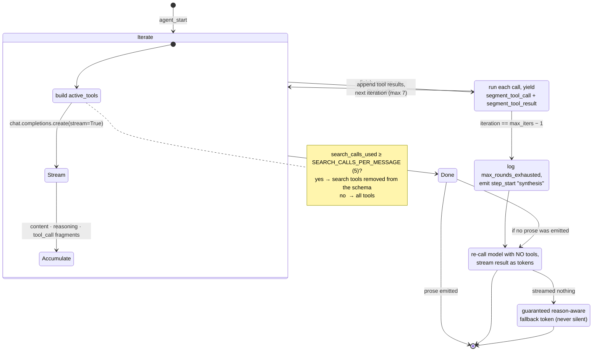
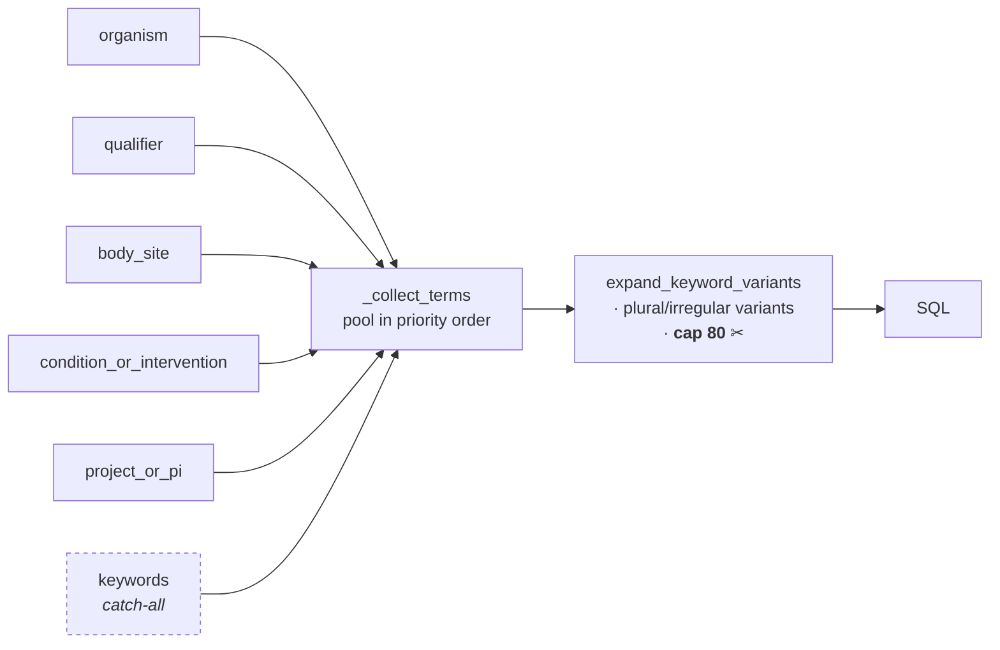

# 05 — The Agent

*How the model is constrained into producing grounded answers, and why the most important constraint is a mutation to the tool schema rather than a sentence in the prompt.*

Prerequisites: [`04-search.md`](04-search.md) — the tools call into the search layer.

---

## The switch

Both chat endpoints always run the agentic tool loop via `stream_agent`. The fork is **which tool schemas** the route passes in:

| Endpoint | `tools=` | Search surface |
|---|---|---|
| Global chat | `TOOL_SCHEMAS` from `agent_tool_schemas.py` | Public Qiita (`search_studies`, `search_by_sample`) |
| Project chat | `PROJECT_TOOL_SCHEMAS` | Local SQLite only (`search_project_studies`) |

Every model in `MODEL_METADATA` supports tool calls, and nothing branches on tool capability — there is no legacy planner/search fallback. (The old `model_supports_tools()` helper and per-model `supports_tools` flag have been removed.)

Project chat is scoped: `_execute_project_tool` rejects global tool names, `/pin` and `/report` gate on current `project_studies` membership, and project-scope pin reads join membership so stale rows never surface.

---


## What `stream_agent` is

`backend/helpers/agent.py :: stream_agent` is a **generator that yields typed dictionaries, not SSE strings**:

```python
stream_agent(messages, *, system_prompt, model, study_context_text,
             scope, chat_id, max_iters=4, deep_search=False)
    -> Generator[dict, None, None]
```

Keeping SSE formatting out of the agent is what allows `backend/agent_harness.py` — an offline CLI driver — to consume the same generator and print to a terminal. The route is the only place that knows about the wire format.

Seven yield types: `agent_start`, `token`, `reasoning`, `segment_tool_call`, `segment_tool_result`, `step_start`/`step_done` (retry, synthesis, overflow recovery) and `context_usage` (what each LLM request held, for the composer's context bar).

A request the provider rejects as too long for the model is compacted and retried once (`helpers/context_fit.py :: OverflowGuard`, wrapped around every LLM call in both loops). See "The context limit" in [`06-streaming-and-chat.md`](06-streaming-and-chat.md).

> `reasoning` **never reaches the browser.** Reasoning-capable models emit `delta.reasoning_content`, and `stream_agent` faithfully yields it as `{"type": "reasoning", ...}`. **No route translates it into an SSE event, and no browser handler exists for it.** The web path silently discards every reasoning token; only `agent_harness.py` consumes them. This is a gap, not a design choice — the plumbing exists on one end and stops halfway. Surfacing it would give users visibility into the model's deliberation at no backend cost.

---

## The loop


```mermaid
stateDiagram-v2
    [*] --> Iterate: agent_start

    state Iterate {
        [*] --> Schema
        Schema: build active_tools
        note right of Schema
            search_calls_used ≥ SEARCH_CALLS_PER_MESSAGE (5)?
              yes → search tools removed from the schema
              no  → all tools
        end note
        Schema --> Stream: chat.completions.create(stream=True)
        Stream --> Accumulate: content · reasoning · tool_call fragments
    }

    Iterate --> Done: finish_reason ≠ "tool_calls"<br/>(model produced prose)
    Iterate --> Execute: finish_reason == "tool_calls"

    Execute: run each call, yield<br/>segment_tool_call + segment_tool_result
    Execute --> Iterate: append tool results,<br/>next iteration (max 7)
    Execute --> Exhausted: iteration == max_iters − 1

    Exhausted: log max_rounds_exhausted,<br/>emit step_start "synthesis"
    Exhausted --> ForcedSynthesis
    Done --> ForcedSynthesis: if no prose was emitted
    Done --> [*]: prose emitted
    ForcedSynthesis: re-call model with NO tools,<br/>stream result as tokens
    ForcedSynthesis --> Fallback: streamed nothing
    ForcedSynthesis --> [*]
    Fallback: guaranteed reason-aware<br/>fallback token (never silent)
    Fallback --> [*]
```


Up to seven iterations. Each one streams a completion, accumulating three things in parallel: prose content, reasoning content, and tool-call fragments — the last reassembled from streamed deltas into `tool_call_map[index] = {id, name, arguments}` by string-concatenating name and argument fragments as they arrive.

The loop exits when `finish_reason != "tool_calls"` or no tool calls were requested. Otherwise it appends the assistant message with its `tool_calls`, executes each call in index order, appends a `{"role": "tool", ...}` message per result, and iterates.

### The search budget

This is the best idea in the codebase, and it is worth understanding as a general technique.

The system prompt tells the model it may call `search_studies` up to five times per message, refining keywords only when results are thin. Prompts are advisory — a model that gets disappointing results will happily search again and again with near-identical terms, burning iterations and latency while producing a worse answer than synthesising what it already has.

So the constraint is not left to the prompt:

```python
def _tools_within_search_budget(tools, search_calls_used):
    if search_calls_used < SEARCH_CALLS_PER_MESSAGE:   # default 5
        return tools
    return [t for t in tools if t.get("function", t)["name"] not in _BUDGETED_SEARCH_TOOL_NAMES]
```

Both loops count *executed* searches — `_execute_tool_call` reports `consumed_search_slot=True` only when a search tool actually ran (an empty-input early return or a crash does not spend a slot). **Once the budget is spent, the search tools cease to exist.** The model is not refused, not scolded, not corrected — the capability is simply absent from the schema it is given on the next round (and a call that slips through anyway short-circuits with "synthesize from the results you have"). There is no failure mode to recover from because there is no failure. The same gating is implemented in the Anthropic path; `tests/agent/test_search_budget.py` pins both the accounting and the schema consequence.

The general principle: *when a constraint matters, encode it in the interface rather than the instructions.* A prompt rule is a request; a schema mutation is a fact. Everything the model cannot do, it cannot attempt.

The bound this buys is concrete: at most one expensive search per turn, so a turn's latency is bounded by one search plus at most four completions.

### Forced synthesis

A tool-calling loop has an ugly failure mode: the model calls a tool, receives the result, and stops — producing a turn whose visible output is a tool card and nothing else. The user sees results with no answer.

```python
if not final_had_synthesis and api_msgs and api_msgs[-1].get("role") == "tool":
    # re-call the model with NO tools and stream the result
```

If the loop ended on a tool message with no prose, the model is called once more **with no tools at all**, and that response streams as tokens. With no tools available, the only thing it can do is answer. The user never sees an empty turn.

Note the interaction with `max_iters`: hitting the ceiling while still requesting tools logs a warning *and* falls into forced synthesis, so exhaustion also degrades into an answer rather than silence.

---


## Two providers, one loop

`get_client(model)` returns `(client, provider)`, and `stream_agent` dispatches to `_stream_anthropic_agent` when the provider is Anthropic. The two implementations are parallel, not shared, because the streaming protocols differ structurally:


| Concern         | OpenAI / NRP-Nautilus                                          | Anthropic                                                     |
| --------------- | -------------------------------------------------------------- | ------------------------------------------------------------- |
| Tool schema     | `{"type":"function","function":{name,description,parameters}}` | `{name, description, input_schema}`                           |
| System prompt   | A message with `role: "system"`                                | A separate `system=` parameter                                |
| Tool arguments  | `delta.tool_calls[].function.arguments` fragments              | `input_json_delta` accumulating `partial_json`                |
| Continue signal | `finish_reason == "tool_calls"`                                | `stop_reason == "tool_use"`                                   |
| Tool results    | `{"role": "tool", "tool_call_id": ...}`                        | A **user** message containing `[{"type":"tool_result", ...}]` |
| Reasoning       | `delta.reasoning_content`                                      | not handled                                                   |


`_openai_tools_to_anthropic` performs the schema translation, so tools are declared once in OpenAI format and rewritten on demand.

A third provider would need: schema translation, system-prompt placement, a streaming accumulator for tool arguments, the stop-signal mapping, the tool-result message shape — and both the search-gating and forced-synthesis behaviours, which are currently duplicated rather than factored out. That duplication is the maintenance cost of this design, and it is real: a fix applied to one path can silently miss the other. TKT-032 tracks consolidating it.

---


## The five tools

Full schemas in [`appendix-c-agent-tools-and-sse.md`](appendix-c-agent-tools-and-sse.md). What follows is why each is shaped the way it is.

### `search_studies` — typed slots, not a query string

The obvious design is one `query` string. This tool instead offers **six typed arrays**:

`organism` · `qualifier` · `body_site` · `condition_or_intervention` · `project_or_pi` · `keywords`

Two concrete problems drove that.

**Problem one: which terms get dropped.** Terms are pooled by `_collect_terms` in a fixed priority order — the order listed above — deduplicated preserving first occurrence. Downstream, `expand_keyword_variants` caps the result at 80 terms. Because `keywords` is pooled **last**, it is what gets truncated first:


```mermaid
flowchart LR
    O["organism"] --> P["_collect_terms<br/>pool in priority order"]
    Q["qualifier"] --> P
    B["body_site"] --> P
    C["condition_or_intervention"] --> P
    PI["project_or_pi"] --> P
    K["keywords<br/><i>catch-all</i>"] --> P
    P --> E["expand_keyword_variants<br/>· plural/irregular variants<br/>· <b>cap 80</b> ✂"]
    E --> S["SQL"]

    style K stroke-dasharray: 4 4
```


A search for a mouse study cannot lose the word "mouse" to a flood of incidental terms. With one flat list, truncation order would be arbitrary.

**Problem two: accidental filtering.** `_collect_terms` returns two lists. `raw_kws` is everything, used for matching. `detect_kws` is **the `keywords` slot only**, and it alone feeds `detect_data_types`, which maps synonyms like "shotgun" onto canonical data types and applies them as an **AND filter**.

The scoping prevents a specific bug. A user asking about *"metagenomics research in captive primates"* has "metagenomics" land in `condition_or_intervention`. If every slot fed type detection, that word would silently add `data_type = 'Metagenomic'` as a hard filter — quietly excluding every 16S study the user wanted. Restricting detection to the explicit catch-all slot means an assay filter is applied only when the user's phrasing put the term there.

`data_types` may also be passed explicitly. `investigation_types` exists but is discouraged in the schema description, because it is sparsely populated (see [`04-search.md`](04-search.md)).

### `get_study_report`

Loads full sample-level metadata for one study and **pins it as a side effect** — the model asking for a report is taken as intent to keep that study in context.

The pin routes through `_pin_studies_validated`, so it respects the cap of 10. But the call is wrapped in a bare `except Exception: pass`: **if the cap rejects the pin, nothing is reported.** The report still renders, the study is silently not pinned, and neither the model nor the user learns why. Worth surfacing.

### `pin_study`

Explicit pinning, capped at 10 per chat. Reports back which IDs were pinned, which were invalid, and which were rejected — unlike the auto-pin path above.

### `search_by_sample`

Structured `{field, value}` filters against sample metadata, for when the user names a field explicitly. Its schema description contrasts it with `search_studies` to steer selection, since the two overlap: `search_studies` always runs a sample probe alongside its text search, so `search_by_sample` is for the case where the *field* is known, not merely the value.

### `compute_diversity`

> **Stub.** `_tool_compute_diversity` always returns a message stating that diversity computation is unavailable pending BIOM/OTU ingestion (TKT-010). **It is present in the live tool schema**, so the model can and does call it — consuming an iteration to receive an apology. Removing it from the schema until it is implemented would be strictly better. Tracked in [`11-roadmap.md`](11-roadmap.md).

---


## Study detail tools (added 2026-10)

Both chats also get ten tools over studies and the user's aggregations: `backend/helpers/study_tools.py`, plus `backend/helpers/aggregation_tools.py` for `add_to_chat_aggregation`, `save_chat_aggregation` and `list_aggregations`. Schemas are `STUDY_TOOL_SCHEMAS` in `agent_tool_schemas.py`, appended to both `TOOL_SCHEMAS` and `PROJECT_TOOL_SCHEMAS`. `execute_tool` routes any name in `STUDY_TOOL_NAMES` to `execute_study_tool` before its scope dispatch. Each tool's result renders as an inline widget in the reply (see [`08-frontend.md`](08-frontend.md)).

| Tool | What the user sees | What the model gets |
|---|---|---|
| `get_study_preps` | Prep table; clicking a prep shows its processing graph beside it | A data-type summary (preps and samples per type) and up to 40 prep rows |
| `show_study_samples` | Sample list with each clicked sample's metadata on the right | Counts, the first 10 ids, the metadata column names — not values |
| `get_sample_metadata` | One sample's metadata card | That sample's preps and `field: value` lines (values ≤ 200 chars) |
| `get_prep_graph` | `ArtifactNetwork` for one prep; a clicked node lists its files | An indented outline of artifacts and jobs (≤ 80 nodes) |
| `list_artifact_files` | Files with download links and full paths | Filenames, file types and ids — **never paths** |
| `add_to_chat_aggregation` | **Writes.** What was added to this chat's aggregation, the new totals, Undo, View | What was added and the totals; "already added — the user can Undo" |
| `save_chat_aggregation` | "Saved as …" with Open ↗ | That it is now in the Sample Aggregation tab |
| `list_aggregations` | The user's saved aggregations and this chat's, each expandable to its studies | Each aggregation's studies, checked rows and filters (≤ 20 aggregations, ≤ 50 studies each) |
| `propose_aggregation_add` | A confirm card for a **saved** aggregation the user named: scope, counts, picker, Add | "Proposal only — nothing was added", counts, the user's saved aggregations |
| `resolve_study` | A "Which study?" picker, when ambiguous | Either the resolved id, or the candidates and an instruction to stop and ask |

**Rules every one follows.**
- **Project gate:** in a project chat the study must be in the project. This is checked before any Qiita read. Every study must also be public (`is_study_public`).
- **Paths:** tool text goes to the LLM provider, so it carries filenames and ids only. Server paths appear only in the widget.
- **Text size:** capped at 6,000 characters, key facts first. Replayed history keeps only 2,000 per tool result.
- **Payloads:** only ids and small scalars. The widget loads its data through the study view's own endpoints and caches. Each payload also carries `result_summary`, the text fallback.
- **Data source:** preps and graphs come from `helpers/study_detail.py`, the same assembly `/api/studies/<id>/detail` returns.
- **`user_id`:** threaded `stream_chat_turn` → `stream_agent` → `_execute_tool_call` → `execute_tool`. Only `propose_aggregation_add` reads it, to list the user's aggregations.

**`resolve_study`** (`helpers/study_resolve.py`) is deliberately cautious. A study is used without asking only when it is the chat's own and the single one that matches the text. "The chat's own" means pinned, or in a project chat any project study. A match is:
- its id;
- the title's acronym, or the start of it ("AGP" ↔ "American Gut Project", and "… Australia" too);
- two or more title or alias words;
- the PI's surname;
- or, when the text names nothing ("show me the samples"), the only chat study.

An explicit "study 10317" in the text is used as is. Everything else becomes a picker:
- matching pins first;
- then public studies whose title acronym the text uses (a memoized title scan; text search can't find "AGP");
- then the Browse text search (the fast pass only).

**`propose_aggregation_add` never writes.** It returns the file filter (data types, plus the per-sample artifacts of the chosen preps), the sample and row counts against the whole study, a suggested target, and why it can't be added (a prep with no per-sample files, or an empty scope). The card's **Add** posts that filter to `POST /api/aggregations/<id>/studies`, which saves it on the study in the same insert.

### This chat's aggregation (added 2026-10-02)

Each chat can hold one **temporary aggregation**. It is an ordinary aggregation with `aggregations.chat_id` / `chat_scope` set, so the Sample Aggregation tab's sample table, filters and export all work on it.

**Lifecycle**
- **Hidden** from the tab's list and from the Browse "+ Aggregate" picker.
- **In the chat:** shown in a bar above the composer (`chat_aggregation_bar.js`).
- **Deleted** with its chat, or with its chat's project, and moved with the chat between scopes.
- **Saving:** `save_chat_aggregation` (or the bar's "Save as…") names it and clears `chat_id`, which makes it a saved one. The next add starts a new temporary one.

**`add_to_chat_aggregation` writes immediately** — a scratchpad doesn't need a confirm card.
- **Scope as artifacts:** a study, its data types or its preps are expressed as per-sample-file artifacts, so repeated adds union. The stored filter is compacted back to data types when the union covers whole types.
- **Refusals change nothing:** an unknown data type or prep, an empty scope, an already-held scope, and the 50-study cap.
- **Undo:** each result carries an undo record, `{was_new, added_artifacts, prev_artifacts, prev_filter}`. Its widget sends it to `POST /api/aggregations/<id>/studies/<sid>/undo-add`, which either removes a newly added study or drops the added artifacts' rows and restores the previous filter.
- **Saved aggregations:** `propose_aggregation_add` is now only for a saved aggregation the user names. "Create an aggregation" in a chat means this chat's temporary one.

## Slash commands force a tool (added 2026-10)

`/preps`, `/graph`, `/files`, `/aggregate` (→ `add_to_chat_aggregation`) and `/aggregations [name]` (→ `list_aggregations`, no study) (`frontend/js/chat_slash.js`; `/samples` and `/sample` were removed 2026-10-02 — their tools remain) send `force_tool {name, args, text}` with the message. `request_utils.parse_force_tool` validates it, and `stream_agent` runs a `ForcedPlan` (`helpers/forced_tool.py`). Each forced round:
- offers only the forced tool's schema;
- **Anthropic:** names it in `tool_choice`;
- **NRP:** sends `tool_choice: "required"`, per `MODEL_METADATA[…]["forced_tool_choice"]`. If a server rejects `tool_choice` with a 400, the round is retried once without it;
- hides the model's text and keeps its call with the forced arguments merged in (forced keys win);
- runs the call even when the server ends it with `finish_reason: "stop"`.

If the model calls nothing, the loop synthesizes the call (id `force_…`, logged `force_tool_synthesized`). A slash command therefore always shows its widget. A hint naming the tool rides on the live user turn and is never saved.

Without a study id the plan is `resolve_study` first:
- **If it resolves:** the next round is forced to the target tool with that `study_id`.
- **If not:** the next round has no tools, so the model can only ask the user to pick.

After the forced rounds every tool is available again and the model comments.

**NRP probe, 2026-10-01:** qwen3-small, deepseek-v4-flash, glm-5 and minimax-m2 all accept `"required"` and the named form, and all return the forced call. The named form ends with `finish_reason: "stop"`. With no `tool_choice`, the single offered tool plus the hint was still enough for all four.

---


## What the LLM does not do

Stated plainly, because the opposite is a reasonable assumption:

**The model never writes SQL.** It emits JSON conforming to a fixed schema. Python reads that JSON and composes parameterized SQL, with every value bound rather than interpolated.

Two properties follow, and the second matters more:

- **Injection is structurally impossible**, not defended against. There is no path from model output to SQL text. The only interpolated values anywhere are table names and `LIMIT`, `int()`-cast and clamped first (see [`04-search.md`](04-search.md); the dead `OFFSET` parameter was removed 2026-08-31).
- **Every query is bounded by construction.** The tool schema caps `limit` at 20; candidate sets are capped at 40 or 500; statement timeouts are attached at the connection. The model cannot express an unbounded query because the vocabulary contains no way to say it.

The cost is expressiveness. Questions the tool set cannot phrase cannot be asked: *"what is the average sample count per data type"*, *"which PIs publish across the most body sites"*, anything requiring aggregation, grouping, or a join the builders do not implement. Users hit this wall, and the answer today is "that query isn't available."

Letting the model author constrained SQL is genuine future work, with a real threat model attached — see [`11-roadmap.md`](11-roadmap.md).

---


## Observability

Each iteration logs time-to-first-token, total elapsed time, content and reasoning lengths, finish reason, and tool-call count. Each tool execution logs its name, elapsed time, and result size, and appends a `· {n}s` suffix to the label the user sees — so tool timing is visible in the UI without opening logs.

**Tool failures do not kill the stream.** `_execute_tool_call` catches exceptions, yields a `"{name} failed"` result segment, and returns the error text *as the tool's content* — so the model receives the failure as an observation and can recover, apologise, or try a different tool. A crashed tool degrades one step rather than the turn.

`backend/agent_harness.py` runs the whole loop from the command line, which is the fastest way to iterate on prompts or tool schemas without a browser — and the only way to observe `reasoning` output.

> `AGENT_DEBUG` **does not affect the server.** Its only reader is `agent_harness.py`. Setting it in the backend's `.env` has no effect on the Gunicorn process — a natural assumption that is wrong, and an easy few minutes lost. Server-side agent logging is whatever `logging.basicConfig(level=INFO)` in `run.py` produces.

---

*See also:* [`06-streaming-and-chat.md`](06-streaming-and-chat.md) *for how these yields become browser state ·* [`appendix-c-agent-tools-and-sse.md`](appendix-c-agent-tools-and-sse.md) *for the full schemas ·* [`04-search.md`](04-search.md) *for what the tools query ·* [`appendix-d-configuration.md`](appendix-d-configuration.md) *for the model roster.*