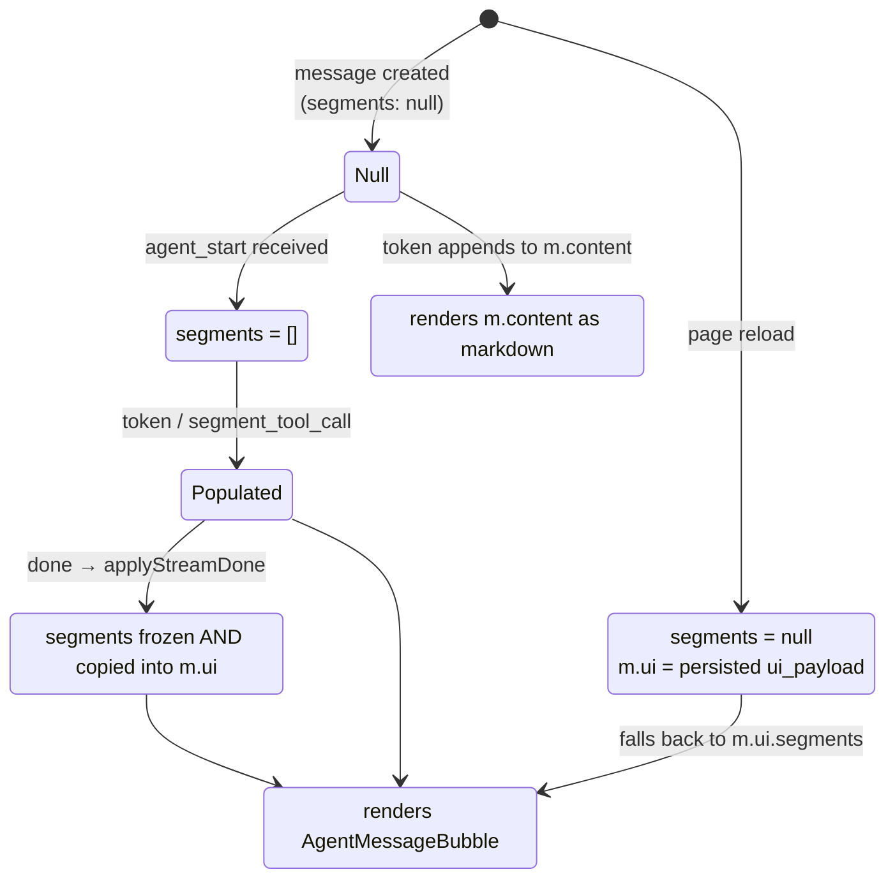
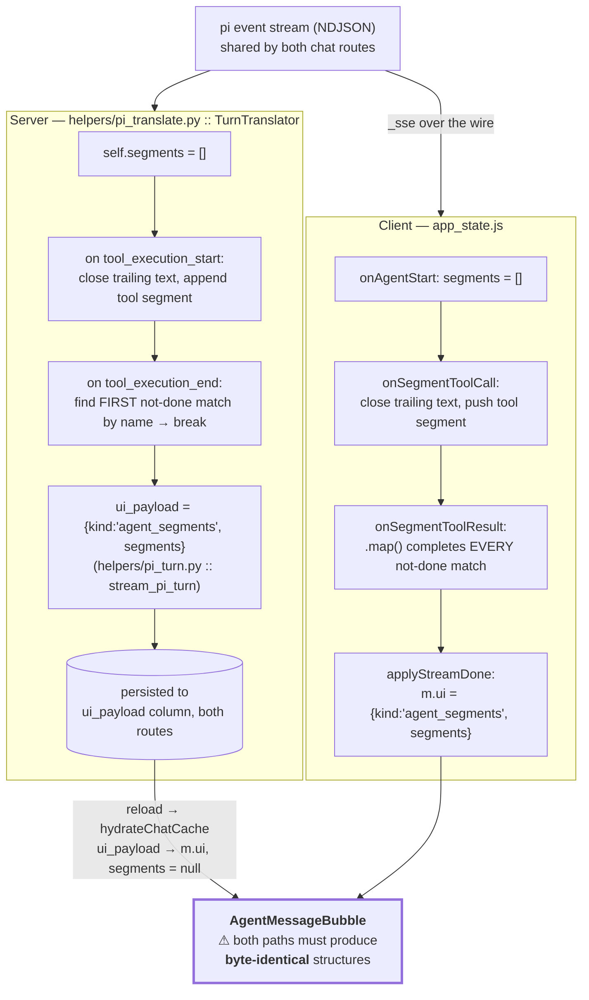

# 06 — Streaming and the Segment Contract

*The wire protocol between the agent loop and the browser — and the one data structure in this codebase that is built twice, by two languages, and must agree exactly.*

Prerequisites: [`05-agent.md`](05-agent.md) — the segments described here are produced by the tool loop.

---

## Two endpoints stream. Nothing else does.

```
POST /api/projects/<pid>/chats/<cid>/message/stream    ← pi-agentic (helpers/pi_turn.py :: stream_pi_turn)
POST /api/global-chats/<cid>/message/stream            ← pi-agentic (same sub-generator)
```

Both routes drive the identical `stream_pi_turn` sub-generator — see [`05-agent.md`](05-agent.md) for what used to fork here (a non-agentic project-chat path and an in-process Python loop, both deleted once pi reached parity) and what still genuinely differs between the two (how each route builds `context_block`).

Every other endpoint in the application is a plain request/response. All SSE frames anywhere are produced by a single function, `backend/helpers/llm_helpers.py :: _sse`:

```python
def _sse(event, payload):
    return f"event: {event}\ndata: {json.dumps(payload)}\n\n"
```

One formatter for the whole app. If the wire format ever needs to change, there is exactly one place to change it.

Both endpoints are wrapped by `sse_response()`, which sets `text/event-stream`, `Cache-Control: no-cache`, and `X-Accel-Buffering: no`. That last header is what nginx forwards (see [`01-architecture.md`](01-architecture.md)) to keep the proxy from buffering the stream.

Bare `: keepalive\n\n` comment frames are emitted between phases. They carry no data; their purpose is to push bytes through any intermediary that is waiting for output before flushing.

### Why not `EventSource`

The browser's built-in SSE client, `EventSource`, **cannot issue a POST**. It is GET-only, so it cannot carry a message body, and its credential handling is more limited than `fetch`. Chat messages need a body — the message text, the model, pinned study IDs, the deep-search flag.

So `frontend/js/utils.js :: parseSSE` is hand-rolled over `response.body.getReader()`: decode each chunk, append to a buffer, split on `\n\n`, and for each complete frame scan lines for `event:` and `data:` prefixes, `JSON.parse` the data inside a try/catch that yields `{}` on failure, then dispatch through a flat handler table. It also honours an `AbortSignal`, which `EventSource` does not expose cleanly.

The buffer-and-split-on-blank-line detail matters: a frame can arrive across two network chunks, and splitting eagerly would corrupt it.

---

## The ten events

| Event | Emitted by | Purpose |
|---|---|---|
| `agent_start` | pi turns | Switches the message into segment mode |
| `segment_tool_call` | pi turns | A tool invocation began |
| `segment_tool_result` | pi turns | That invocation returned |
| `token` | pi turns, and the `/pin` flow | One chunk of assistant text |
| `runtime` | every normal-branch turn, both routes | Names the runtime that served the turn (always `{"runtime": "pi"}`) |
| `step_start` | pi's compaction/retry translation + pin/report flows | A named phase began |
| `step_done` | same | That phase finished |
| `ui` | the `/report` flow | A structured render payload replaces the text body |
| `done` | every branch, both routes | Turn complete; carries title and pinned studies |
| `error` | every branch, both routes | Turn failed; carries a user-facing message |

Exactly ten, and the set is symmetric: every event `_sse` emits has a handler in `parseSSE`, and every handler corresponds to an emitted event.

With one exception, in the other direction. pi emits a **`thinking_delta`** event for reasoning-capable models streaming their chain-of-thought. `helpers/pi_translate.py :: TurnTranslator` has no branch for it, and `parseSSE` has no handler either — it is generated by the model and dropped on the Python side, deliberately, rather than invented as a new SSE event. See [`05-agent.md`](05-agent.md#translation-pis-events-onto-the-fixed-sse-contract).

### Project chat and global chat emit the same event set

There used to be a real asymmetry here: project chat had no agentic branch at all, so it could never emit `agent_start`/`segment_tool_call`/`segment_tool_result`, and the (now-deleted) keyword-planner path on global chat emitted a `query_plan` event project chat never had an equivalent for. Both of those are gone — the non-agentic project-chat path and the keyword-planner path were deleted together with the Python loop. Both routes now drive the identical `stream_pi_turn` sub-generator, and `frontend/js/app_state.js`'s project-chat and global-chat `sendMessage` call sites both spread the same `agentHandlers(chatId)` object (`onToken`, `onAgentStart`, `onSegmentToolCall`, `onSegmentToolResult`, `onRuntime`) — there is no separate handler set for one chat type versus the other any more. `step_start`/`step_done` and `ui` were already shared before this, via the pin and report flows both routes call into.

---

## The segment model

An assistant message is not a string. It is an ordered list of **segments**, each either a run of text or a tool call with its result:

```js
// text segment
{ type: 'text', content: '...', done: false }

// tool segment
{ type: 'tool', name: 'tool_search_studies_tool:1784970149356:aaaaaaaaaaa', label: 'Searching…',
  args: {...}, done: false,
  result: null }   // → { label, detail, ui_payload } when it completes
```

This is what produces the interleaved rendering: prose, then a tool card, then more prose. A flat string could not express it.

`name` is not the tool's name. It is a correlation key, `f"tool_{tool_name}_{tool_call_id}"` (`helpers/pi_translate.py :: _tool_step_name`) — the tool name plus the **full** call id pi assigned that invocation, not a truncated slice. An earlier version used a `[:6]` prefix of the call id, which worked when the provider's ids were high-entropy from the first character; pi's own ids are shaped `"tool:<epoch-ms>:<rand>"`, so a six-character prefix is `"tool:1"` for every call for the next two hundred-odd years, and two calls to the same tool in one turn would collide onto it. Using the full id makes it unique per invocation regardless, and a later section explains why that uniqueness is load-bearing.

### The tri-state

`message.segments` has three meaningful states, and the renderer branches on all three:



| State | Meaning | Renderer |
|---|---|---|
| `null` | Not an agent message | Legacy: markdown of `m.content` |
| `[]` or populated | Live agent message | `AgentMessageBubble` over the array |
| `null` **with** `m.ui.kind === 'agent_segments'` | Hydrated from history | `AgentMessageBubble` over `m.ui.segments` |

The renderer's condition accepts either signal, and its data expression falls back across both:

```js
m.segments !== null || m.ui?.kind === 'agent_segments'      // which branch
segments={m.segments ?? m.ui?.segments ?? []}               // which data
```

That fallback is the entire reason a reloaded conversation looks identical to a live one.

### How segments are built

Four handlers, applied to the last message in the chat:

| Event | Effect |
|---|---|
| `agent_start` | `segments = []`. **This is the switch** from legacy mode to agent mode. |
| `token` | If `segments === null`, append to `m.content` (legacy). Otherwise append to the trailing open text segment, or push a new one. |
| `segment_tool_call` | Mark a trailing open text segment `done`, then push a tool segment. |
| `segment_tool_result` | Find the matching not-done tool segment by `name`; set `done` and attach `result`. |

Every one of these goes through `patchLast`, a functional updater that copies the array but leaves every earlier message referentially identical — so React re-renders one bubble, not the transcript.

---

## The dual-authoring hazard

**This is the most important thing in this document set.** Read it before changing anything in the streaming path.

The segment array is constructed **twice, independently, in two languages**:



The live view comes from the client's construction. The reloaded view comes from the server's. **If the two ever disagree, a conversation renders one way while you watch it and a different way after refresh** — a bug that is invisible in development, since you rarely reload mid-conversation, and obvious to users.

**Moving to pi halved this hazard, not eliminated it.** There used to be a genuinely separate, second Python implementation of the segment-building logic (the streaming SSE path in one function, the persisted-`ui_payload` assembly in another, inside `global_chat_routes.py`, with project chat having no equivalent at all). `helpers/pi_translate.py :: TurnTranslator` is now the single Python implementation — one walk over pi's event stream builds `.segments` as a side effect of the same pass that yields the live SSE frames, and both `chat_routes.py` and `global_chat_routes.py` persist whatever `stream_pi_turn` returns. That closes the *Python-vs-Python* half of the hazard. The diagram above is otherwise unchanged, because the other half never went away: the frontend still has no way to receive the server's already-built segment list before the stream ends, so `app_state.js` still independently re-derives the live view from the same 10 SSE events this document describes. `tests/test_pi_translate.py` is the parity test this section used to ask for — fed a real captured pi event stream rather than a hand-constructed guess — but it only proves the *server* side is internally consistent; it says nothing about whether the client's independent re-derivation agrees with it.

### Current status: they agree

Verified field by field. Both produce:

```json
{"kind": "agent_segments",
 "segments": [
   {"type": "text", "content": "...", "done": true},
   {"type": "tool", "name": "tool_search_studies_tool:1784970149356:aaaaaaaaaaa", "label": "...",
    "args": {...}, "done": true,
    "result": {"label": "...", "detail": "...", "ui_payload": {...}}}]}
```

Same keys, same nesting, same types — including `args`, which is easy to omit on the persistence side and would silently disable the tool card's argument panel after reload.

### One latent asymmetry

The server and client implementations of `segment_tool_result` are **not** semantically identical:

```python
# server (TurnTranslator._close_tool_segment): completes the FIRST match, then stops
for seg in self.segments:
    if seg["type"] == "tool" and seg["name"] == payload["name"] and not seg["done"]:
        seg["done"] = True; seg["result"] = {...}
        break
```

```js
// client: completes EVERY match
segs = segs.map(s =>
  s.type === 'tool' && s.name === name && !s.done ? {...s, done: true, result} : s)
```

With two not-done segments sharing a `name`, the server would complete one and the client both — and the persisted and live renders would diverge.

> **The invariant that makes these equivalent:** the correlation key `name` is built from the **full** `toolCallId` pi assigned the call (`helpers/pi_translate.py :: _tool_step_name`), not a truncated slice of it — so **no two live tool segments ever share a name**, regardless of whether the calls that produced them ran one after another or overlapped. With at most one match, first-match and every-match are the same operation.
>
> This is a stronger guarantee than it used to be, and deliberately so: an earlier version relied on tool calls executing strictly sequentially (so there was only ever one open call to reason about) *plus* a call-id-derived name, and a `[:6]`-prefix scheme that assumed the provider's call ids were high-entropy from the first character. pi's own call ids are shaped `"tool:<epoch-ms>:<rand>"`, where a six-character prefix collapses to the same string for every call in the same era — so `tests/test_pi_translate.py :: test_distinct_calls_to_the_same_tool_do_not_collide` now specifically covers two overlapping calls to the same tool (e.g. two `get_study_report` calls open at once) and asserts each result still finds its own call. Uniqueness no longer depends on sequential execution, only on the full call id being unique, which this codebase does not control but can rely on.
>
> Making the client `break` on first match would remove even the residual dependence on that invariant, at no cost.

### If you change this, change both

A checklist, because the compiler cannot help here:

1. `backend/helpers/pi_translate.py :: TurnTranslator` — the `.segments` assembly, shared by both chat routes.
2. `frontend/js/app_state.js :: onSegmentToolCall`, `onSegmentToolResult`, `onTokenAgent`.
3. `frontend/js/app_state.js :: applyStreamDone` — the freeze into `m.ui`.
4. `frontend/js/app_state.js :: hydrateChatCache` — the `ui_payload` → `ui` rename.
5. `frontend/js/components.js :: AgentMessageBubble` / `ToolCallCard` — the consumers.

Then verify by having a real agentic conversation **and reloading the page**, comparing before and after. Nothing else catches this.

> **What's still missing.** `tests/test_pi_translate.py` closed the server-side half of this — it pins `TurnTranslator`'s segment output against a real captured pi event stream, so a regression in the Python reducer is now caught. What remains missing is a check that the **client's** independent re-derivation in `app_state.js` agrees with it: driving the same recorded event sequence through a JS port of the client's logic and asserting deep equality against the Python output. That cross-language parity test is still the single highest-value test this repo lacks. See [`10-testing.md`](10-testing.md).

---

## Persistence and hydration

On `done`, the server persists the assistant message with `ui_payload` set to the segments object. The frontend independently freezes its own copy:

```js
const frozen = (m.segments || []).map(s => s.type === 'text' ? {...s, done: true} : s);
next.segments = frozen;
next.ui = { kind: 'agent_segments', segments: frozen };
```

Marking every text segment `done` kills the streaming cursor; copying into `m.ui` produces the shape hydration will later supply.

On reload, `hydrateChatCache` renames each message's `ui_payload` to `ui` and **sets `segments: null`** — so hydrated messages take the `m.ui.segments` fallback path described above. It is a no-op if the chat is already cached, so history is fetched once per chat per session.

`done` also carries the chat title and the authoritative pinned-study list, which are reconciled into local state without a refetch. When `pinned_studies` is absent, existing pins are left untouched rather than cleared — the distinction between "no pins" and "not reported" is preserved.

Two other `ui.kind` values round-trip through the same mechanism: `samples_report` (a study report bubble) and `systems_status`.

---

## Cancellation

`abortRef` holds the in-flight stream's `AbortController`. It is aborted at the top of every send — so a new message cancels the previous stream — and on unmount. `parseSSE` checks the signal each loop iteration and stops reading. `AbortError` is filtered out of error reporting, since a deliberate cancel is not a failure.

> **Known defect.** Aborting leaves the cancelled message stuck. The stream ends without a `done` event, so `applyStreamDone` never runs and the message keeps `isStreaming: true` — rendering a spinner indefinitely, until the page is reloaded and the message is re-hydrated from the server. The fix is to finalize the message in the abort path rather than only on `done`.

---

*See also: [`05-agent.md`](05-agent.md) for what produces these events · [`appendix-c-agent-tools-and-sse.md`](appendix-c-agent-tools-and-sse.md) for exact payload shapes · [`08-frontend.md`](08-frontend.md) for the render layer · [`10-testing.md`](10-testing.md) for the missing parity test.*
