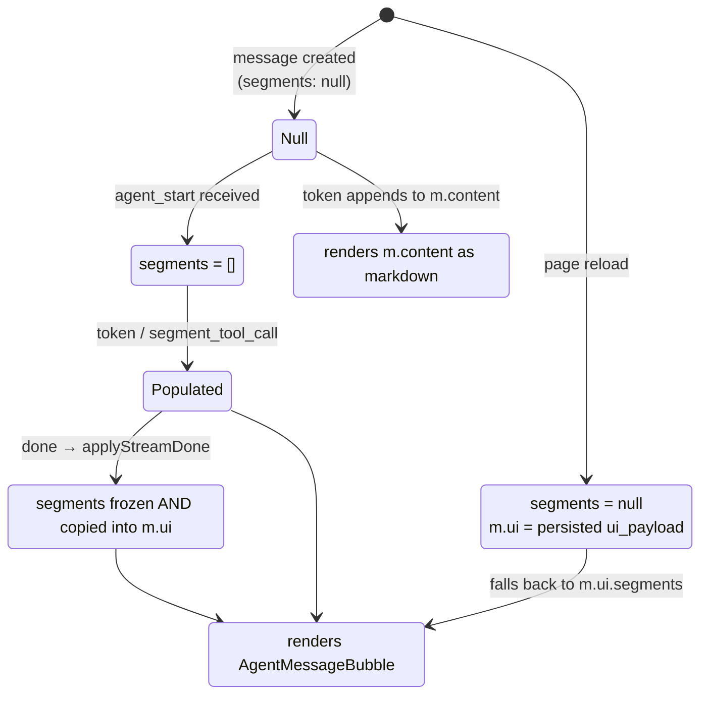
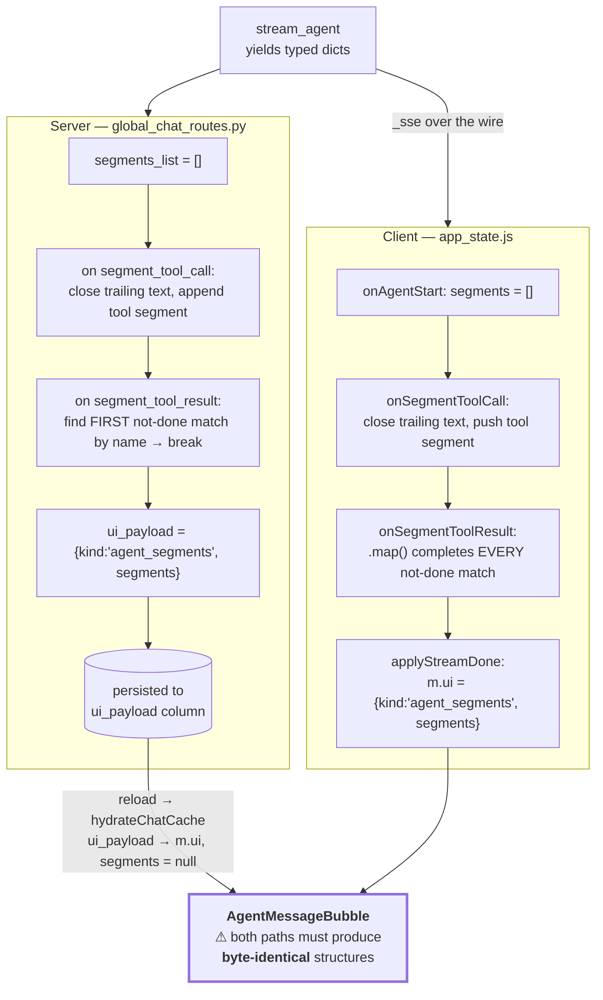

# 06 — Streaming and the Segment Contract

*The wire protocol between the agent loop and the browser — and the one data structure in this codebase that is built twice, by two languages, and must agree exactly.*

Prerequisites: [`05-agent.md`](05-agent.md) — the segments described here are produced by the tool loop.

---

## Two endpoints stream. Nothing else does.

```
POST /api/projects/<pid>/chats/<cid>/message/stream    ← agentic (project-scoped tools)
POST /api/global-chats/<cid>/message/stream            ← agentic (global tools)
```

Every other endpoint in the application is a plain request/response. All SSE frames anywhere are produced by a single function, `backend/helpers/llm_helpers.py :: _sse`:

```python
def _sse(event, payload):
    return f"event: {event}\ndata: {json.dumps(payload)}\n\n"
```

One formatter for the whole app. If the wire format ever needs to change, there is exactly one place to change it.

Both endpoints are wrapped by `sse_response()`, which sets `text/event-stream`, `Cache-Control: no-cache`, and `X-Accel-Buffering: no`. That last header is what nginx forwards (see [`01-architecture.md`](01-architecture.md)) to keep the proxy from buffering the stream.

Bare `: keepalive\n\n` comment frames are emitted between phases. They carry no data; their purpose is to push bytes through any intermediary that is waiting for output before flushing.

### Why not `EventSource`

The browser's built-in SSE client, `EventSource`, **cannot issue a POST**. It is GET-only, so it cannot carry a message body, and its credential handling is more limited than `fetch`. Chat messages need a body — the message text, the model, pinned study IDs, the deep-search flag.

So `frontend/js/utils.js :: parseSSE` is hand-rolled over `response.body.getReader()`: decode each chunk, append to a buffer, split on `\n\n`, and for each complete frame scan lines for `event:` and `data:` prefixes, `JSON.parse` the data inside a try/catch that yields `{}` on failure, then dispatch through a flat handler table. It also honours an `AbortSignal`, which `EventSource` does not expose cleanly.

The buffer-and-split-on-blank-line detail matters: a frame can arrive across two network chunks, and splitting eagerly would corrupt it.

---

## The ten events


| Event                 | Emitted by | Purpose                                                  |
| --------------------- | ---------- | -------------------------------------------------------- |
| `agent_start`         | agentic    | Switches the message into segment mode                   |
| `segment_tool_call`   | agentic    | A tool invocation began                                  |
| `segment_tool_result` | agentic    | That invocation returned                                 |
| `token`               | both       | One chunk of assistant text                              |
| `step_start`          | pin/report/context prep, agent loop (`synthesis`), `llm_retry` (`retry`) | A named phase began (`build_context`, `load_samples`, `synthesis`, …) |
| `step_done`           | pin/report/context prep, `llm_retry` | That phase finished (`synthesis` has no `step_done`; `done` closes it) |
| `ui`                  | both       | A structured render payload replaces the text body       |
| `done`                | both       | Turn complete; carries title and pinned studies          |
| `error`               | both       | Turn failed; carries a user-facing message               |


Exactly nine event types are wired end-to-end: every event `_sse` emits has a handler in `parseSSE`, and every handler corresponds to an emitted event.

With one exception, in the other direction. `stream_agent` yields a `reasoning` type for reasoning-capable models. No route translates it, and `parseSSE` has no handler for it. Reasoning tokens are generated and dropped; only `backend/agent_harness.py` sees them. See [`05-agent.md`](05-agent.md).

### The two endpoints

Both streams use the same agent segment contract. The difference is scope and which preparatory steps run before `stream_agent`:


|                             | Project chat           | Global chat                 |
| --------------------------- | ---------------------- | --------------------------- |
| Agentic path                | always (`PROJECT_TOOL_SCHEMAS`) | always (`TOOL_SCHEMAS`) |
| `agent_start` / `segment_*` | yes                    | yes                         |
| `step_start` / `step_done`  | context prep, pin, report, agent synthesis, retry | pinned_reports, pin, report, agent synthesis, retry |
| Tool search surface         | project SQLite only    | public Qiita DB             |
| Frontend handlers wired     | `onTokenAgent`, segment handlers | same                        |

The frontend mirrors this: both `sendMessage` call sites wire `onTokenAgent`, `onAgentStart`, `onSegmentToolCall`, and `onSegmentToolResult`. `/pin` and `/report` turns on either scope still use the steps/content bubble (`m.steps`, `m.content`) because those branches never enter `stream_agent`.

---


## The segment model

An assistant message is not a string. It is an ordered list of **segments**, each either a run of text or a tool call with its result:

```js
// text segment
{ type: 'text', content: '...', done: false }

// tool segment
{ type: 'tool', name: 'tool_search_studies_a3f91c', label: 'Searching…',
  args: {...}, done: false,
  result: null }   // → { label, detail, ui_payload } when it completes
```

This is what produces the interleaved rendering: prose, then a tool card, then more prose. A flat string could not express it.

`name` is not the tool's name. It is a synthetic identifier, `f"tool_{name}_{call_id[:6]}"` — the tool name plus a slice of the provider's call id. **The call-id suffix makes it unique per invocation**, and a later section explains why that uniqueness is load-bearing.

### The tri-state

`message.segments` has three meaningful states, and the renderer branches on all three:




| State                                            | Meaning               | Renderer                                  |
| ------------------------------------------------ | --------------------- | ----------------------------------------- |
| `null`                                           | Not an agent message  | Legacy: markdown of `m.content`           |
| `[]` or populated                                | Live agent message    | `AgentMessageBubble` over the array       |
| `null` **with** `m.ui.kind === 'agent_segments'` | Hydrated from history | `AgentMessageBubble` over `m.ui.segments` |


The renderer's condition accepts either signal, and its data expression falls back across both:

```js
m.segments !== null || m.ui?.kind === 'agent_segments'      // which branch
segments={m.segments ?? m.ui?.segments ?? []}               // which data
```

That fallback is the entire reason a reloaded conversation looks identical to a live one.

### How segments are built

Four handlers, applied to the last message in the chat:


| Event                 | Effect                                                                                                                         |
| --------------------- | ------------------------------------------------------------------------------------------------------------------------------ |
| `agent_start`         | `segments = []`. **This is the switch** from legacy mode to agent mode.                                                        |
| `token`               | If `segments === null`, append to `m.content` (legacy). Otherwise append to the trailing open text segment, or push a new one. |
| `segment_tool_call`   | Mark a trailing open text segment `done`, then push a tool segment.                                                            |
| `segment_tool_result` | Find the matching not-done tool segment by `name`; set `done` and attach `result`.                                             |


Every one of these goes through `patchLast`, a functional updater that copies the array but leaves every earlier message referentially identical — so React re-renders one bubble, not the transcript.

---


## The dual-authoring hazard

**This is the most important thing in this document set.** Read it before changing anything in the streaming path.

The segment array is constructed **twice, independently, in two languages**:




The live view comes from the client's construction. The reloaded view comes from the server's. **If the two ever disagree, a conversation renders one way while you watch it and a different way after refresh** — a bug that is invisible in development, since you rarely reload mid-conversation, and obvious to users.

### Current status: they agree

Verified field by field while writing this document. Both produce:

```json
{"kind": "agent_segments",
 "segments": [
   {"type": "text", "content": "...", "done": true},
   {"type": "tool", "name": "tool_search_studies_a3f91c", "label": "...",
    "args": {...}, "done": true,
    "result": {"label": "...", "detail": "...", "ui_payload": {...}}}]}
```

Same keys, same nesting, same types — including `args`, which is easy to omit on the persistence side and would silently disable the tool card's argument panel after reload.

### One latent asymmetry

The two implementations of `segment_tool_result` are **not** semantically identical:

```python
# server: completes the FIRST match, then stops
for seg in segments_list:
    if seg["type"] == "tool" and seg["name"] == event["name"] and not seg["done"]:
        seg["done"] = True; seg["result"] = {...}
        break
```

```js
// client: completes EVERY match
segs = segs.map(s =>
  s.type === 'tool' && s.name === name && !s.done ? {...s, done: true, result} : s)
```

With two not-done segments sharing a `name`, the server would complete one and the client both — and the persisted and live renders would diverge.

> **The invariant that makes these equivalent:** the synthetic `name` is suffixed with the provider's call id, so **no two live tool segments ever share a name**. With at most one match, first-match and every-match are the same operation.
>
> This holds today. It would break if tool naming were changed to drop the call-id suffix, or if the same tool were invoked twice concurrently within one assistant turn. The [search budget](05-agent.md) reduces the exposure but does not eliminate it — nothing prevents the model from requesting two `get_study_report` calls in a single turn, and the current loop executes them sequentially, which is what keeps this safe.
>
> Making the client `break` on first match would remove the dependence on that invariant, at no cost.


### If you change this, change both

A checklist, because the compiler cannot help here:

1. `backend/routes/global_chat_routes.py` — the `segments_list` assembly and the persisted `ui_payload`.
2. `frontend/js/app_state.js :: onSegmentToolCall`, `onSegmentToolResult`, `onTokenAgent`.
3. `frontend/js/app_state.js :: applyStreamDone` — the freeze into `m.ui`.
4. `frontend/js/app_state.js :: hydrateChatCache` — the `ui_payload` → `ui` rename.
5. `frontend/js/components.js :: AgentMessageBubble` / `ToolCallCard` — the consumers.

Then verify by having a real agentic conversation **and reloading the page**, comparing before and after. Nothing else catches this.

> **The missing test.** There is no automated check that the two constructions agree. A parity test — drive `stream_agent` with a recorded event sequence, build the segment array with the server's logic and with a port of the client's, assert deep equality — is the single highest-value test this repo lacks. See [`10-testing.md`](10-testing.md).

---


## Persistence and hydration

On `done`, the server persists the assistant message with `ui_payload` set to the segments object. The frontend independently freezes its own copy:

```js
const frozen = (m.segments || []).map(s => s.type === 'text' ? {...s, done: true} : s);
next.segments = frozen;
next.ui = { kind: 'agent_segments', segments: frozen };
```

Marking every text segment `done` kills the streaming cursor; copying into `m.ui` produces the shape hydration will later supply.

On reload, `hydrateChatCache` renames each message's `ui_payload` to `ui` and **sets** `segments: null` — so hydrated messages take the `m.ui.segments` fallback path described above. It is a no-op if the chat is already cached, so history is fetched once per chat per session.

`done` also carries the chat title and the authoritative pinned-study list, which are reconciled into local state without a refetch. When `pinned_studies` is absent, existing pins are left untouched rather than cleared — the distinction between "no pins" and "not reported" is preserved.

The title itself starts as a fast, deterministic truncation of the first message; a background thread (`helpers/chat_title.py`) generates a real title from it during that same turn, and `helpers/chat_turn.py` joins that thread — for at most 5s — right before building the `done` payload, so the LLM title can ride along on the same frame instead of requiring a second round trip. If the join times out, `done` reports the provisional truncation instead, and the LLM title (if it lands afterward) surfaces only on the next reload or chat-list fetch.

Two other `ui.kind` values round-trip through the same mechanism: `samples_report` (a study report bubble) and `systems_status`.

---


## Cancellation

`abortRef` holds the in-flight stream's `AbortController`. It is aborted at the top of every send — so a new message cancels the previous stream — and on unmount. `parseSSE` checks the signal each loop iteration and stops reading. `AbortError` is filtered out of error reporting, since a deliberate cancel is not a failure.

> **Known defect.** Aborting leaves the cancelled message stuck. The stream ends without a `done` event, so `applyStreamDone` never runs and the message keeps `isStreaming: true` — rendering a spinner indefinitely, until the page is reloaded and the message is re-hydrated from the server. The fix is to finalize the message in the abort path rather than only on `done`.

---

*See also:* [`05-agent.md`](05-agent.md) *for what produces these events ·* [`appendix-c-agent-tools-and-sse.md`](appendix-c-agent-tools-and-sse.md) *for exact payload shapes ·* [`08-frontend.md`](08-frontend.md) *for the render layer ·* [`10-testing.md`](10-testing.md) *for the missing parity test.*