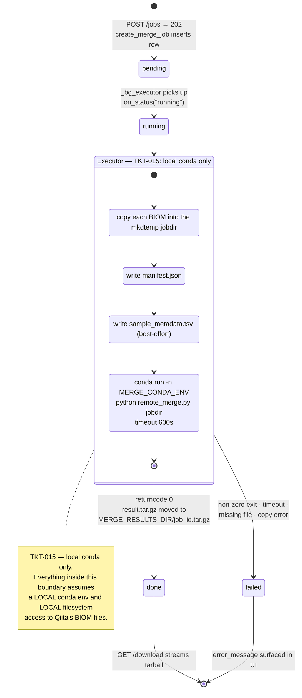
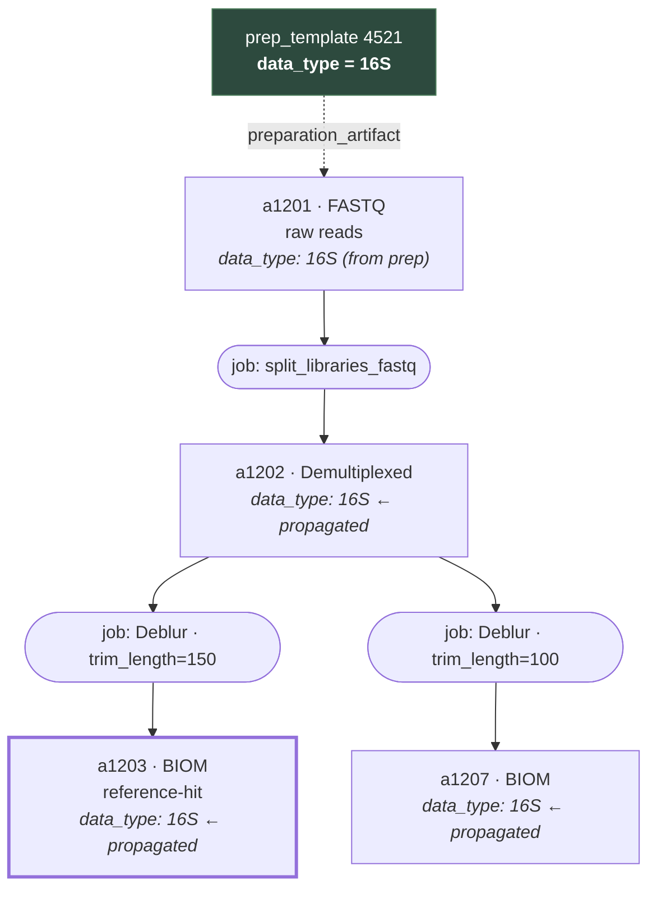

# 07 — Merge and BIOM

*How several Qiita studies become one BIOM table: assembling a workspace, choosing an artifact from a processing graph, validating compatibility, and running the merge out-of-process.*

Prerequisites: [`03-data-access-and-caching.md`](03-data-access-and-caching.md) — the study-detail cache and the cache-through pattern this subsystem leans on heavily.

---

## What the subsystem is for

A **BIOM table** is a feature-by-sample matrix: rows are features (OTUs, ASVs, gene families), columns are samples, cells are counts. Every processed Qiita study produces one or more of them. A researcher who wants to ask a question spanning several studies — does this taxon track this host phenotype across cohorts? — needs those separate tables combined into one, with a matching sample-metadata file, before any downstream tool will touch it.

That combination is what this subsystem does. It is deliberately narrow: it does **not** rarefy, normalize, compute diversity, or run statistics. It produces a merged table, a provenance record, and a metadata TSV, in a tarball. Everything analytical is downstream and out of scope.

The whole flow is organized around a **merge workspace** — a named, user-owned container holding up to five studies and the artifact choices made for each. It persists in SQLite, so a workspace survives a page reload and a server restart.

> Five is a hard cap, enforced in `backend/store/merge_crud.py :: add_study_to_workspace` via `_MAX_STUDIES`. The sixth `POST` returns 400 with an explicit message rather than silently truncating. The cap exists because merge cost and the sample-ID collision surface both grow with study count, and because five studies already exceeds what the validation UI can present legibly.

---

## The user-facing flow

Seven steps, each a distinct endpoint group. The endpoints themselves are catalogued in [`appendix-a-api-reference.md`](appendix-a-api-reference.md) — the 14 in `routes/merge_routes.py` and the 4 in `routes/artifact_routes.py`. This section is about the sequence and where it can stall.

| Step | What the user does | What the backend does |
|---|---|---|
| **1. Open a workspace** | Creates a new one, or picks from the existing list | `create_workspace` mints a 12-char UUID prefix; `list_workspaces` is scoped to `g.user_id` |
| **2. Add studies** | Adds from the browse grid or a study modal | `add_study_to_workspace` snapshots `study_title`, `data_types`, `num_samples` into the workspace row |
| **3. Inspect artifacts** | Expands a study to see its processing tree | `GET /api/studies/<id>/detail` returns `artifact_graph`; the tree renders from it |
| **4. Choose (or accept autopick)** | Ticks BIOM checkboxes, or leaves it alone | `PATCH .../studies/<study_id>` stores `chosen_artifact_ids` as a JSON list |
| **5. Validate** | Nothing — it runs automatically | `GET .../validate` recomputes type intersection, autopick, sample membership, namespace compatibility, and a merge preview |
| **6. Submit** | Clicks Merge | `POST .../jobs` re-validates, snapshots the selection, creates a `pending` job, submits to `_bg_executor`, returns **202** |
| **7. Poll and download** | Watches a spinner | `GET /api/merge-jobs/<job_id>` every 3 s until `done` or `failed`; then `GET .../download` streams the tarball |

Two details of the frontend contract are worth naming. Validation is **not** a button — `merge_workspace.js` recomputes a signature over `(study_id, chosen_artifact_ids)` and re-runs `GET /validate` whenever it changes, so the compatibility banner is always current with the selection. And the Merge button is gated on `validation?.compatible && studies.length >= 2` in `MergeCart`, so a single-study workspace can never be submitted from the UI — though the endpoint itself accepts one study and will happily produce a one-table "merge".

Downloads are plain `<a href>` navigations rather than `fetch` calls. They are `GET`, so they carry the session cookie and need no CSRF token — see [`02-authentication.md`](02-authentication.md).

### Job lifecycle



Three states only — `pending`, `running`, `done`/`failed` — and no cancellation. `finally` always removes the temp jobdir, whichever way the job ended.

---

## Why artifacts need a graph

A Qiita study does not have "a BIOM file". It has a **processing tree**: raw sequence data at the root, and a branching lineage of derived artifacts produced by processing jobs. Picking the right node in that tree is the whole problem.

The tree matters for a second, less obvious reason. A prep template — the record describing how a set of samples was prepared and sequenced — carries the `data_type` (`16S`, `ITS`, `Metagenomic`, …). But the prep is linked to the *root* of the processing lineage. A BIOM sitting four levels down is not itself linked to a prep in the `preparation_artifact` sense that would give it a data type. **Its data type is only knowable by walking up to an ancestor that has one.**

`backend/helpers/artifact_graph.py :: fetch_artifact_graph` solves this by walking *down* instead. It issues five queries on a dedicated psycopg2 connection, builds the node set, then breadth-first-propagates `data_type` from every prep-linked root to all of its descendants:

```python
node_dt = {f"a{aid}": dt for aid, dt in art_to_dt.items()}   # prep-linked seeds
queue = list(node_dt.keys())
while queue:
    nid = queue.pop(0)
    dt  = node_dt.get(nid)
    for cnid in kids.get(nid, []):
        if cnid not in node_dt and dt:
            node_dt[cnid] = dt
        queue.append(cnid)
```

A realistic lineage, with the propagation shown:



Without propagation, `a1203` and `a1207` carry no data type, and every downstream decision — namespace compatibility, type filtering, autopick — has nothing to key on. With it, the whole subtree is typed from a single prep row.

Two further properties of the graph builder:

**It never raises.** `fetch_artifact_graph` wraps `_build` in a bare `try/except`, logs with `logger.exception`, and returns `[]`. A study whose graph fails to build renders an empty tree rather than a 500. The frontend has a matching fallback: `ArtifactOutputsView` in `merge_artifacts.js` falls back to a flat 20-row artifact table when `artifact_graph` is empty or absent.

**It uses a dedicated connection, not the shared pool and not `TRN`.** Its module docstring says why: the five queries are dependent and want a consistent view, and it is called from background threads where the `TRN` singleton would interleave with other requests. This is the third of the three PostgreSQL access mechanisms described in [`01-architecture.md`](01-architecture.md).

### Two artifact lists, not one

This is a real source of confusion, so state it plainly. There are **two** independently-built artifact lists in play:

| Source | Built by | Used by | Coverage |
|---|---|---|---|
| `artifact_graph` | `artifact_graph.py :: fetch_artifact_graph` | The tree UI, Smart Select, `_resolve_artifact_file` | All artifacts in `qiita.study_artifact`, with parent edges, job nodes, per-file lists, and propagated `data_type` |
| `artifacts` (flat) | `qiita_fetch.py :: _fetch_study_detail_from_qiita` | `merge_helpers.py :: _get_artifacts` → autopick, validate, submit | Prep-joined only, `LIMIT 500`, one row per artifact, `data_type` taken directly from the prep |

Both are cached in `study_detail_cache`, in different columns (`artifact_graph_json` and `artifacts_json`). The user selects from the first; the backend resolves from the second.

> **Consequence worth knowing.** If a BIOM appears in the graph but not in the flat list, an explicit user selection of it is silently discarded. `merge_helpers.py :: _resolve_artifact` and the submit handler both do `chosen = [a for a in artifacts if a["artifact_id"] in chosen_ids]`, and on an empty result fall through to `autopick_artifact(...)` with no warning. The merge then runs on a *different* artifact than the one the user ticked. Not observed in practice — the two lists largely coincide — but the fallback is silent by construction, and worth a ticket.

---

## Choosing an artifact: autopick

When the user has not made an explicit choice, `backend/helpers/biom_autopick.py :: autopick_artifact` picks one. It first narrows to artifacts whose `artifact_type` is `BIOM`, then applies a data-type-specific heuristic — attributed in the docstring to a domain expert rather than derived from the data:

| Data type | Rule | Scoring |
|---|---|---|
| **16S** | Prefer Deblur at 150 bp | `deblur` **and** `150` in name/path → 2; `deblur` alone → 1; otherwise 0 |
| **Metagenomic** / **WGS** | Prefer the final table | `biom_final` in name/path → 1; otherwise 0 |
| Everything else | Newest wins | `generated_timestamp` only |

Ties break on `generated_timestamp` in every branch, since the score and the timestamp are compared as a tuple.

The matching is **substring matching over `prep_name + full_path`, lowercased**. That is a heuristic on a filename, not a read of processing parameters — a pipeline that names its output differently will score 0 and fall back to "newest". `autopick_reason` produces the human-readable string shown in the UI ("Deblur + 150 bp (preferred for 16S)") from exactly the same substring checks, so the explanation and the decision cannot drift apart.

Type filtering happens before autopick, in `merge_helpers.py :: _type_filtered_artifacts`, and it has a deliberate softening: if filtering to the common namespace leaves nothing, it returns the **unfiltered** list rather than nothing. A study with mislabeled or missing data types still yields a candidate instead of blocking the workspace.

### Namespace grouping and compatibility

`_namespace()` collapses raw data-type strings into canonical merge namespaces:

| Raw `data_type` | Namespace |
|---|---|
| `16s` | `16S` |
| `18s` | `18S` |
| `its`, `its1`, `its2` | `ITS` |
| `metagenomic`, `wgs` | `Metagenomic` |
| `metatranscriptomic` | `Metatranscriptomic` |
| anything else | passed through, or `Unknown` |

`studies_type_intersection` takes one comma-separated `data_types` string per study, maps each to its namespace set, discards `Unknown`, and intersects. An empty intersection is a hard stop, returned by both `GET /validate` and `POST /jobs` before any artifact work happens.

`check_namespace_compatibility` then produces the findings the UI displays. Only one condition is an **error**; the rest are warnings:

| Condition | Severity | Message |
|---|---|---|
| Selected BIOMs span more than one namespace | **Error** — `compatible: false` | "Selected BIOMs are of different data types: …" |
| Two studies share sample IDs | Warning | "…share N sample ID(s): […]. Shared IDs will be collapsed during merge." |
| A sample ID exceeds 63 characters | Warning | "…exceeding 63 characters (HDF5 label limit); they may be truncated." |

The 63-character warning is about HDF5, not BIOM: HDF5 dimension labels have a length limit, and BIOM v2 is HDF5 underneath. The collision warning matters because `biom.Table.merge` unions sample axes — two studies that independently named a sample `sample1` produce **one** column in the output, not two.

Note the `explicit_only` flag. `GET /validate` passes `explicit_only=True`, so the namespace check covers only studies where the user actually chose an artifact. Autopicked artifacts are excluded on the grounds that the user has not committed to them. `POST /jobs` uses the default (`False`) and checks everything that is about to be merged. The practical effect: **a workspace where nothing has been explicitly chosen validates as compatible with an empty `namespace_groups`**, because there is nothing to disagree. The real check happens at submit.

---

## TKT-023 — autopick ignores biological compatibility

> **Known defect.** Artifact selection filters on `data_type` namespace and nothing else. Two 16S preps amplified over **different hypervariable regions — V3 versus V4 — pass every check and are merged into a single feature table.** The result is biologically meaningless, and nothing in the pipeline says so.

### The mechanism

`check_namespace_compatibility` reduces each selected artifact to `_namespace(artifact["data_type"])`. For an amplicon study that value is the string `16S`. Every 16S prep in Qiita maps to that one namespace regardless of which region of the gene was actually amplified, which primers were used, or which platform sequenced it. One namespace, zero errors, `compatible: true`.

Three fields that would catch the problem are never read:

| Field | Where it lives | What it would prevent |
|---|---|---|
| `prep_template.deprecated` | Prep row | A prep the submitter has explicitly retired being selected for a merge |
| `prep_template.current_human_filtering` | Prep row | Human-read-filtered data being merged with unfiltered data — different effective read sets |
| `target_gene`, `target_subfragment`, `platform` | Per-sample `sample_values` JSONB (Qiita duplicates prep-level fields onto every sample row) | Primer, region, and instrument mismatches |

None are in `_fetch_study_detail_from_qiita`'s artifact query, so they are not in the artifact dicts, so `biom_autopick` could not check them even if it wanted to. This is a data-plumbing gap as much as a logic gap.

### Why the V3/V4 case is not a technicality

The 16S rRNA gene has nine hypervariable regions. A study amplifies a subset — V4 with the 515F/806R primer pair, or V3–V4 with 341F/805R, and so on. The sequence a study observes is the amplified region, and nothing else.

Two consequences follow, and both defeat the merge:

**The feature spaces do not overlap.** A V4 ASV and a V3 ASV from the *same organism* are different DNA sequences. Under any sequence-derived feature ID — a Deblur ASV hash, a de novo OTU — they are two distinct features. `biom.Table.merge` unions the feature axis by ID, so it stacks them: the same taxon appears twice, in disjoint rows, each present in only one study's samples. The merged table is block-diagonal by construction, and every cross-study comparison reduces to comparing presence in study A against structural absence in study B.

**Taxonomic resolution differs by region.** Regions discriminate taxa unevenly — a genus separable in V3 may collapse in V4, and vice versa. Even after mapping to a shared reference taxonomy, per-region assignment rates and error profiles differ. A difference in observed community composition between the two study groups is then indistinguishable from a difference in what the two primer sets can see. The confound is perfectly aligned with the study variable, which is the worst possible arrangement.

The failure is silent in both directions: the merge succeeds, the tarball downloads, and the provenance records feature and sample counts that look entirely plausible.

### What a fix has to do

- Carry `deprecated`, `current_human_filtering`, `target_gene`, `target_subfragment`, and `platform` through `qiita_fetch.py :: _fetch_study_detail_from_qiita` into the artifact dicts.
- Exclude `deprecated` preps from autopick candidates by default; allow explicit override with a warning.
- Treat a `target_gene` / `target_subfragment` mismatch across selected artifacts as an **error**, the same class as a namespace mismatch — not a warning, because the output is unusable rather than merely caveated.
- Treat mixed `current_human_filtering` and mixed `platform` as errors and warnings respectively; platform differences are a real batch effect but not a disjoint feature space.
- Extend `autopick_reason` so the UI states the region it selected, making a mismatch visible before validation runs.

Tracked as TKT-023 in `TICKETS/tickets.md`; see [`11-roadmap.md`](11-roadmap.md).

---

## Validation

`GET /api/merge-workspaces/<id>/validate` is the read-only dry run behind the compatibility banner. It computes five things in order, and bails at the first hard stop.

**1 — Study-level type intersection.** `studies_type_intersection` over the stored `data_types` strings. With more than one study and an empty intersection, it returns immediately with `compatible: false` and an error telling the user to pick studies sharing a data type. No artifact work happens.

**2 — Per-study artifact resolution.** For each slot, `_get_artifacts(study_id)` (cache-through against `study_detail_cache`), then `_resolve_artifact` — explicit choice if present, otherwise autopick over the type-filtered candidates.

**3 — True per-BIOM sample membership.** For each resolved artifact with a path, `get_biom_sample_ids(artifact_id, full_path)`. This is the step that makes validation meaningful: a study's *sample template* may list samples that never made it into a given BIOM, having been dropped at demultiplexing or filtering. The counts and overlaps shown are read from the actual file. On any exception it degrades to `_get_sample_ids(study_id)`, the sample-template list from cache.

**4 — Namespace compatibility.** `check_namespace_compatibility(..., explicit_only=True)`, producing `compatible`, `namespace_groups`, `warnings`, `errors`.

**5 — Merge preview.** Only when at least two studies resolved to a non-empty sample list. `biom_samples.py :: compute_merge_preview` folds the per-study ID sets:

| Field | Meaning |
|---|---|
| `total_unique` | Size of the union — the sample count the merged table will actually have |
| `per_study` | `[{study_id, num_samples}]` — contribution before deduplication |
| `overlap_count` | Sum of per-study sizes minus the union size — samples that will collapse |

`overlap_count` is the number the user is meant to react to. A non-zero value means the merged table has fewer columns than the inputs sum to, and the sample-ID collision warning explains which studies collided.

An explicit `sample_filter` on a slot overrides BIOM membership. It is stored as a JSON string, parsed defensively, and falls back to BIOM membership if it will not parse.

---

## Running a merge job

`POST /api/merge-workspaces/<id>/jobs` re-does the validation work rather than trusting the last `GET /validate` — workspace state may have changed between the two calls. It then rejects any study with no BIOM artifact, or an artifact with no `full_path`, with a 400 naming the study.

It builds a **workspace snapshot**: one entry per chosen artifact, carrying `study_id`, `artifact_id`, `artifact_path`, and `sample_ids`. The snapshot is persisted into the `merge_jobs` row as JSON (see [`appendix-b-sqlite-schema.md`](appendix-b-sqlite-schema.md)), so a job records exactly what it ran on even if the workspace is edited or deleted afterward. Note that a study contributing multiple chosen artifacts produces multiple snapshot entries, while the namespace check only examines the *first* chosen artifact per study.

The job row is created `pending`, the work is submitted to `_bg_executor`, and the endpoint returns **202** immediately.

### The executor

`backend/helpers/merge_executor.py :: run_merge_job` is a blocking function designed to run inside a `ThreadPoolExecutor` worker. Its only channel back to the world is the `on_status(status, error=None, result_path=None)` callback the route closes over.

1. `mkdtemp(prefix=f"merge_{job_id}_", dir=MERGE_RESULTS_DIR)` — the working directory lives inside the results directory.
2. `on_status("running")`.
3. Copy each BIOM into the jobdir as `{study_id}_{artifact_id}.biom`, resolving relative paths against `QIITA_BASE_DATA_DIR`, and record the local filename on the snapshot entry as `biom_file`.
4. Write `manifest.json` — `{job_id, studies: [...]}`.
5. Write `sample_metadata.tsv` — best-effort, described below.
6. `subprocess.run(["conda", "run", "--no-capture-output", "-n", MERGE_CONDA_ENV, "python", _SCRIPT_PATH, str(jobdir)], capture_output=True, text=True, timeout=600)`.
7. Log stdout at INFO and stderr at WARNING, line by line, tagged `[merge:{job_id}]`.
8. `result.check_returncode()` — a non-zero exit raises.
9. `shutil.move(jobdir/"result.tar.gz", MERGE_RESULTS_DIR/f"{job_id}.tar.gz")`, then `on_status("done", result_path=...)`.

Any exception anywhere — a missing source file, a failed copy, the 600-second timeout, a non-zero exit — lands in one `except`, logs a traceback, and calls `on_status("failed", error=str(e))`. The `finally` block always `rmtree`s the jobdir, so a failed job leaves no debris and no artifacts to post-mortem beyond the log lines already emitted.

The subprocess is invoked as an **argument list, never a shell string**, so nothing in a path or environment value can be interpreted as shell syntax.

### What `remote_merge.py` does

`scripts/remote_merge.py` is a standalone script with no backend imports — it reads only its `jobdir` argument and the manifest inside it, which is what makes the eventual move to a remote host tractable. It loads each BIOM with `biom.load_table`, applies the per-entry `sample_ids` filter if present, raises if a filter leaves a table with zero samples, and folds the tables with `Table.merge`. It writes `merged.biom` as HDF5, rewrites `sample_metadata.tsv` to keep only rows whose sample ID survived into the merged table, writes `provenance.json` (`job_id`, `study_ids`, `feature_count`, `sample_count`, `merged_at`, `includes_sample_metadata`), and tars all three into `result.tar.gz`. Exit 0 on success, 1 with a traceback on failure.

### The metadata TSV and `"not applicable"`

`_write_merged_sample_metadata` builds one metadata table spanning studies that were never designed to share a schema. Study A records `host_age` and `bmi`; study B records `host_age` and `collection_device`. A single TSV needs a single header.

The resolution is a union with a literal filler:

```python
cols = sorted(all_keys)
writer.writerow(["#SampleID"] + cols)
for r in all_rows:
    writer.writerow([r["sample_id"]] + [r["fields"].get(c, "not applicable") for c in cols])
```

Every field key seen in any study becomes a column; any sample lacking that field gets the string `"not applicable"`. This follows the QIIME/Qiita convention for a value that is structurally absent rather than merely unmeasured, and it keeps the file rectangular.

Two things to hold onto. **`"not applicable"` is a string, not a null** — a downstream tool that reads the column naively will type it as categorical, and a numeric column with any gap becomes a mixed-type column. And **the whole step is best-effort**: any per-study fetch failure is logged and skipped, and if no rows survive, the function returns `False` and the merge proceeds with no metadata file at all. `provenance.json` records this as `includes_sample_metadata: false`, which is the only signal that anything was lost.

### Where jobs actually run

`_bg_executor` is a `ThreadPoolExecutor(max_workers=4)` created per Gunicorn worker process. With four workers that is 16 background slots in total, but they are **not a shared queue** — a job submitted while serving on worker 2 runs on worker 2's pool and is invisible to the other three.

The consequence is stated in [`01-architecture.md`](01-architecture.md) and is worth repeating here: **a worker restart mid-job orphans it.** The job row sits at `running` with nothing driving it, no reaper marks it `failed`, and the frontend polls it every three seconds indefinitely. There is no timeout sweep over `merge_jobs` and no startup reconciliation. A job stuck in `running` after a deploy is almost certainly this, and the only recovery is to resubmit.

Two related gaps in job-state handling:

- `update_merge_job_status` writes `error_message` and `result_path` unconditionally, so every transition overwrites both with whatever was passed — `None` included. The current call ordering makes this harmless, but a future intermediate status that omits `result_path` would erase it.
- The snapshot persisted by `create_merge_job` is written *before* the executor adds `biom_file` to each entry. The stored JSON and the manifest that actually ran therefore differ, and any future retry-from-row path must re-derive those filenames rather than assume them.

### Reading a failure

`error_message` on the job row is `str(exc)` from whatever raised, and the subprocess's own stderr is already in the Gunicorn log under `[merge:{job_id}]`. The common cases map cleanly:

| Symptom | Likely cause | Where to look |
|---|---|---|
| `FileNotFoundError` naming a `.biom` path | Qiita's data directory is not mounted on the API host | TKT-015 — the copy step, before any subprocess runs |
| `No such file or directory: 'conda'` | `conda` absent from the service process `PATH` | TKT-015 — environment of the Gunicorn unit |
| `CalledProcessError` exit 1 | `remote_merge.py` raised; the traceback is in the log at WARNING | The `[merge:…]` stderr lines |
| `no samples remain after filter` | A `sample_filter` selected IDs absent from the chosen BIOM | The slot's `sample_filter` versus `biom_sample_cache` |
| `TimeoutExpired` | The merge exceeded 600 s | Table sizes; the timeout is a fixed constant, not configurable |
| Stuck at `running`, never resolving | The worker holding the job restarted | Orphaned job — no reaper exists; resubmit |

---

## TKT-015 — the merge executor is dev-only

> **Known defect.** The executor shells out to a **local** `conda run` against a **local** filesystem. On any deployment where the API server is not the machine holding Qiita's BIOM files and the `qiita` conda environment, every merge job fails. The module docstring's TODO — replace the local path with a paramiko SFTP+SSH pipeline — was never done, and the code reached master anyway.

### The mechanism

Step 6 of the executor is:

```python
cmd = ["conda", "run", "--no-capture-output",
       "-n", MERGE_CONDA_ENV, "python", _SCRIPT_PATH, str(jobdir)]
result = subprocess.run(cmd, capture_output=True, text=True, timeout=600)
```

That single call assumes four things about the host serving HTTP requests:

| Assumption | Fails when |
|---|---|
| `conda` is on `PATH` of the Gunicorn process | The service runs under a systemd unit or container with a minimal environment |
| An env named `$MERGE_CONDA_ENV` (default `qiita`) exists with `biom-format` and `h5py` | The API host is a plain app server |
| `scripts/remote_merge.py` is on local disk at a path derived from `__file__` | The backend is deployed without the `scripts/` sibling directory |
| Every `artifact_path` in the snapshot is readable by `shutil.copy2` | Qiita's data directory is on another machine, or an unmounted share |

Step 3 fails before the subprocess is even reached in the last case, which is the most likely one: the paths come from Qiita's `data_directory.mountpoint`, which is meaningful on the Qiita compute host and nowhere else.

### The deployment boundary, stated plainly

**Do not demo the merge feature on barnacle expecting it to work, and do not treat a successful local merge as evidence the path is production-ready.** Merge is functional exactly where the API process, the `qiita` conda environment, and Qiita's BIOM storage are all on the same machine with the same filesystem view. That is the developer's setup and is not guaranteed anywhere else.

The failure is at least loud. Every branch converges on `on_status("failed", error=str(e))`, the message is stored on the job row and rendered by `MergeJobStatus`, and stderr from the subprocess is already in the logs. Nothing corrupts and nothing hangs beyond the 600-second timeout — a wrong-host deployment produces failed jobs with readable errors, not silent garbage.

### What a fix looks like

The TODO names the shape: keep `run_merge_job`'s signature and the `on_status` interface, and replace only the internals with SFTP upload of the jobdir, `ssh exec` of `remote_merge.py` on the compute host, and download of `result.tar.gz`. The design already anticipates this — `remote_merge.py` imports nothing from the backend and communicates purely through `manifest.json` and files in a directory, so it can be dropped onto a remote host unchanged.

The alternative the ticket allows is to make local-only mode explicit: preflight `conda`, the env, the script, and the readability of each `artifact_path` at submit time, and return a 400 that says which prerequisite is missing rather than accepting a job that will fail two seconds later.

Tracked as TKT-015 in `TICKETS/tickets.md`; see [`11-roadmap.md`](11-roadmap.md).

---

## File access safety

Two endpoints stream files from disk: `download_artifact_file` and `download_merge_result`. Both are places where a path-traversal bug would be severe, and both are structured to make one hard.

### `_resolve_artifact_file`

`backend/routes/artifact_routes.py :: _resolve_artifact_file` is the gate for artifact downloads. Its central property is that **the request never supplies a path**. The client sends `study_id`, `artifact_id`, and `filepath_id` — three integers, all coerced by Flask's `int` converter or `type=int`. The function then:

1. Loads the study's artifact graph from `study_detail_cache`, falling back to a live `fetch_artifact_graph(study_id)`.
2. Finds the node with `kind == "artifact"` and the matching `artifact_id`, raising `ValueError` if the artifact is not in *this study*.
3. Finds the filepath entry with the matching `filepath_id` within that node, raising if absent.
4. Reads `full_path` from that entry — a value that originated in `qiita.data_directory.mountpoint` joined to `qiita.filepath.filepath`, never from the request.
5. `os.path.realpath` — collapses `..` and resolves symlinks, so the check applies to the true destination.
6. `os.path.isfile` — rejects directories and non-existent paths.
7. Rejects any resolved path under `_FORBIDDEN_ROOTS = ('/etc/', '/proc/', '/sys/', '/dev/', '/root/')`.

Every `ValueError` becomes a **403** with the message, so a caller cannot distinguish "artifact not in study" from "file missing on disk" by status code alone.

Steps 1–4 are the real defense; steps 5–7 are defense in depth against a malformed database row or a symlink planted in Qiita's storage. Worth being clear about what the forbidden-roots list is and is not: it is a **denylist**, and a denylist is strictly weaker than an allowlist rooted at `QIITA_BASE_DATA_DIR`. It exists because the graph-derived path is already trusted; it catches a plainly wrong value rather than constraining an attacker-controlled one. If path construction ever moves closer to user input, this check must be replaced by an allowlist prefix test, not extended.

### Merge result downloads

`download_merge_result` never touches user-supplied paths at all. It fetches the job with `get_merge_job(job_id, g.user_id)` — **owner-scoped in the `WHERE` clause**, so another user's job returns 404 rather than leaking its existence — then checks `status == "done"`, then checks `os.path.exists(result_path)`. `result_path` was written by the executor as `MERGE_RESULTS_DIR/{job_id}.tar.gz` and is never client-influenced. The download name is regenerated server-side as `merge_{job_id}.tar.gz`.

This owner scoping is the same pattern used throughout the store layer; see [`02-authentication.md`](02-authentication.md) for the tenancy guarantee it implements. Note that the merge subsystem's workspace endpoints follow it consistently — `get_workspace`, `list_workspaces`, `list_merge_jobs`, and the `_workspace_owned` guard inside the mutation helpers all filter on `user_id`. `update_merge_job_status` does not, but it is called only from the executor closure with a server-generated `job_id`.

---

## Caching

The merge path touches three caches, one of which is unusual.

| Cache | Where | TTL | Scope |
|---|---|---|---|
| `study_detail_cache` (`artifacts_json`, `artifact_graph_json`) | SQLite | 6 hours | Shared across workers |
| `biom_sample_cache` | SQLite | **Never expires** | Shared across workers |
| `_study_header_cache` | Process memory | 1 hour | Per worker |

### Why `biom_sample_cache` is permanent

`backend/helpers/biom_samples.py :: get_biom_sample_ids` is cache-through against a table keyed on `artifact_id`, with columns `num_samples`, `sample_ids_json`, and `cached_at` — and `cached_at` is **recorded but never read**. There is no expiry check and no invalidation path.

The justification is a property of the data model, not an optimization shortcut: **Qiita artifacts are immutable.** Reprocessing produces a *new* artifact with a new ID and a new node in the graph; it does not rewrite an existing BIOM in place. So the set of sample IDs in artifact 1203 is a fixed fact about artifact 1203, and a cached answer cannot go stale. The cost of being wrong would be high — the alternative is re-opening an HDF5 file on Qiita's storage on every validation, every sample-browser page, and every batch sample-count call.

The read itself avoids the heavy path where it can:

```python
import h5py
with h5py.File(resolved, "r") as f:
    return [s.decode() if isinstance(s, bytes) else s for s in f["sample/ids"][:]]
```

One dataset, read directly out of the HDF5 file. `biom.load_table` — which parses the whole table, including the counts matrix nobody needs here — is the `except` fallback for files the direct read cannot handle.

The cache is only ever written, never invalidated or pruned. Its growth is bounded by the number of distinct BIOM artifacts a deployment's users have inspected, and each row holds a full JSON array of sample IDs, so a heavily-used instance accumulates real bytes. See [`03-data-access-and-caching.md`](03-data-access-and-caching.md) for how this fits the wider caching strategy, and [`appendix-b-sqlite-schema.md`](appendix-b-sqlite-schema.md) for the table definition.

---

*See also: [`03-data-access-and-caching.md`](03-data-access-and-caching.md) for the study-detail cache and cache-through patterns · [`appendix-a-api-reference.md`](appendix-a-api-reference.md) for the 18 merge and artifact endpoints · [`appendix-b-sqlite-schema.md`](appendix-b-sqlite-schema.md) for `merge_workspaces`, `merge_workspace_studies`, `merge_jobs`, and `biom_sample_cache` · [`11-roadmap.md`](11-roadmap.md) for TKT-015 and TKT-023.*
