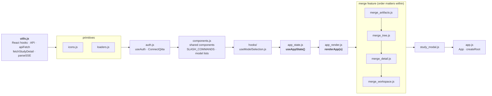
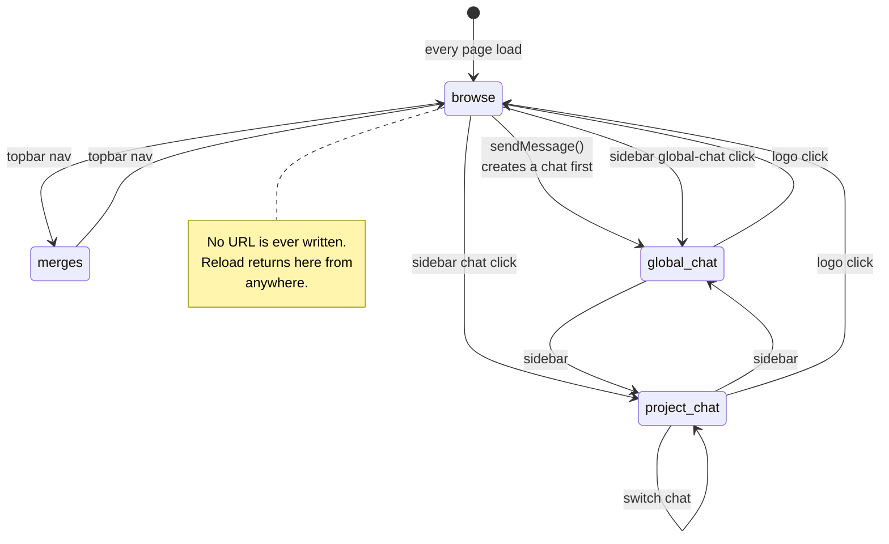
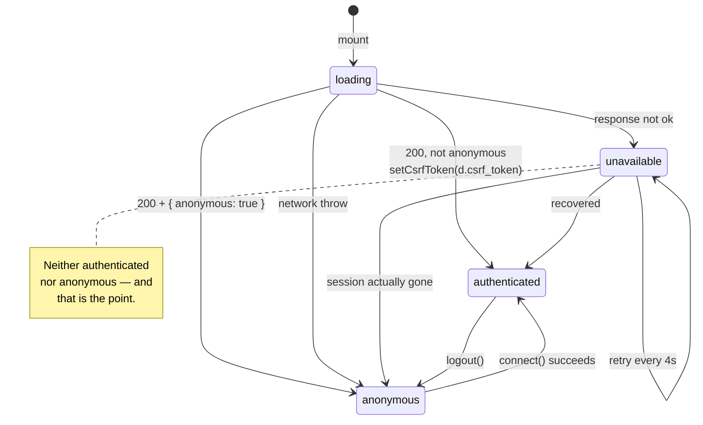

# 08 — Frontend

*How a browser turns fourteen unbundled script tags into an application, why one hook holds all the state, and the two things this design cannot do.*

Prerequisites: [`06-streaming-and-chat.md`](06-streaming-and-chat.md) — the SSE event protocol and the segment model. This chapter deliberately does not re-derive them.

---

## No build step

There is no bundler, no `package.json`, no `node_modules`, and no compile artifact. `frontend/index.html` loads React 18 UMD, `marked`, `DOMPurify`, and `@babel/standalone` from CDNs, and then lists every application file as a `<script type="text/babel">`. Babel transpiles the JSX **in the browser, on every page load**.

```html
<script src="https://unpkg.com/@babel/standalone@7.23.10/babel.min.js"></script>
<script type="text/babel" src="js/utils.js?v=5"></script>
<script type="text/babel" src="js/icons.js?v=1"></script>
<!-- … twelve more … -->
```

There are no ES modules. No file has an `import` or an `export`. Every function, every constant, and every component lands in one shared global lexical scope, and each file reaches the previous file's definitions by name.

**What this buys.** QiitaExplore is a research console for a small group, served as static files by nginx (production) or a Live Server extension (development). Editing `app_render.js` and hitting reload is the entire iteration loop. There is no watch process to keep alive, no dependency tree to resolve, no lockfile to reconcile, and nothing to install before a new person can change the UI. For a tool with this deployment story, that is a real reduction in operational surface.

**What it costs.** Around 6,000 lines of JSX are parsed and transpiled client-side on every cold load, before the first paint. There is no type checking, no linting, no tree shaking, and no minification — the browser downloads the source as written, comments included. A syntax error in any one file surfaces as a runtime console error at load time rather than at edit time, and because the files share a global scope, that error can leave later files' globals undefined in ways that look like unrelated component crashes.

**The exit.** TKT-020 proposes an *optional* production precompile: a `build.sh` running `@babel/cli` over `frontend/js/` into a single hashed bundle, selected by a separate `index.prod.html`, with the no-build development path left exactly as it is. It is explicitly additive. Nobody has to install anything to keep working the way they work today. See [`11-roadmap.md`](11-roadmap.md).

### The API base, and why `127.0.0.1`

`index.html` carries a `<meta name="api-base">` tag that `frontend/js/utils.js` reads at load time, falling back to a hardcoded default if the tag is missing. It currently points at port **5002** with a revert-to-5001 TODO — the repo's development-port convention described in [`01-architecture.md`](01-architecture.md), not a mistake.

The host in that URL is load-bearing, and `index.html` documents why in a comment longer than most of the file. **A browser treats** `127.0.0.1` **and** `localhost` **as different sites.** The session cookie set by `POST /api/auth/connect` is `SameSite=Lax`. If the page is served from `127.0.0.1` and the API base says `localhost`, every authenticated fetch becomes cross-site, the cookie is withheld, and the application presents as permanently logged out with no error message that points at the cause. Both sides must agree, which is also why the development SSH tunnel is specified as `ssh -L 127.0.0.1:5002:localhost:5002` and why that exact origin must appear in barnacle's `QIITA_EXPLORE_ALLOWED_ORIGINS`.

---


## Load order is the dependency graph

With no module system, **the order of the script tags in** `index.html` **is the only thing enforcing dependencies.** Moving a tag up or down is a breaking change. Several files carry a header comment naming the globals they expect to already exist — `frontend/js/study_modal.js` and `frontend/js/merge_tree.js` both open with one.

The single most consequential line in the whole frontend is the first line of `frontend/js/utils.js`:

```js
const { useState, useEffect, useRef, useMemo, useCallback } = React;
```

That one destructure is why every later file can call `useState(...)` bare, without a `React.` prefix and without importing anything. It is also why `utils.js` must load first. (A few components still write `React.useState` explicitly — `ModelPickerCard`, `SamplesBrowser` — which works identically and is harmless inconsistency.)




Arrows read *"defines globals consumed by"*. The chain is close to linear because the load order is literally sequential; the merge files form a sub-chain of their own (`merge_artifacts.js` defines `prepReachableSet` and `ArtifactOutputsView`, which `merge_tree.js` and `study_modal.js` both consume).

### File inventory


| File                                     | Lines | Purpose                                                                                                              |
| ---------------------------------------- | ----- | -------------------------------------------------------------------------------------------------------------------- |
| `frontend/index.html`                    | 46    | Script tags, CDN dependencies, `api-base` meta, cache-bust versions                                                  |
| `frontend/style.css`                     | 1885  | Every style in the application. Tokens, layout, dark theme                                                           |
| `frontend/js/utils.js`                   | 86    | Global hook destructure, `API`, `apiFetch`/`apiPost`/`apiPatch`/`apiDel`, CSRF token, `fetchStudyDetail`, `parseSSE` |
| `frontend/js/icons.js`                   | 60    | Five inline stroke SVG components (`ChevronIcon`, `MergeIcon`, `SunIcon`, `MoonIcon`, `BoltIcon`)                    |
| `frontend/js/loaders.js`                 | 235   | Canvas-drawn loading animations (`InfinityLoader`, `HelixLoader`, `WreathLoader`)                                    |
| `frontend/js/auth.js`                    | 179   | `useAuth`, `ConnectQiita`, `LegacyClaimBanner`, `AccountBar`                                                         |
| `frontend/js/components.js`              | 684   | Shared components — samples browser, prep/artifact tables, agent bubbles, model picker, slash menu                   |
| `frontend/js/hooks/useModelSelection.js` | 30    | Model choice with per-chat and global `localStorage` persistence                                                     |
| `frontend/js/app_state.js`               | 633   | `useAppState()` — the whole application state and every action                                                       |
| `frontend/js/app_render.js`              | 601   | `renderApp(s)` — sidebar, topbar, browse grid, chat transcript, composer                                             |
| `frontend/js/merge_artifacts.js`         | 354   | Artifact graph filtering, BIOM cards, pipeline breadcrumb, global BIOM selector                                      |
| `frontend/js/merge_tree.js`              | 291   | Provenance forest — org-chart and indented-list renderers                                                            |
| `frontend/js/merge_detail.js`            | 404   | Study summary card, sample peek, merge preview/validation, job status and history                                    |
| `frontend/js/merge_workspace.js`         | 438   | `MergeWorkspacePanel`, `MergeStudySlot`, `MergesTab`                                                                 |
| `frontend/js/study_modal.js`             | 305   | `StudyModal` plus the add-to-project / add-to-merge bars                                                             |
| `frontend/js/app.js`                     | 38    | `App` (auth gate), `AuthenticatedApp`, `ReactDOM.createRoot`                                                         |


### Cache busting is manual

Every script tag carries a hand-maintained query string — `js/app_render.js?v=18`, `style.css?v=39`. The version numbers are unrelated to each other and are bumped by whoever edits the file.

The failure mode is the obvious one, and it is worth naming because it costs debugging time: **if you change a file and forget to bump its `?v=`, returning users keep running the cached old copy.** Your machine, which reloaded during development with the cache disabled, shows the fix working. Theirs does not. The symptom is a bug report describing behaviour that no longer exists in the source, and the first diagnostic step is a hard reload rather than a code read. There is no automation guarding this — no content hash, no build step to compute one — which is one more thing TKT-020 would incidentally fix.

---


## State: one mega-hook

`frontend/js/app_state.js :: useAppState` is the entire client state layer. It is one function, it calls roughly forty `useState` hooks and four `useRef`s, and it returns a flat object of **96 keys**: setters, values, refs, action functions, and memoised derived values, all in one namespace.

There is no context provider, no reducer, no store library, and no state colocation. `frontend/js/app_render.js :: renderApp` opens by destructuring 91 of those 96 keys in one statement and threads them down as props.

The buckets, roughly:


| Bucket        | Representative keys                                                                                                |
| ------------- | ------------------------------------------------------------------------------------------------------------------ |
| Projects      | `projects`, `projLoading`, `openProjId`, `openProject`, `projInnerTab`, `projDetailLoading`                        |
| Navigation    | `view`, `sidebarCollapsed`, `topTitle`                                                                             |
| Chats         | `chatCache`, `globalChats`, `chatLoading`, `activeMsgs`, `lastContent`                                             |
| Browse/search | `query`, `results`, `firstStudies`, `searching`, `searched`, `sqlQuery`, `showSql`, `deepSearch`, `displayStudies` |
| Composer      | `input`, `sending`, `compErr`, `slashMatches`, `slashIndex`, `slashDismissed`, `canSend`, `taRef`                  |
| Model         | `selectedModel`, `showModelPicker`, `anthropicKeySet`                                                              |
| Merge         | `mergeWorkspaceId`, `showMergePanel`, `pendingMergeStudy`                                                          |
| Modal         | `modalStudy`, `modalDetail`, `modalDetailLoading`                                                                  |
| Presentation  | `theme`                                                                                                            |


**Why it works at this size.** Every action needs several of these at once, and most of them are genuinely global — `view` and `chatCache` and `openProject` are read by the sidebar, the topbar, the transcript, and the composer simultaneously. Splitting them into providers would mean either a provider per bucket with cross-bucket actions reaching through several `useContext` calls, or one provider holding the same object, which is what already exists minus a layer. There is exactly one consumer (`renderApp`), so prop drilling is one level deep. The pattern is legible: to find where anything is set, open one file and search.

**What it costs.** `useAppState` is called from `AuthenticatedApp`, which renders `renderApp(s)` — so **any state change anywhere re-renders the entire application tree.** Typing one character into the composer updates `input`, which re-renders the sidebar, the study grid, and every message in the transcript. React's reconciler makes this survivable rather than free, and it becomes measurable in long chats with many rendered `SamplesReportBubble` sections. Nothing is memoised at the component level; the only `useMemo` calls guard derived values inside the hook, not subtree renders.

The secondary cost is that a 96-key return and a 91-key destructure must be kept in agreement by hand. They currently are: five keys are returned and never destructured (`loadProjects`, `fetchProjectDetail`, `loadGlobalChats`, `loadFirstStudies`, `lastContent`), and nothing is destructured that is not returned. `lastContent` exists only to drive a scroll effect inside the hook; the four loaders are called internally on mount. They are dead weight in the return value, not bugs.

**The exit** is TKT-036, which proposes splitting `app_state.js` into `sse_helpers.js`, expanded `loaders.js`, `search_helpers.js`, and `chat_actions.js`, leaving a ~200-line hook. Some of the groundwork has already landed — `useModelSelection` was extracted (TKT-033), and the project-chat and global-chat `sendMessage` branches were deduplicated behind a shared `streamChat`. The file split itself is unstarted, and `app_state.js` remains over the repo's 500-line cap at 633.

### `chatCache`

One object, keyed by chat ID, holding every chat opened this session:

```js
chatCache[chatId] = {
  messages,               // [{role, content, isStreaming, steps, segments, ui, …}]
  title,                  // string; also mirrored into the sidebar list
  pinnedStudies,          // [studyId] — server-authoritative after each turn
  totalStudiesInProject,  // for the "N of M studies in context" hint
  ctxStudies,             // [study] — global chats only, seeded from Browse
}
```

Both project chats and global chats share this one map, keyed by chat ID alone, which is why `view` has to carry `projId` separately — the cache cannot tell you which project a chat belongs to.

`ctxStudies` is the one field that is **session-only**. It is written when a chat is created from the Browse view (carrying the pinned study chips forward) but `hydrateChatCache` never restores it from the server, because the server does not persist it. Reload the page and reopen that chat and the context bar is empty, even though the studies were sent with the original message. Pinned studies, which *are* persisted, are the durable mechanism.

---


## Routing that isn't

Navigation is a tagged union in a single state variable:

```js
{ type: 'browse' }
{ type: 'merges' }
{ type: 'project-chat', projId, chatId }   // chatId may be null
{ type: 'global-chat',  chatId }           // chatId may be null
```

`renderApp` switches on `view.type` and the derived `isChat` flag. That is the whole router.




The `browse → global-chat` transition is the interesting one. Sending a message from Browse is not a navigation the user asks for: `sendMessage` sees `view.type === 'browse'`, creates a global chat, snapshots the current `ctxStudies` into its cache entry, clears them, and rewrites `view` — all before the first network call for the message itself.

### The limitation

**Nothing about** `view` **is reflected in the URL.** There is no `history.pushState`, no hash, no query parameter, and no `popstate` listener anywhere in the frontend. That has three consequences that are worth stating as product limitations rather than as technical debt, because they are what a user actually experiences:

- **You cannot link to anything.** There is no way to send a colleague "look at this chat" or "this study's provenance tree" or "this merge workspace". The only way to share a result is a screenshot or a copy-paste. For a tool whose purpose is collaborative interpretation of shared datasets, this is a meaningful gap.
- **The browser Back button leaves the application.** It does not return to the previous chat, because no history entry was ever pushed. It navigates away entirely, and everything not persisted server-side — `ctxStudies`, scroll position, the whole `chatCache` — is gone. Users learn to avoid Back, which is a bad thing to have to learn.
- **Reload always lands on Browse.** Refreshing while reading a chat loses your place; you must find the chat in the sidebar again. On slower connections this compounds, because the sidebar itself has to reload before you can navigate.

The fix is not large in principle — `view` is already a serialisable tagged union, so it maps cleanly onto a path like `/p/:projId/c/:chatId`, and a `popstate` handler that calls `setView` would restore Back. The reason it has not been done is that the frontend is served as a static file with no server-side rewrite rule, so real paths would 404 on direct load and a hash-based scheme would be needed instead. That is a deployment change, not a React change.

---


## The no-refresh pattern

This is the most distinctive idea in the frontend, and it is a stated rule in `CLAUDE.md` rather than an emergent habit.

> **The invariant.** After any mutation, splice the server's response body into local React state. Never re-fetch to discover what changed.

Every mutating endpoint is designed to return the new state of the thing it mutated — the updated project, the created chat, the current pinned-study list. The client's job is to put that where it belongs. The result is that adding a study, creating a chat, deleting a chat, and pinning a study all render instantly, with no spinner and no visible reload of the sidebar. Four examples, and the reasoning behind each.

### 1. `optimisticAppend` — two messages, one setState, zero network

When a message is sent, `frontend/js/app_state.js :: optimisticAppend` pushes **both** the user's message and an empty assistant placeholder into the cache in a single state update, before any request is made:

```js
messages: [
  ...c.messages,
  { role: 'user',      content: userMsg },
  { role: 'assistant', content: '', isStreaming: true,
    steps: [], pendingStep: null, queryPlan: null, segments: null },
]
```

Both are needed up front. The user's message must appear the instant Enter is pressed. The assistant placeholder must exist before the first SSE frame arrives, because every subsequent streaming update is a mutation of *the last message in the array* — there is no code path that creates the assistant message lazily on first token. It also gives the loading indicator somewhere to live: an assistant message that is `isStreaming` with no content yet renders a loader.

Note the `|| { messages: [], title: userMsg.slice(0, 60) }` fallback. Sending into a chat that is not in the cache creates the entry rather than dropping the message.

### 2. `patchLast` — the smallest possible streaming update

```js
const patchLast = (chatId, fn) =>
  setChatCache(prev => {
    const c = prev[chatId];
    if (!c) return prev;
    const msgs = [...c.messages];
    msgs[msgs.length - 1] = fn(msgs[msgs.length - 1]);
    return { ...prev, [chatId]: { ...c, messages: msgs } };
  });
```

Three properties earn their keep. It is a **functional updater**, so it composes correctly with the dozens of updates a single token stream produces without reading a stale `chatCache` from a closure. It returns `prev` unchanged when the chat is gone — deleting a chat mid-stream is a no-op rather than a crash. And it copies exactly one array and one object per call, leaving every other chat's entry referentially identical, so React can skip them.

Every streaming handler is built on it: token accumulation, step markers, the error path, and the segment builders described in [`06-streaming-and-chat.md`](06-streaming-and-chat.md).

### 3. Creating a chat — seed the cache, then prepend to the list

`createGlobalChatAndSeed` and `createProjChatAndSeed` do the same two things in the same order:

```js
const chat = await res.json();
setChatCache(prev => ({ ...prev, [chat.chat_id]: { messages: [], title, … } }));
setGlobalChats(prev => [chat, ...prev]);   // or: patch openProject.chats
```

**Seeding the cache first is what makes the subsequent** `setView` **safe.** The moment `view.chatId` points at the new chat, `renderApp` reads `chatCache[view.chatId]` for the title, the pinned-study bar, and the transcript. If the entry did not exist yet, the chat would render as empty-and-unknown for a frame, and `hydrateChatCache` would fire a pointless fetch for a chat the client has itself created and knows to be empty.

Prepending to `globalChats` (or to `openProject.chats`) rather than calling `loadGlobalChats()` is the invariant proper. A re-fetch would work, but it costs a round trip during which the sidebar is stale, and it re-renders the whole list.

Deletion is the mirror image: `delete` the cache key, filter the list, and reset `view.chatId` to `null` if the deleted chat was the one on screen.

### 4. `pinStudy` — optimistic, then reconcile

Pinning writes the new ID into `pinnedStudies` immediately, then awaits the request, and *then* overwrites the local array with the server's `pinned_studies` if the response carried one:

```js
setChatCache(/* optimistic: append studyId */);
const res = await apiPost(`…/pinned/${studyId}`, {});
if (res?.ok) {
  const data = await res.json();
  if (data.pinned_studies) setChatCache(/* replace with server list */);
}
```

The optimistic step exists for feedback — the chip appears on click. The reconcile step exists because the server enforces a cap of 10 pinned studies per chat, and it may also have pins the client does not know about. The client's guess is a prediction; the server's list is the truth, and the truth wins as soon as it arrives. `unpinStudy` does the optimistic half only, since removal cannot exceed a cap.

Both swallow network errors in a bare `catch (_) {}`, which means a failed pin leaves the UI showing a chip that does not exist server-side until the next hydrate. That is a real, if minor, divergence from the invariant.

---


## Lazy fetching and request de-duplication

The Qiita PostgreSQL database is slow enough that avoiding a request is worth real complexity. Three mechanisms do it.

### `hydrateChatCache` — one fetch per chat per session

```js
const hydrateChatCache = async (type, projId, chatId) => {
  if (chatCache[chatId]) return;
  …
};
```

The first line is the whole design. Opening a chat you have already opened this session is free — no request, no loading state, and your scroll position and expanded sections are exactly where you left them. Reopening only re-fetches after a page reload.

`openProjChat` and `openGlobChat` each check the same condition again before setting `chatLoading`, so the spinner does not flash for a cached chat. On hydrate, persisted `ui_payload` values are lifted onto `m.ui` and `segments` is initialised to `null`, which is the flag that puts a message on the legacy rendering path — see [`06-streaming-and-chat.md`](06-streaming-and-chat.md) for what that distinction means.

The guard reads `chatCache` from the render closure, so two clicks on the same uncached chat within one render cycle can start two fetches. Both write the same data, so the consequence is a duplicated request rather than a wrong result.

### `fetchStudyDetail` — a result cache *and* an in-flight cache

`frontend/js/utils.js` keeps two module-scope maps:

```js
const _studyDetailCache    = new Map();  // studyId → resolved detail
const _studyDetailInflight = new Map();  // studyId → pending promise
```

The second one is the important one, and the reason it exists is a specific observed pathology. A single agent turn can render several `SamplesReportBubble` components at once, each of which calls `ensureDetail()` on mount for prep and artifact tables. Open the study modal for one of those studies and that is another caller. With only a result cache, all of them would miss simultaneously — the first request has not resolved yet, so there is nothing to hit — and fire N parallel `/studies/<id>/detail` requests for the same study. Each of those runs several dependent queries against a database where a single study's detail can take seconds, against a connection pool of 8 per worker (see [`01-architecture.md`](01-architecture.md)).

Returning the pending promise instead collapses all of them into one request whose result every caller awaits. The in-flight entry is cleared in a `finally`, so a failure does not poison the key.

Two behaviours follow from where the cache write sits:

- **A 404 maps to** `{ isPrivate: true }` rather than throwing. Qiita returns 404 for studies the user cannot see, and that is a legitimate state to render — `StudyModal` shows a "private study" panel instead of an error. It is a normal result, not a failure.
- That mapping happens **before** the `_studyDetailCache.set`, so private studies are never cached and re-request on every open. Errors are likewise uncached, which is correct; the private case is an oversight of the same code path.

`openStudyModal` holds an `AbortController` to guard its `setState` against a stale modal, but does not pass the signal down into `fetchStudyDetail`. That is the right call given the shared cache — aborting a coalesced request would cancel it for every other component awaiting the same promise.

### Lazy sub-section mounts

Detail is not fetched with the thing that might display it. `PrepsTable` and `ArtifactsTable` both take an `onMount` callback and fire it from a `useEffect` with an empty dependency array, and `CollapsibleSection` renders `children` only while open. Together that means a collapsed "Prep Templates" section never mounts its table, so `ensureDetail()` never runs, so no request is made — until you actually expand it. The `detailReqRef` guard inside `SamplesReportBubble` makes the callback idempotent across the two sections that share it.

The same principle is not applied on the merge page, where `MergesTab` fetches full detail for every workspace in parallel on mount and `GlobalBiomSelector` fans out unbounded study-detail fetches on Smart Select. That is TKT-012.

---


## Auth in the UI

`frontend/js/auth.js :: useAuth` is a four-state machine over a single `GET /api/auth/me`.




### Why `unavailable` is its own state

The backend returns **503 with the session row untouched** when it cannot re-verify a stored PAT against the control plane because the control plane is momentarily unreachable — the transient branch documented in [`02-authentication.md`](02-authentication.md). The frontend has to have a state that corresponds to it, and collapsing it into either neighbour is wrong in a specific way:

- **Treating it as** `authenticated` would run the whole application against an identity the backend has explicitly declined to vouch for. Every subsequent request would fail anyway, and the user would see a working-looking UI that errors on contact.
- **Treating it as** `anonymous` would drop the user onto the paste-your-PAT screen. Their session is *fine*; nothing was revoked. They would go find a token, paste it, and obtain a session they already had — because a service they do not know exists restarted.

So `unavailable` renders its own screen ("Reconnecting to Qiita…") and `App` schedules `refresh` on a 4-second timer for as long as the state holds. When the control plane comes back, the next `/auth/me` succeeds and the user continues with no action taken. A backend restart is a few seconds of a reconnecting spinner rather than a re-authentication for everyone.

Note the asymmetry in `refresh`: a non-ok *response* yields `unavailable`, but a thrown fetch (backend entirely unreachable, DNS failure, CORS rejection) yields `anonymous`. The reasoning is that a response, even a bad one, proves the backend is reachable and answering; a throw does not, and the connect screen is the more useful thing to show someone whose backend is not there at all.

### The ordering guarantee

`frontend/js/app.js` splits the tree in two, and the split exists for one reason:

```js
function AuthenticatedApp({ identity, onLogout, onClaimDone }) {
  const state = useAppState();     // ← only reachable once auth resolved
  return <>…{renderApp(state)}</>;
}
```

`useAppState` fires four requests on mount — `/projects`, `/global-chats`, `/studies/first`, `/settings`. Because `AuthenticatedApp` is a separate component that `App` returns only in the `authenticated` branch, `useAppState` **is never called at all** in the other three states. Not called-and-discarded; not mounted. React cannot run a hook belonging to a component it never renders.

Doing this with a conditional inside one component would be a Rules-of-Hooks violation. Doing it with an `if (!authenticated) return` guard inside every loader would be four guards to maintain and one to forget. The component boundary makes it structural: the four requests cannot fire before there is a session, and a 401 storm on first load is impossible by construction.

### No token storage

Nothing durable is written. There is no bearer token, no `localStorage` entry, no `sessionStorage` entry, and no auth material in any URL.

- **The session** is a `SameSite=Lax` cookie. `apiFetch` sets `credentials: 'include'` on **every** request, so it rides along automatically and no call site does anything auth-specific.
- **The CSRF token** lives in a module-scope `let _csrfToken` in `frontend/js/utils.js`, written by `setCsrfToken` from the `/auth/me` or `/auth/connect` response body. `apiFetch` attaches it as `X-CSRF-Token` **only** when the method is one of POST, PUT, PATCH, DELETE. A cross-site page can make the browser send the cookie but cannot read the response body that carries the token.
- **The PAT** exists only as the `token` value in `ConnectQiita`'s `useState`, is POSTed once, and is cleared with `setToken('')` on the success path *and* both failure paths. It is never persisted anywhere.

Full server-side treatment is in [`02-authentication.md`](02-authentication.md).

---


## Rendering layers

Four tiers, distinguished by what they know about.

`components.js` **— knows nothing about the application.** Everything here takes props and returns markup: `SamplesBrowser`, `PrepsTable`, `ArtifactsTable`, `CollapsibleSection`, `InlineStudyCard`, `SamplesReportBubble`, `SystemsStatusBubble`, `AgentMessageBubble`, `ToolCallCard`, `ToolResultWidget`, `ModelPickerCard`, `PlusMenu`, `SlashCommandMenu`, `PinnedBar`. Several hold their own local state — a filter string, an expanded flag, a split-pane percentage — but none reach into `useAppState`. This is also where two registries live that other files consume by name: `SLASH_COMMANDS` and the `_NRP_MODELS` / `_CLAUDE_MODELS` lists. At 684 lines it is the largest JS file and over the repo cap (TKT-038).

`app_render.js` **— knows everything, owns nothing.** One function, `renderApp(s)`, that destructures the state object and lays out the shell: sidebar (workspaces, chats, studies), topbar (nav, merge toggle, theme toggle), the browse grid, the chat transcript, the composer, and the two overlays. It holds no state of its own — every value it reads and every handler it calls came in through `s`. It is where the `view` dispatch happens, and where the per-message branch decides between `AgentMessageBubble`, `SamplesReportBubble`, `SystemsStatusBubble`, and the plain markdown bubble. 601 lines, over cap (TKT-037).

**The four** `merge_`* **files — a self-contained feature.** They form their own load-ordered chain and are the only part of the frontend that manages substantial state outside `useAppState`; `MergeWorkspacePanel` runs its own fetches, validation polling, and job status. `app_state.js` holds only the three keys needed to *open* the feature (`mergeWorkspaceId`, `showMergePanel`, `pendingMergeStudy`). The seam is deliberate — merge is reachable both as a full page (`view.type === 'merges'`, rendered `embedded`) and as a slide-over panel from anywhere else, and the same component serves both.

`study_modal.js` **— a bridge.** `StudyModal` is presentational, but `AddToProjectBar` and `AddToMergeBar` each fetch their own list and post their own mutation, because the modal is reachable from contexts that have no relevant surrounding state (an inline study card inside a tool result, for instance). `StudyModalOutputs` reuses `ArtifactOutputsView` from `merge_artifacts.js` with `selectable={false}` — the same provenance viewer as the merge page, in read-only mode.

### Markdown and XSS

Model output is untrusted input, and it is rendered as HTML in exactly two places — `app_render.js` for legacy plain-token messages, and `components.js :: AgentMessageBubble` for agent text segments. Both go through the same pipeline:

```js
dangerouslySetInnerHTML={{ __html: DOMPurify.sanitize(marked.parse(content)) }}
```

`marked.parse` produces HTML from the model's markdown; `DOMPurify.sanitize` strips scripts, event handlers, and dangerous URLs from it. **The sanitize step is the mitigation, and it must never be dropped from either call site.** This matters more here than in a typical application because the CSRF token lives in a JavaScript variable, so successful script injection in the page defeats it — the dependency is noted from the other direction in [`02-authentication.md`](02-authentication.md). Everything else the model influences (tool labels, result summaries, SQL text) is rendered as text nodes, not HTML.

---


## Styling and theming

`frontend/style.css` is 1,885 lines and the largest single file in the repository. There is no preprocessor, no CSS-in-JS, and no utility framework — one stylesheet, plain CSS, organised by feature with comment banners.

**Tokens.** A `:root` block defines custom properties for surfaces (`--bg`, `--surface`, `--sidebar-bg`, `--border`, `--border-soft`), text (`--text`, `--text-2`, `--text-3`), accent (`--accent`, `--accent-h`, `--accent-soft`), radii, and layout constants (`--sidebar-w: 280px`, `--chat-max-w: 860px`, `--t: 140ms ease`). A second group defines aliases — `--text-1`, `--surface-2`, `--accent-2`, `--bg-2`, `--bg-3` — pointing at the primary tokens, because the merge and artifact-tree rules were written against a different naming scheme and the aliases were cheaper than renaming every rule.

**The palette** is warm parchment and terracotta rather than the usual blue-grey: a `#f0ebe2` page, `#fefcf8` sidebar, `#1c1810` text, and a `#c47a55` accent. Dark mode inverts to near-black warm greys with a lifted `#d99269` accent.

**Dark mode is class-based, not a media query.** The switch is a single block:

```css
.app.dark { --bg: #171613; --surface: #1e1c19; /* … */ }
```

`renderApp` writes `className={`app${theme === 'dark' ? ' dark' : ''}`}` on the root element, and every rule underneath reads tokens, so the whole application re-themes from that one class. Using `@media (prefers-color-scheme: dark)` instead would mean the OS setting is authoritative and the in-app toggle could not override it — which is the wrong behaviour here, because the light palette is tuned for reading dense study metadata under bright lab lighting regardless of what the laptop's system theme says. The class approach makes the user's explicit choice win, and persists it to `localStorage['ui:theme']`.

Only three `@media` blocks exist at all, two of them narrow-viewport layout adjustments. A handful of `.app.dark`-prefixed overrides handle cases where a token swap is not enough (message bubbles, tool-call card borders).

### `localStorage` keys

Five keys, all UI preference, none of them security-relevant:


| Key                    | Written by                            | Holds                              |
| ---------------------- | ------------------------------------- | ---------------------------------- |
| `ui:theme`             | `app_state.js :: setTheme`            | `'light'` or `'dark'`              |
| `llm:model`            | `hooks/useModelSelection.js`          | Global default model id            |
| `model:chat:<chatId>`  | `hooks/useModelSelection.js`          | Per-chat model override            |
| `collapse:<sectionId>` | `components.js :: CollapsibleSection` | `'1'` / `'0'` open state           |
| `qiita_tree_view`      | `merge_tree.js :: useTreeView`        | `'tree'` or the indented-list view |


Every read and write is wrapped in `try/catch`, so private-browsing modes that throw on `localStorage` access degrade to defaults rather than breaking the page. `useModelSelection` also validates the stored id against the known model list before using it, so a model removed from `config.py` does not strand a chat pointing at something the backend will reject.

---

## Project chat vs. global chat: an asymmetry

Worth flagging here because it is invisible from the UI and surprising when first encountered: **only global chats use the agentic tool-calling path.** Project chats stream through a plain token accumulator — `onToken` appends to `m.content`, and that is the entire handler.

Compare the two `streamChat` call sites in `frontend/js/app_state.js :: sendMessage`. The project branch passes `onToken` and `onDone`. The global branch passes `onToken`, `onQueryPlan`, `onAgentStart`, `onSegmentToolCall`, `onSegmentToolResult`, and `onDone`. Segments, tool-call cards, and inline study results only ever appear in a global chat.

The reason is scope: a project chat already has an explicit, bounded study set assembled server-side, so there is nothing for a search tool to do. A global chat is searching all of Qiita and needs tools to find anything at all.

The full protocol — the SSE event types, how segments are constructed and frozen, and the `ui_payload` persistence contract — belongs to [`06-streaming-and-chat.md`](06-streaming-and-chat.md).

---


## Known limitations

Stated plainly.

- **There are no frontend tests of any kind.** No unit tests, no component tests, no end-to-end browser tests, no test runner, no `package.json` to hang one off. The backend has a `tests/` tree with unit, e2e, and benchmark suites; the frontend has nothing. Every frontend change is verified by a human opening a browser, which is why `CLAUDE.md` requires running barnacle and walking the golden path before calling a UI change done. This is the single largest gap in the frontend's engineering story.
- **No URL routing.** No deep links, no working Back button, no shareable state, and a reload always lands on Browse. Detailed above; it is a product limitation, not only debt.
- **Four files exceed the repo's 500-line cap** — `style.css` (1885, exempt in practice as a stylesheet), `components.js` (684, TKT-038), `app_state.js` (633, TKT-036), and `app_render.js` (601, TKT-037). All three JS splits are planned and unstarted.
- **Runtime transpile cost on every cold load.** Around 6,000 lines through Babel standalone before first paint, with no minification and no caching of the compiled output. TKT-020.
- **Manual cache-bust versioning.** A forgotten `?v=` bump ships a fix that the developer sees and users do not.
- `SamplesReportBubble` **calls hooks after an early return.** `frontend/js/components.js :: SamplesReportBubble` opens with `if (!ui) return null;` and then calls `useState` three times. If a mounted instance ever receives a null `ui` after a non-null one, React throws on the hook-count mismatch. Every current call site guards `ui`, so it does not fire today — but it is a Rules-of-Hooks violation waiting for a fourth call site.
- **A cancelled stream leaves a permanent spinner.** `sendMessage` aborts any prior in-flight stream before starting a new one. The aborted stream's `AbortError` is swallowed, so its assistant message never receives `applyStreamDone` and keeps `isStreaming: true` until the chat is re-hydrated from the server.
- **Segment tool results are matched by tool name.** `onSegmentToolResult` marks *every* not-yet-done segment with a matching `name`, so two concurrent calls to the same tool in one turn would both resolve on the first result. Safe while the agent loop is sequential; a latent correctness bug if it ever is not.
- **Failed pins diverge silently.** `pinStudy` and `unpinStudy` swallow network errors, leaving the optimistic state on screen with no server-side counterpart until the next hydrate.

---

*See also:* [`06-streaming-and-chat.md`](06-streaming-and-chat.md) *for the SSE protocol and segment model this chapter defers to ·* [`02-authentication.md`](02-authentication.md) *for the server side of the auth state machine ·* [`appendix-a-api-reference.md`](appendix-a-api-reference.md) *for every endpoint the frontend calls ·* [`11-roadmap.md`](11-roadmap.md) *for TKT-012, TKT-020, and the file-split tickets.*