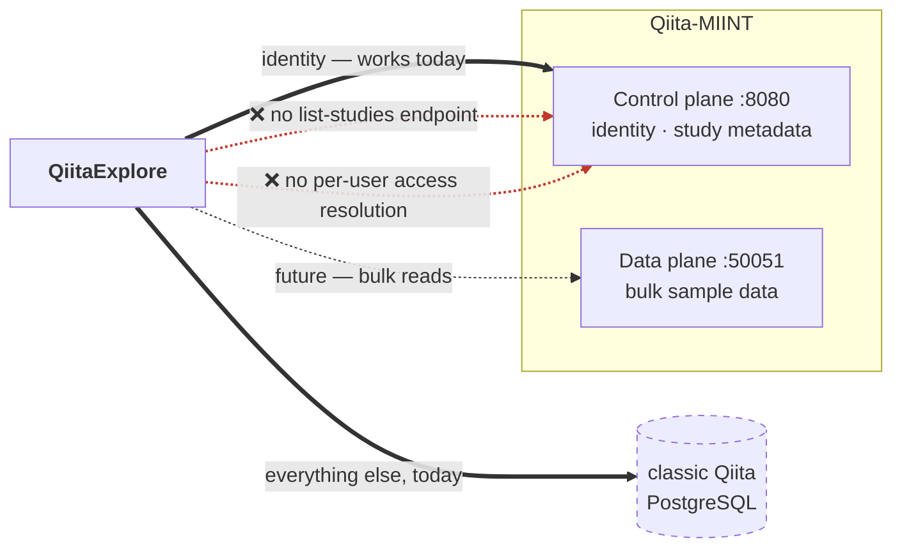

# 11 — Roadmap

*Where QiitaExplore is going, the two platform gaps standing in the way, and an honest index of what is broken today.*

Prerequisites: [`00-orientation.md`](00-orientation.md) — the two-Qiitas distinction is the whole subject of this chapter.

---

## The strategic problem

QiitaExplore straddles two systems:

- **Identity** comes from the Qiita-MIINT control plane, over HTTPS.
- **All scientific data** comes from the classic Qiita monolith, over direct read-only SQL, through a vendored copy of Qiita's own database layer.

That is not a destination. It is where an in-progress migration currently stands, and it carries real costs: a vendored dependency (`qiita_db/`, `qiita_core/`) that must track upstream schema changes, direct coupling to a database schema that is not a published interface, and a thread-unsafe transaction singleton still in the request path.

The target:



Both dashed red edges are blocked on capabilities the platform does not currently expose. They are described below, verified against the Qiita repository rather than assumed.

---

## TKT-007 — migrate off the vendored database layer

**Scope is smaller than it looks.** `qiita_db.sql_connection.TRN` has exactly **two** live call sites:

- `backend/routes/study_routes.py` — the single-sample metadata fetch
- `backend/helpers/sample_search.py :: _get_candidate_ids` — the candidate-study lookup

Every other mention of `TRN` in the backend is a docstring explaining why that module avoids it. Both remaining sites are straightforward to move onto `pooled_fetchall`, which would remove the thread-safety hazard described in [`03-data-access-and-caching.md`](03-data-access-and-caching.md) immediately — independent of any platform migration.

Note that `qiita_core.qiita_settings.qiita_config` is still needed after that, since it supplies PostgreSQL credentials from `QIITA_CONFIG_FP`. Fully deleting the vendored packages requires replacing data access as well, which is what the blockers below govern.

**The chokepoint is `qiita_fetch`.** Nearly every Qiita read passes through it, so a REST/Flight reimplementation is largely confined to one module. Preserving that property is worth doing deliberately: each new bypass is another site the migration must touch.

---

## Blocker 1 — no per-user access resolution

QiitaExplore would like to hold **one service-account credential** and serve all users from it, rather than storing and re-verifying each user's PAT. That requires asking the platform a question it cannot currently answer:

> *"Does principal 4471 have at least READ access to study 812?"*

`qiita-control-plane/src/qiita_control_plane/auth/guards.py :: require_study_access` gates a route on **the caller's own** tier of access to the study in the path. It resolves the requesting bearer's `principal_idx` and compares that principal's tier. There is no parameter, header, or scope that redirects the check to a different principal.

A service account therefore has exactly two options, and neither is what is needed:

1. **Check its own access.** Answers "can *the service account* read study 812" — useless for filtering on behalf of a user.
2. **Hold `SYSTEM_ADMIN` and bypass.** The guard's role-bypass returns without any database lookup at all. This answers "can anyone read it" — the service account sees everything, and QiitaExplore would have to reimplement per-user visibility itself, from access data the API does not expose.

### One capability that exists but does not help

The platform *does* have an on-behalf-of concept, so a grep for the term is misleading. `POST /study` accepts an `owner_idx`, letting a `wet_lab_admin` or `system_admin` create a study owned by someone else — the admin becomes `created_by_idx`, the named user becomes `owner_idx`, and the auto-granted ADMIN row targets the named user.

That is **create-time ownership assignment**, not read-path impersonation. It sets who owns a new record; it does not let a caller evaluate an existing record's visibility as another principal. The read path has no equivalent.

### The options

| Approach | How it works | Cost |
|---|---|---|
| **Per-user PAT forwarding** *(what ships today)* | Store each user's PAT, call the platform as them | Must store and re-verify credentials; every user needs a PAT |
| **New platform endpoint** | Add `GET /study/{idx}/access/{principal_idx}` or an `X-On-Behalf-Of` scope | Requires an upstream change and a security review — an impersonation surface is a serious thing to add |
| **Cached access list** | Service account periodically syncs per-user grants into local storage | Stale-permission window; duplicates the platform's authorization model |

**Recommendation: keep per-user PATs.** It is what works, the credential-handling cost is already paid (see [`02-authentication.md`](02-authentication.md)), and it has the property that QiitaExplore can never see more than the user can. The other two options either need upstream work or move authorization decisions into an application that should not be making them.

---

## Blocker 2 — no list-studies endpoint

The browse grid is QiitaExplore's front door: a list of studies, searched and filtered. There is no REST equivalent.

The control plane's study surface is, verified against `routes/study.py`:

```
POST  /study                      create
GET   /study/{study_idx}          fetch one, by known id
PATCH /study/{study_idx}          update
POST  /study/lookup-by-accession  resolve an accession to one study
```

Every read requires **already knowing which study you want**. There is no list, no search, no filter, no pagination. Both of QiitaExplore's primary read patterns — "show me GOLD studies" and "find studies matching these keywords, ranked by relevance" — are inexpressible.

Sample-metadata search is further out still. It needs predicate evaluation across per-study metadata, which is precisely what the Arrow Flight data plane and its DuckDB/DuckLake backing are built for — but it needs a query interface exposed for that purpose.

### The options

| Approach | Fit |
|---|---|
| **Add `GET /study` with filters** to the control plane | Cleanest. Needs upstream work, and needs to be designed to serve relevance ranking, not just pagination. |
| **Query via the data plane** | The right home for sample-level predicates. Requires a signed Flight ticket for an ad-hoc query shape, which the current `REPLAY_SAFE_ACTIONS` model does not obviously accommodate. |
| **Maintain a local index** | QiitaExplore syncs study metadata into its own store and searches that. Removes the dependency, but takes on cache-coherency and becomes a second source of truth. |

No recommendation here — this needs an upstream conversation, not a local decision.

---

## Feature work

### TKT-010 — BIOM ingestion and diversity

`compute_diversity` is a hard stub that is **live in the tool schema**, so the model calls it and receives an apology. The immediate, near-zero-cost improvement is to **remove it from the schema until it is implemented**.

A real implementation needs decisions that have not been made: where BIOM tables are ingested and held (the merge pipeline already reads them — see [`07-merge-and-biom.md`](07-merge-and-biom.md)); a rarefaction policy, since alpha diversity is not comparable across uneven sampling depth; which metrics (Shannon, Simpson, Faith's PD, and any phylogenetic metric needs a tree); and where results are cached — plausibly permanently, keyed on artifact id, since artifacts are immutable.

### TKT-021 — cohort builder

Select samples across studies by metadata predicate, export the selection, and hand it to the merge workspace. This is the natural composition of sample search (which finds *studies* whose samples match) with merge (which combines whole artifacts). The missing middle is sample-level selection as a first-class, persistable object.

Depends on TKT-022 for usability: without knowing which fields studies share, a user cannot write a predicate that spans them.

### TKT-022 — cross-study metadata field-overlap matrix

Which studies share which metadata fields, and with what value distributions. Built on the same JSONB probing as [`04-search.md`](04-search.md)'s third path. This is the answer to "can I even combine these two studies", which today requires opening both and comparing by eye.

### TKT-018 — stream sample-search results incrementally

Today the fanout completes or times out before anything reaches the user. Streaming each match as it arrives would make deep search *feel* dramatically faster without being faster, and would give the UI a place to report that results were truncated — which it currently cannot do at all.

Requires new SSE events, so read the dual-authoring warning in [`06-streaming-and-chat.md`](06-streaming-and-chat.md) first.

### TKT-020 — production JavaScript precompile

Every page load transpiles ~4,300 lines of JSX in the browser via Babel standalone. Precompiling for production would cut first paint substantially while keeping the zero-build development workflow. See [`08-frontend.md`](08-frontend.md).

---

## LLM-authored SQL — unshipped

**This does not exist today.** The shipped system has the model fill typed tool arguments while Python composes parameterized SQL ([`05-agent.md`](05-agent.md)). This section describes what letting the model emit SQL would require, and why it is not obviously a good idea.

**The motivation is real.** The fixed tool set cannot express aggregation, grouping, or arbitrary joins. *"What is the average sample count per data type?"* and *"which PIs publish across the most body sites?"* are reasonable questions with no path to an answer.

**What would have to be true:**

| Control | Why |
|---|---|
| A dedicated read-only PostgreSQL role | Not a `pg_pool` connection. Revoke everything but SELECT on an explicit table allowlist. |
| A hard `statement_timeout` | Every generated query, no exceptions. |
| A mandatory `LIMIT` | Injected by the caller, not requested of the model. |
| Schema allowlisting | The model sees a curated schema subset. Per-study `sample_{id}` tables are hundreds of tables with no schema — almost certainly out of scope. |
| A parser-level validator | Reject anything that is not a single `SELECT`: no CTEs writing data, no `;`, no function calls that touch the filesystem. Validate the parse tree, not the string. |
| Result caps and cost estimation | `EXPLAIN` before executing; refuse plans above a cost ceiling. |

**The honest assessment.** Injection is not the primary risk — a read-only role with a table allowlist bounds the blast radius well. The real risks are *resource exhaustion* (a plausible-looking cross join against a table with millions of sample rows) and *silent wrongness* (a query that returns confidently incorrect numbers because the model misunderstood the schema, with nothing to catch it). The current design has neither failure mode, and that is worth a great deal.

A middle path is more attractive than either extreme: **extend the tool schema with parameterized aggregate tools** — "count studies grouped by data type", "distribution of sample counts" — keeping SQL generation in Python while widening what can be asked. That captures most of the motivating value with none of the new risk surface.

---

## Known debt

Documented where it lives, indexed here.

| Ticket | Area | Impact | Chapter |
|---|---|---|---|
| **TKT-023** | Merge | Autopick ignores deprecation, human-filtering, and primer compatibility — V3 and V4 16S preps can merge into a **biologically meaningless** table | [`07`](07-merge-and-biom.md) |
| **TKT-015** | Merge | Executor shells to a local `conda run`; **fails on remote deploy** | [`07`](07-merge-and-biom.md) |
| **TKT-024** | Search | `/api/search` latency 86 ms – 13.5 s; leading-wildcard `ILIKE`, no supporting index | [`04`](04-search.md) |
| **TKT-005** | Chat | History hard-windowed to 10 messages regardless of model context size | [`03`](03-data-access-and-caching.md) |
| **TKT-002** | Store | Bare `except: pass` around migrations and cache reads hides real failures | [`03`](03-data-access-and-caching.md) |
| **TKT-032** | Agent | OpenAI and Anthropic paths duplicate the loop; a fix to one can miss the other | [`05`](05-agent.md) |
| **TKT-041** | Tests | `fresh_db` does not isolate route-level tests from the real local database | [`10`](10-testing.md) |
| **TKT-036/037/038/039** | Both | `components.js`, `app_state.js`, `app_render.js`, `agent_tools.py` over the 500-line cap | [`08`](08-frontend.md) |

Ticket bodies live in [`TICKETS/tickets.md`](../TICKETS/tickets.md); this table is an index, not a substitute.

### Found while writing these documents

None of these were previously ticketed. The four most serious were filed as **TKT-042 – TKT-045**; the remainder are documented in place and still need tickets.

| Finding | Ticket | Severity | Chapter |
|---|---|---|---|
| `/api/settings` is **global, not per-user** — any user overwrites everyone's Anthropic API key | **TKT-042** | **High** | [`02`](02-authentication.md) |
| Artifact download performs **no study-level authorization** — any authenticated user can fetch files from non-public studies | **TKT-043** | **High** | [`02`](02-authentication.md) |
| Merge silently falls back to autopick when an explicitly chosen artifact is absent from the prep-joined list — **merges a different artifact than the one selected** | **TKT-044** | **High** | [`07`](07-merge-and-biom.md) |
| `.env.bak.*` files accumulate on the deployment host containing the LLM key and the **PAT encryption key** in plaintext | **TKT-045** | **High** | [`09`](09-operations.md) |
| No test guards the dual-authored segment contract | — | Medium | [`06`](06-streaming-and-chat.md), [`10`](10-testing.md) |
| `study_detail_cache.cached_at` is per-row while payload columns COALESCE — one fresh column resets the TTL for all nine | — | Medium | [`03`](03-data-access-and-caching.md) |
| Aborting a stream leaves the message spinning until reload | — | Medium | [`06`](06-streaming-and-chat.md) |
| e2e tier and `run_tests.sh` preflight both hit protected endpoints unauthenticated — **the whole tier skips** | — | Medium | [`10`](10-testing.md) |
| SQLite opened with no `busy_timeout` — `database is locked` surfaces as a 500 under write contention | — | Medium | [`09`](09-operations.md) |
| `purge_expired_sessions()` is defined but **never called** — session rows accumulate forever | — | Low | [`02`](02-authentication.md) |
| Cache TTL check **fails open** on an unparseable timestamp; the auth path fails closed | — | Low | [`03`](03-data-access-and-caching.md) |
| `reasoning` tokens are generated and **silently dropped** on the web path | — | Low | [`05`](05-agent.md), [`06`](06-streaming-and-chat.md) |
| `get_study_report`'s auto-pin swallows cap rejection — the study is silently not pinned | — | Low | [`05`](05-agent.md) |
| Pin/unpin cap enforcement is **non-atomic** — concurrent requests can exceed the cap | — | Low | [`appendix-b`](appendix-b-sqlite-schema.md) |
| Merge result tarballs in `MERGE_RESULTS_DIR` are **never cleaned up** | — | Low | [`09`](09-operations.md) |

---

## Suggested sequence

Ordered by value per unit of effort, not by ticket number.

1. **The three access-control defects** — TKT-042 (settings tenancy), TKT-043 (artifact download authorization), TKT-045 (plaintext key backups). Small, contained, and currently wrong. TKT-045 first if the barnacle host has accumulated `.env.bak.*` files, since exposure continues until they are removed.
2. **Remove `compute_diversity` from the live schema.** One line; stops wasting agent iterations today.
3. **The segment-contract parity test.** The contract is correct *now*; a test is what keeps it correct.
4. **TKT-023's compatibility checks.** Scientifically the most consequential item on this list — a silently wrong merge is worse than a failed one.
5. **Move the two `TRN` call sites onto `pooled_fetchall`.** Removes a thread-safety hazard independently of the platform migration.
6. **Request `pg_trgm` indexes from whoever owns classic Qiita's database.** The largest available latency win, but **not a change this codebase can make** — QiitaExplore's access is read-only. TKT-024's cited precedent (`patches/93.sql`) is not in this repository. Treat it as an upstream ask, not a task. See [`04-search.md`](04-search.md).
7. **Open the upstream conversation** about a list-studies endpoint and per-user access resolution. Long lead time; start it before it is on the critical path.

Note that items 6 and 7 are both requests to other teams. They are the two longest-lead items here and the two most often deferred; starting them early costs nothing.

---

*See also: [`00-orientation.md`](00-orientation.md) for the two-Qiitas framing · [`03-data-access-and-caching.md`](03-data-access-and-caching.md) for what migrating off PostgreSQL touches · [`TICKETS/tickets.md`](../TICKETS/tickets.md) for full ticket bodies.*
