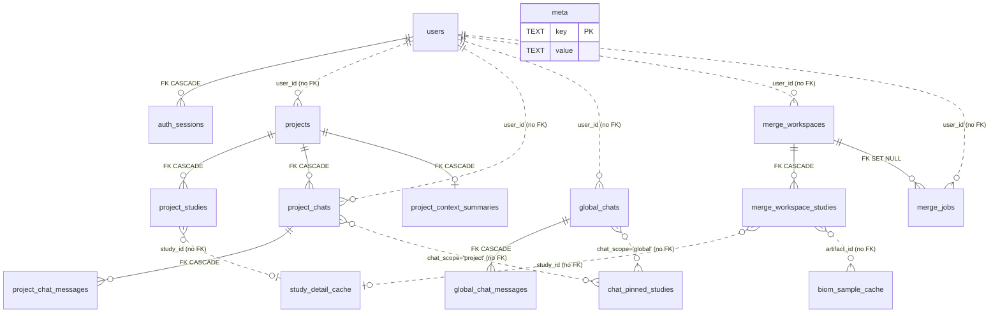

# Appendix B — Local SQLite Schema

Complete reference for QiitaExplore's local SQLite store: the 16 tables, 11 indexes, their owning modules, and the migration behavior that runs on every import.

---

## Conventions

### Database location

The path comes from the `QIITA_EXPERIMENT_DB_PATH` environment variable, defaulting to `backend/data/projects.db`:

```python
_DEFAULT_DATA_DIR = os.path.join(os.path.dirname(os.path.dirname(__file__)), "data")
os.makedirs(_DEFAULT_DATA_DIR, exist_ok=True)
DB_PATH = os.getenv("QIITA_EXPERIMENT_DB_PATH", os.path.join(_DEFAULT_DATA_DIR, "projects.db"))
```

The data directory is created at import time if absent (`backend/store/db.py`, module level). Two legacy TinyDB paths are also computed here — `backend/data/projects.json` and `/tmp/qiita-experiment/projects.json` — used only by the one-time import path described below.

### Connection PRAGMAs

Every connection is opened fresh by `backend/store/db.py :: _conn` and configured identically:

| PRAGMA | Value | Why |
|---|---|---|
| `foreign_keys` | `ON` | SQLite defaults FK enforcement to *off* per connection. Without this, the `ON DELETE CASCADE` clauses in the DDL would be inert. |
| `journal_mode` | `WAL` | Write-ahead logging lets readers proceed during writes — necessary because Gunicorn runs 4 worker processes against the same file. |
| `synchronous` | `NORMAL` | Trades a small durability window at OS-crash time for write throughput. Safe under WAL. |

`row_factory` is set to `sqlite3.Row`, and `backend/store/db.py :: _as_dict` converts rows to plain dicts (returning `None` for a `None` row) so callers never leak `sqlite3.Row` objects into JSON serialization. There is no connection pool — each store function opens a connection, works inside a `with` block, and closes.

### Timestamps

All timestamp columns are `TEXT`, written by `backend/store/db.py :: _now` as `datetime.utcnow().isoformat() + "Z"`. They sort lexicographically, which is what every `ORDER BY ... DESC` in the CRUD layer relies on. Nothing in the store uses SQLite's native date functions.

### Ownership columns and the `"default"` fallback

Six tables carry a `user_id TEXT NOT NULL` column: `projects`, `project_chats`, `global_chats`, `merge_workspaces`, `merge_jobs`, and `auth_sessions`. For the first five, `user_id` is the tenancy key — every read and write in the CRUD layer filters on it, and there is no cross-user fallback (see the docstring on `backend/store/crud.py :: get_project`).

Values come from one of two places:

- **Authenticated requests** — `g.user_id`, set by `backend/helpers/auth_middleware.py` from the session cookie. This is `str(principal_idx)` from the Qiita control plane, matching `users.user_id`.
- **Unauthenticated / legacy rows** — the literal string `"default"`, produced by `backend/store/db.py :: _resolve_user`:

  ```python
  def _resolve_user(user_id):
      return (user_id or "").strip() or "default"
  ```

  Empty string, whitespace, and `None` all collapse to `"default"`. This is the pre-authentication tenancy fallback: every row created before the auth system existed is owned by `"default"`, and `backend/store/legacy_claim.py` exists to reassign those rows to a real principal once.

**None of the `user_id` columns declare a foreign key to `users`.** That is deliberate and load-bearing: `"default"` has no `users` row, so an FK would reject every legacy row. The relationship is application-enforced only.

`backend/store/crud.py`, `global_chat_crud.py`, and `cache.py` all call `_resolve_user()` on entry. `backend/store/merge_crud.py` does **not** — it stores whatever `g.user_id` holds verbatim. In practice the auth middleware guarantees a non-empty value, so the two paths agree, but the merge tables have no `"default"` normalization of their own.

### Migration philosophy

Forward-only and additive. There is no schema version number and no down-migration path. New tables arrive as `CREATE TABLE IF NOT EXISTS` inside the single `executescript` in `backend/store/db.py :: _create_schema`; new columns arrive as bare `ALTER TABLE ... ADD COLUMN` wrapped in `try: / except Exception: pass`, so re-running against an already-migrated database is a no-op.

The `meta` table is not a schema-version table — nothing reads a version from it before deciding what to migrate. The one case this model cannot handle is a table whose *shape* changed: `CREATE TABLE IF NOT EXISTS` sees the name exists and does nothing. `_reconcile_legacy_users_table` is the hand-written escape hatch for exactly that situation on `users`.

### Import-time bootstrap

The last line of `backend/store/db.py` is a bare call:

```python
_bootstrap()
```

Importing anything from `store` — including `from store import get_project` via the facade — opens the database, creates missing tables and indexes, runs every additive `ALTER`, and possibly performs the one-time TinyDB import. There is no explicit `init_db()` to call and no way to import the module without this side effect.

Consequences worth knowing:

- Under Gunicorn with 4 workers, `_bootstrap()` runs up to 4 times. Every statement is idempotent, so concurrent bootstraps converge, but they contend for the write lock at startup.
- Tests that want an isolated database must set `QIITA_EXPERIMENT_DB_PATH` **before** the first `import store` anywhere in the process.
- A malformed or unwritable database path surfaces as an exception at import, not at first query.

### The public facade

`backend/store/__init__.py` re-exports a flat function surface from `crud`, `global_chat_crud`, `merge_crud`, and `cache`, so callers write `from store import get_project, upsert_study_detail_cache, ...`. Absent from the facade: `auth_store`, `legacy_claim`, and the `get_setting` / `set_setting` pair in `crud.py` — all imported by fully qualified path (`from store.auth_store import create_session`), which keeps the auth surface visibly separate from the general data surface.

---

## ER diagram

**Legend**

- **Solid line (`--`)** — a foreign key *declared in the DDL* and enforced by SQLite (`PRAGMA foreign_keys = ON` is set on every connection).
- **Dashed line (`..`)** — a relationship enforced only by application code. SQLite does not know about it, and orphan rows are possible.

There are **8 declared foreign keys** and several conventional relationships.



`meta` is drawn standalone — it is a key/value side table with no relationships at all.

**Why `chat_pinned_studies` has no foreign key.** Its `chat_id` is polymorphic: the same column points at `project_chats.chat_id` when `chat_scope = 'project'` and at `global_chats.chat_id` when `chat_scope = 'global'`. SQLite has no conditional or polymorphic foreign keys, so declaring one is not possible without splitting the table in two. The cost is real: deleting a chat cascades its messages but leaves its pin rows behind as orphans (see the table section below).

`study_detail_cache.study_id` and `biom_sample_cache.artifact_id` reference entities that live in the **Qiita PostgreSQL database**, not in this file. No FK is possible by construction.

---

## Tables

### table-meta

Key/value side table. Holds the TinyDB import marker, the legacy-claim markers, and any application setting written through `set_setting()`.

| Name | Type | Null | Default | Meaning |
|---|---|---|---|---|
| `key` | TEXT | no (PK) | — | Setting name. |
| `value` | TEXT | yes | — | Setting value, always stored as text. |

**Keys/constraints:** `key` is the primary key. `backend/store/legacy_claim.py :: claim_legacy_default` relies on that uniqueness as its concurrency guard — a second racing claim hits an `IntegrityError` on the plain `INSERT` and rolls the whole transaction back.

**Known keys:**

| Key | Written by | Meaning |
|---|---|---|
| `tinydb_imported` | `backend/store/db.py :: _mark_migration` | `'1'` once the TinyDB JSON import has run or been skipped. |
| `default_claimed_by` | `backend/store/legacy_claim.py :: claim_legacy_default` | `user_id` that claimed the legacy `"default"` rows. Its presence permanently disables further claims. |
| `default_claimed_at` | `backend/store/legacy_claim.py :: claim_legacy_default` | Timestamp of the claim. |
| `anthropic_api_key` | `backend/routes/study_routes.py` via `set_setting` | Stored API key. **Stored in plaintext** — unlike PATs, which are Fernet-encrypted in `auth_sessions`. |

**Writes owned by:** `backend/store/crud.py :: set_setting`, `backend/store/db.py :: _mark_migration`, `backend/store/legacy_claim.py :: claim_legacy_default`. Rows are never evicted.

---

### table-projects

A user-owned collection of Qiita studies plus its chats. The root of the project ownership tree.

| Name | Type | Null | Default | Meaning |
|---|---|---|---|---|
| `project_id` | TEXT | no (PK) | — | 8-char UUID prefix (`str(uuid.uuid4())[:8]`). |
| `user_id` | TEXT | no | — | Owner. `"default"` for pre-auth rows. |
| `name` | TEXT | no | — | Display name; falls back to `"Untitled"` when blank. |
| `created_at` | TEXT | yes | — | ISO-8601 UTC with `Z` suffix. |
| `updated_at` | TEXT | yes | — | Bumped on nearly every child mutation, not only on rename. |

**Keys/constraints:** PK on `project_id`. `user_id` is *not* an FK (see Conventions). Four child relationships cascade on delete.

**Writes owned by:** `backend/store/crud.py` — `create_project`, `update_project`, `delete_project`, and `updated_at` bumps inside `add_study_to_project`, `remove_study_from_project`, `create_chat`, `append_chat_messages`, `delete_chat`.

**Lifecycle:** deletion is owner-scoped (`WHERE project_id = ? AND user_id = ?`) and cascades to `project_studies`, `project_chats`, `project_chat_messages` (transitively), and `project_context_summaries`. `updated_at` doubles as the sidebar sort key — hence the child-mutation bumps.

**Legacy claim:** this is one of the **5 root ownership tables** rewritten by `backend/store/legacy_claim.py :: claim_legacy_default`. See [`02-authentication.md`](02-authentication.md).

---

### table-project_studies

Denormalized copy of the Qiita study metadata a project has collected. Deliberately a snapshot, not a live view — it lets the sidebar and LLM context render without touching PostgreSQL.

| Name | Type | Null | Default | Meaning |
|---|---|---|---|---|
| `project_id` | TEXT | no (PK part) | — | Owning project. |
| `study_id` | INTEGER | no (PK part) | — | Qiita study ID (external key into PostgreSQL). |
| `study_title` | TEXT | yes | — | Study title at time of add. |
| `study_abstract` | TEXT | yes | — | Study abstract at time of add. |
| `pi_name` | TEXT | yes | — | Principal investigator name. |
| `pi_email` | TEXT | yes | — | Principal investigator email. |
| `pi_affiliation` | TEXT | yes | — | Principal investigator affiliation. |
| `lab_person_name` | TEXT | yes | — | Lab contact name. |
| `summary_text` | TEXT | yes | — | LLM-generated per-study summary. |
| `added_at` | TEXT | yes | — | When the study joined the project; the list sort key. |
| `updated_at` | TEXT | yes | — | Last enrichment/summary write. |
| `data_types` | TEXT | yes | — | *(migration)* Data types, stored as text. |
| `num_samples` | INTEGER | yes | — | *(migration)* Sample count. |
| `num_preps` | INTEGER | yes | — | *(migration)* Prep-template count. |
| `preps_json` | TEXT | yes | — | *(migration)* JSON array of prep summaries. |

**Keys/constraints:** composite PK `(project_id, study_id)` — a study can appear once per project. FK `project_id → projects(project_id) ON DELETE CASCADE`.

**Writes owned by:** `backend/store/crud.py :: add_study_to_project` (uses `INSERT OR IGNORE`, so re-adding an existing study is a silent no-op and does **not** refresh metadata) and `remove_study_from_project`. Enrichment columns are written by `backend/store/cache.py :: update_project_study_data`; `summary_text` by `backend/store/cache.py :: upsert_project_study_summary`.

**Lifecycle:** rows live until the study is removed or the project is deleted. There is no TTL — the snapshot goes stale silently if the underlying Qiita study changes. Adding or removing a study also deletes the project's `project_context_summaries` row, forcing the LLM context summary to be regenerated.

---

### table-project_chats

A conversation thread scoped to one project.

| Name | Type | Null | Default | Meaning |
|---|---|---|---|---|
| `chat_id` | TEXT | no (PK) | — | 8-char UUID prefix. |
| `project_id` | TEXT | no | — | Owning project. |
| `user_id` | TEXT | no | — | Owner, duplicated from the project for direct filtering. |
| `title` | TEXT | yes | — | First 60 chars of the first user message; `"New chat"` until then. |
| `created_at` | TEXT | yes | — | Creation timestamp. |
| `updated_at` | TEXT | yes | — | Last message append; the sidebar sort key. |

**Keys/constraints:** PK on `chat_id`. FK `project_id → projects(project_id) ON DELETE CASCADE`. `user_id` is redundant with `projects.user_id` but is stored so chat queries filter on both without a join — the CRUD layer consistently uses `WHERE project_id = ? AND user_id = ?`.

**Writes owned by:** `backend/store/crud.py` — `create_chat`, `append_chat_messages` (title + `updated_at`), `delete_chat`. Cascades to `project_chat_messages` on delete; does **not** cascade to `chat_pinned_studies`, which is left orphaned. The title is set once: `backend/store/crud.py :: _resolved_chat_title` only overwrites when the current title is still the literal `"New chat"`.

**Legacy claim:** one of the **5 root ownership tables**. See [`02-authentication.md`](02-authentication.md).

---

### table-project_chat_messages

Persisted turns of a project chat, including the rendered UI payload for agentic turns.

| Name | Type | Null | Default | Meaning |
|---|---|---|---|---|
| `id` | INTEGER | no (PK) | autoincrement | Monotonic ordering key — all reads use `ORDER BY id ASC`, never a timestamp. |
| `chat_id` | TEXT | no | — | Owning chat. |
| `role` | TEXT | no | — | `'user'` or `'assistant'`. Not constrained by a CHECK; normalization happens in Python. |
| `content` | TEXT | no | — | Message text. |
| `created_at` | TEXT | yes | — | Write timestamp. Both messages of a pair share one value. |
| `ui_payload` | TEXT | yes | — | *(migration)* JSON blob for structured rendering — e.g. `{"kind": "agent_segments", "segments": [...]}`. Assistant rows only. |

**Keys/constraints:** autoincrement PK. FK `chat_id → project_chats(chat_id) ON DELETE CASCADE`.

**Writes owned by:** `backend/store/crud.py :: _insert_chat_message_pair`, called from `append_chat_messages`. Messages are always written in user/assistant **pairs**, in one transaction — there is no single-message insert path.

**Lifecycle:** no eviction, no cap, no pruning; history grows unbounded per chat and is removed only with the chat or project. `ui_payload` is decoded on read by `backend/store/crud.py :: _decode_ui`, which returns `None` on malformed JSON rather than raising — a corrupt payload degrades to a plain text message.

---

### table-project_context_summaries

One cached LLM-generated summary of a project's whole study set, used to keep chat prompts inside the model's context budget.

| Name | Type | Null | Default | Meaning |
|---|---|---|---|---|
| `project_id` | TEXT | no (PK) | — | Owning project. PK, so at most one summary per project. |
| `summary_text` | TEXT | yes | — | The generated summary. |
| `source_updated_at` | TEXT | yes | — | The `projects.updated_at` the summary was generated against — the staleness check. |
| `created_at` | TEXT | yes | — | First generation. |
| `updated_at` | TEXT | yes | — | Last regeneration. |

**Keys/constraints:** PK on `project_id` (a 1:1 with `projects`). FK `project_id → projects(project_id) ON DELETE CASCADE`.

**Writes owned by:** `backend/store/cache.py :: upsert_project_context_summary` (an `ON CONFLICT DO UPDATE` upsert, which — unlike the study-detail cache — overwrites unconditionally rather than COALESCEing). Deletions come from `backend/store/crud.py` on study add/remove.

**Lifecycle:** explicitly invalidated. `add_study_to_project` and `remove_study_from_project` both `DELETE FROM project_context_summaries WHERE project_id = ?`, so a membership change discards the summary immediately. `source_updated_at` supports a second, softer staleness check against `projects.updated_at`. No TTL.

---

### table-global_chats

A conversation thread not scoped to any project — the entry point for the agentic study-search flow.

| Name | Type | Null | Default | Meaning |
|---|---|---|---|---|
| `chat_id` | TEXT | no (PK) | — | 8-char UUID prefix. |
| `user_id` | TEXT | no | — | Owner. |
| `title` | TEXT | yes | — | First 60 chars of the first user message; `"New chat"` until then. |
| `created_at` | TEXT | yes | — | Creation timestamp. |
| `updated_at` | TEXT | yes | — | Last message append; the sidebar sort key. |

**Keys/constraints:** PK on `chat_id`. No FK at all — global chats have no parent row in this database.

**Writes owned by:** `backend/store/global_chat_crud.py` — `create_global_chat`, `append_global_chat_messages`, `delete_global_chat`. Cascades to `global_chat_messages`; leaves `chat_pinned_studies` rows orphaned, same as project chats.

**Legacy claim:** one of the **5 root ownership tables**. See [`02-authentication.md`](02-authentication.md).

---

### table-global_chat_messages

Persisted turns of a global chat. Structurally identical to `project_chat_messages`.

| Name | Type | Null | Default | Meaning |
|---|---|---|---|---|
| `id` | INTEGER | no (PK) | autoincrement | Ordering key; reads use `ORDER BY id ASC`. |
| `chat_id` | TEXT | no | — | Owning global chat. |
| `role` | TEXT | no | — | `'user'` or `'assistant'`. |
| `content` | TEXT | no | — | Message text. |
| `created_at` | TEXT | yes | — | Write timestamp. |
| `ui_payload` | TEXT | yes | — | *(migration)* JSON blob. This is where agentic tool-call segments are frozen for rehydration after a page reload. |

**Keys/constraints:** autoincrement PK. FK `chat_id → global_chats(chat_id) ON DELETE CASCADE`.

**Writes owned by:** `backend/store/global_chat_crud.py :: append_global_chat_messages`, which shares `backend/store/crud.py :: _insert_chat_message_pair` with the project path — the two message tables are written by the same function, parameterized by table name. No eviction or cap; same unbounded growth as the project message table.

---

### table-study_detail_cache

Cached expensive per-study reads from the Qiita PostgreSQL database — prep templates, artifacts, the artifact provenance graph, and sample metadata. This is the busiest table in the store and the one the COALESCE upsert pattern exists for.

| Name | Type | Null | Default | Meaning |
|---|---|---|---|---|
| `study_id` | INTEGER | no (PK) | — | Qiita study ID. |
| `preps_json` | TEXT | yes | — | JSON array of prep templates. |
| `artifacts_json` | TEXT | yes | — | JSON array of artifacts. |
| `samples_context` | TEXT | yes | — | Flattened sample metadata as prose, for LLM prompt injection. |
| `cached_at` | TEXT | yes | — | Last write of *any* column. Drives the TTL check. |
| `full_samples_json` | TEXT | yes | — | *(migration)* Complete sample metadata, unlimited. |
| `artifact_graph_json` | TEXT | yes | — | *(migration)* Artifact/job provenance graph nodes. |
| `prep_metadata_json` | TEXT | yes | — | *(migration)* Map of `str(prep_template_id)` → per-prep metadata summary. |
| `samples_json` | TEXT | yes | — | *(migration)* Sample list capped at 200 rows, for the study-detail modal. |
| `total_samples` | INTEGER | yes | — | *(migration)* True total sample count, uncapped, paired with `samples_json`. |

**Keys/constraints:** PK on `study_id`. No FK — `study_id` points into PostgreSQL.

**Writes owned by:** `backend/store/cache.py :: upsert_study_detail_cache`. Callers span `backend/routes/study_routes.py`, `backend/routes/project_routes.py`, `backend/helpers/qiita_fetch.py`, `backend/helpers/llm_helpers.py`, and `backend/helpers/merge_helpers.py` — each writing a different subset of columns.

**Lifecycle:** TTL of **6 hours**, checked on read in `backend/store/cache.py :: get_study_detail_cache` against `_STUDY_DETAIL_CACHE_TTL_HOURS`. The constant is hardcoded — **not** environment-tunable. Expiry is lazy and read-side only: an expired row is not deleted, it is merely reported as a miss, and the next write overwrites it in place. Nothing sweeps this table, so it grows to one row per study ever viewed. An unparseable `cached_at` is treated as a hit, not a miss (the `except Exception: pass` in the TTL check falls through to returning the row).

`backend/routes/study_routes.py` layers a second, content-based staleness check on top of the TTL: it inspects `artifact_graph_json` for the presence of `filepaths` and `command_params` keys and refetches if a cached graph predates those features. That is schema-drift detection inside a JSON blob, not a database concern — but it is the reason a cached row can be discarded before its 6 hours are up.

---

### table-chat_pinned_studies

Studies explicitly attached to a chat so they are always included in that chat's LLM context, regardless of what the model searches for.

| Name | Type | Null | Default | Meaning |
|---|---|---|---|---|
| `chat_id` | TEXT | no (PK part) | — | Target chat. Polymorphic — see below. |
| `chat_scope` | TEXT | no (PK part) | — | `'project'` or `'global'`. Disambiguates which table `chat_id` refers to. |
| `study_id` | INTEGER | no (PK part) | — | Pinned Qiita study ID. |
| `pinned_at` | TEXT | yes | — | Pin timestamp; the display sort key (`ORDER BY pinned_at ASC`). |

**Keys/constraints:** composite PK `(chat_id, chat_scope, study_id)`, which makes re-pinning idempotent at the database level in addition to the Python-level check.

**No foreign key exists on this table.** `chat_id` refers to `project_chats` when `chat_scope = 'project'` and to `global_chats` when `chat_scope = 'global'`. SQLite cannot express a conditional foreign key, so the relationship is application-enforced by `backend/store/cache.py :: _normalize_scope`, which coerces any unrecognized scope value to `SCOPE_PROJECT` rather than rejecting it.

**Writes owned by:** `backend/store/cache.py` — `pin_study_to_chat`, `unpin_study_from_chat`. Called from `backend/helpers/qiita_fetch.py` (the `/pin` command flow) and the agentic `pin_study` tool.

**Lifecycle:** capped at **10 pins per chat** by `PINNED_STUDIES_PER_CHAT_CAP` in `backend/store/cache.py`. The cap is enforced by a read-then-write in `pin_study_to_chat`: it loads existing pins, returns `True` early if the study is already pinned, returns `False` if the count is at the cap, then inserts. Since the check and the insert are separate statements without an explicit transaction, two concurrent pins on the same chat can both pass the cap check — the composite PK prevents duplicates but not a count of 11.

**Orphan behavior:** deleting a chat does not remove its pins, because no FK cascade reaches this table. Orphan rows are harmless in practice — reads are always keyed by a live `chat_id` — but they accumulate and nothing collects them.

---

### table-merge_workspaces

A named scratch space collecting up to 5 studies whose BIOM artifacts will be merged.

| Name | Type | Null | Default | Meaning |
|---|---|---|---|---|
| `workspace_id` | TEXT | no (PK) | — | 12-char UUID prefix (`str(uuid.uuid4())[:12]`) — wider than the 8-char IDs used elsewhere. |
| `user_id` | TEXT | no | — | Owner. |
| `name` | TEXT | no | — | Display name. Not defaulted in the store layer, unlike `projects.name`. |
| `created_at` | TEXT | yes | — | Creation timestamp. |
| `updated_at` | TEXT | yes | — | Bumped on every study add/remove/update and on rename. |

**Keys/constraints:** PK on `workspace_id`. `user_id` is not an FK.

**Writes owned by:** `backend/store/merge_crud.py` — `create_workspace`, `rename_workspace`, `delete_workspace`, plus `updated_at` bumps from the study mutators.

**Lifecycle:** cascades to `merge_workspace_studies`, but **not** to `merge_jobs` — that FK is `ON DELETE SET NULL`, so deleting a workspace preserves its job history with a null `workspace_id`. That is intentional: a completed merge's result file outlives the workspace that produced it.

**Legacy claim:** one of the **5 root ownership tables**. See [`02-authentication.md`](02-authentication.md).

---

### table-merge_workspace_studies

The studies in a merge workspace, with the artifact and sample selections that parameterize the merge.

| Name | Type | Null | Default | Meaning |
|---|---|---|---|---|
| `workspace_id` | TEXT | no (PK part) | — | Owning workspace. |
| `study_id` | INTEGER | no (PK part) | — | Qiita study ID. |
| `study_title` | TEXT | yes | — | Denormalized title. |
| `data_types` | TEXT | yes | — | Denormalized data types. |
| `num_samples` | INTEGER | yes | — | Denormalized sample count. |
| `chosen_artifact_id` | INTEGER | yes | — | **Legacy** single-artifact selection. Kept in sync for old readers. |
| `sample_filter` | TEXT | yes | — | JSON-encoded list of sample IDs, or a raw filter string. |
| `added_at` | TEXT | yes | — | Add timestamp; the list sort key. |
| `chosen_artifact_ids` | TEXT | yes | — | *(migration)* JSON array — the current multi-artifact selection. |

**Keys/constraints:** composite PK `(workspace_id, study_id)`. FK `workspace_id → merge_workspaces(workspace_id) ON DELETE CASCADE`.

**Writes owned by:** `backend/store/merge_crud.py` — `add_study_to_workspace` (enforces `_MAX_STUDIES = 5` with the same non-atomic read-then-write shape as the pin cap), `remove_study_from_workspace`, `update_workspace_study`.

**Lifecycle:** bounded at 5 rows per workspace; cascades on workspace delete. `chosen_artifact_id` and `chosen_artifact_ids` are written together by `update_workspace_study`, which sets the legacy column to `ids_list[0]`. Reads normalize through `backend/store/merge_crud.py :: _hydrate_study`, which prefers the JSON list and falls back to wrapping the legacy scalar — so pre-migration rows keep working without a data backfill.

---

### table-merge_jobs

One asynchronous merge execution: its status, its result path, and a frozen snapshot of the workspace it ran against.

| Name | Type | Null | Default | Meaning |
|---|---|---|---|---|
| `job_id` | TEXT | no (PK) | — | Full UUID (not truncated, unlike other IDs here). |
| `workspace_id` | TEXT | yes | — | Source workspace. Nulled if that workspace is deleted. |
| `user_id` | TEXT | no | — | Owner. Enforced on every read so a poll or download cannot leak another user's job. |
| `status` | TEXT | no | `'pending'` | Job state. The only column-level DEFAULT in the whole schema. |
| `error_message` | TEXT | yes | — | Failure detail. |
| `result_path` | TEXT | yes | — | Filesystem path to the merged output archive. |
| `workspace_snap` | TEXT | yes | — | JSON snapshot of the workspace's studies at submit time, so the job is reproducible after the workspace changes. |
| `created_at` | TEXT | yes | — | Submit timestamp; the list sort key. |
| `updated_at` | TEXT | yes | — | Last status transition. |

**Keys/constraints:** PK on `job_id`. FK `workspace_id → merge_workspaces(workspace_id) ON DELETE SET NULL` — the only non-CASCADE foreign key in the schema. `user_id` is not an FK.

**Writes owned by:** `backend/store/merge_crud.py` — `create_merge_job`, `update_merge_job_status`. Status transitions are driven from `backend/routes/merge_routes.py`.

**Lifecycle:** rows are never deleted, and nothing cleans up the files at `result_path`. Job history and merge output both accumulate indefinitely. `update_merge_job_status` writes `error_message` and `result_path` unconditionally (not COALESCEd), so a transition that omits them clears whatever was there.

**Legacy claim:** one of the **5 root ownership tables**. See [`02-authentication.md`](02-authentication.md).

---

### table-biom_sample_cache

Sample IDs extracted from a BIOM artifact file. Caches an expensive file parse, not a database query.

| Name | Type | Null | Default | Meaning |
|---|---|---|---|---|
| `artifact_id` | INTEGER | no (PK) | — | Qiita artifact ID. |
| `num_samples` | INTEGER | yes | — | Sample count, denormalized from the ID list. |
| `sample_ids_json` | TEXT | yes | — | JSON array of sample IDs. |
| `cached_at` | TEXT | yes | — | Last write. Recorded but **never read** — there is no TTL check. |

**Keys/constraints:** PK on `artifact_id`. No FK — `artifact_id` points into PostgreSQL.

**Writes owned by:** `backend/store/cache.py :: upsert_biom_sample_cache`, called from `backend/helpers/biom_samples.py`.

**Lifecycle:** **permanent.** Unlike `study_detail_cache`, this table has no TTL — `backend/store/cache.py :: get_biom_sample_cache` returns any row it finds without checking age. That is correct rather than an oversight: Qiita artifacts are immutable, so a given `artifact_id` always names the same file with the same samples and a cached parse can never go stale. Its upsert overwrites all three columns unconditionally, safe for the same reason.

---

### table-users

Users authenticated against the Qiita control plane. One row per Qiita principal.

| Name | Type | Null | Default | Meaning |
|---|---|---|---|---|
| `user_id` | TEXT | no (PK) | — | `str(principal_idx)`. This is the value that lands in every `user_id` ownership column. |
| `principal_idx` | INTEGER | no | — | The same identity as an integer, as returned by the control plane. |
| `email` | TEXT | yes | — | Email from the control plane profile. |
| `system_role` | TEXT | yes | — | Role string from the control plane. |
| `scopes` | TEXT | yes | — | JSON array of granted scopes. |
| `profile_complete` | INTEGER | no | `0` | Boolean as 0/1. |
| `created_at` | TEXT | yes | — | First login. |
| `updated_at` | TEXT | yes | — | Last profile refresh. |
| `last_login_at` | TEXT | yes | — | Last login. Set to the same value as `updated_at` on every upsert. |

**Keys/constraints:** PK on `user_id`. Referenced by `auth_sessions.user_id` — the only declared FK pointing at this table. The five ownership tables point here by convention only.

**Writes owned by:** `backend/store/auth_store.py :: upsert_user`, called from `backend/routes/auth_routes.py` on connect. It is an `ON CONFLICT(user_id) DO UPDATE` upsert that refreshes every profile field on each login while preserving `created_at`. Rows are never deleted; deleting one would cascade its `auth_sessions` but leave its projects, chats, workspaces, and jobs behind, since those have no FK.

**Note:** `principal_idx` is stored twice, once as the TEXT primary key and once as an INTEGER column, because `user_id` needs to be TEXT to hold the `"default"` sentinel across the ownership tables while the control plane's identity is genuinely numeric.

---

### table-auth_sessions

Server-side sessions. Each row holds a Fernet-encrypted Qiita Personal Access Token and the CSRF token bound to that session.

| Name | Type | Null | Default | Meaning |
|---|---|---|---|---|
| `session_hash` | TEXT | no (PK) | — | `hashlib.sha256(raw_token).hexdigest()`. See below. |
| `user_id` | TEXT | no | — | Session owner. |
| `pat_encrypted` | TEXT | no | — | Fernet-encrypted Qiita PAT (`backend/helpers/pat_crypto.py`). |
| `token_idx` | TEXT | yes | — | Control-plane token index, when the source provides one. |
| `source` | TEXT | no | `'paste'` | How the PAT was obtained. |
| `pat_expires_at` | TEXT | yes | — | Expiry of the underlying PAT, distinct from session expiry. |
| `csrf_token` | TEXT | no | — | Per-session CSRF token, 32 bytes url-safe. |
| `created_at` | TEXT | yes | — | Session start. |
| `last_seen_at` | TEXT | yes | — | Drives the idle timeout. |
| `last_verified_at` | TEXT | yes | — | Last successful revalidation against the control plane. |
| `absolute_expires_at` | TEXT | no | — | Hard ceiling. Never extended. |
| `revoked_at` | TEXT | yes | — | Set on logout. A non-null value fails the session lookup. |

**Keys/constraints:** PK on `session_hash`. FK `user_id → users(user_id) ON DELETE CASCADE`.

**The raw session token is never stored.** `backend/store/auth_store.py :: create_session` generates a 32-byte url-safe token, returns it to the caller for the cookie, and persists only its SHA-256 digest as the primary key. Lookup in `get_session_by_token` re-hashes the incoming cookie and probes by that digest. A database compromise therefore yields no usable session cookies — though it does yield encrypted PATs, whose safety rests on the Fernet key living outside the database.

**Writes owned by:** `backend/store/auth_store.py` — `create_session`, `touch_session`, `mark_session_verified`, `revoke_session`, `purge_expired_sessions`.

**Lifecycle — three independent expiry mechanisms:**

1. **Absolute** — `absolute_expires_at`, set at creation to now + `AUTH_SESSION_ABSOLUTE_TTL_SECONDS` (default 30 days). `touch_session` carries an explicit comment that it must never extend this.
2. **Idle** — `last_seen_at` + `AUTH_SESSION_IDLE_TTL_SECONDS` (default 7 days), computed on read. `touch_session` slides this window forward on each request.
3. **Revocation** — `revoked_at` set by logout.

All three are evaluated read-side in `get_session_by_token`, which returns `None` for any of them. Notably, a malformed or missing timestamp also returns `None` (`except (KeyError, ValueError)`) — the auth path fails closed, unlike the study cache's TTL check, which fails open.

`purge_expired_sessions` hard-deletes rows past absolute expiry but **preserves revoked rows** (`AND revoked_at IS NULL`) so logouts remain auditable.

---

## Indexes

All 11 indexes are created inside the `executescript` in `backend/store/db.py :: _create_schema`, as `CREATE INDEX IF NOT EXISTS`.

| Name | Table | Columns | Query it serves |
|---|---|---|---|
| `idx_projects_user_updated` | `projects` | `user_id, updated_at DESC` | `backend/store/crud.py :: list_projects` — the sidebar project list, `WHERE user_id = ? ORDER BY updated_at DESC`. Composite order exactly matches the query. |
| `idx_project_studies_project` | `project_studies` | `project_id, updated_at DESC` | `backend/store/crud.py :: _load_project_studies` filters on `project_id`. Note the query orders by `added_at DESC, study_id ASC`, **not** `updated_at` — so only the leading `project_id` column of this index is actually used, and the sort still requires a pass. |
| `idx_project_studies_study` | `project_studies` | `study_id` | Reverse lookup: which projects contain a given study. No query in the store layer uses this — it is the composite PK's missing second half, available for ad-hoc and cross-project queries. |
| `idx_project_chats_project_updated` | `project_chats` | `project_id, updated_at DESC` | `backend/store/crud.py :: _load_project_chats` and `list_chats` — `WHERE project_id = ? ORDER BY updated_at DESC`. Exact match. |
| `idx_global_chats_user_updated` | `global_chats` | `user_id, updated_at DESC` | `backend/store/global_chat_crud.py :: list_global_chats` — `WHERE user_id = ? ORDER BY updated_at DESC`. Exact match. |
| `idx_chat_pins` | `chat_pinned_studies` | `chat_id, chat_scope` | `backend/store/cache.py :: _load_pinned_studies` — `WHERE chat_id = ? AND chat_scope = ?`. Redundant with the leading two columns of the composite PK; SQLite can serve this query from either. |
| `idx_merge_ws_user` | `merge_workspaces` | `user_id, updated_at DESC` | `backend/store/merge_crud.py :: list_workspaces` — `WHERE user_id = ? ORDER BY updated_at DESC`. Exact match. |
| `idx_merge_jobs_ws` | `merge_jobs` | `workspace_id, created_at DESC` | `backend/store/merge_crud.py :: list_merge_jobs` — `WHERE workspace_id = ? AND user_id = ? ORDER BY created_at DESC`. Covers the workspace filter and the sort; the `user_id` predicate is a residual check. |
| `idx_merge_jobs_user` | `merge_jobs` | `user_id, created_at DESC` | No store-layer query filters `merge_jobs` by `user_id` alone — `get_merge_job` uses the PK plus a `user_id` residual, and `list_merge_jobs` leads with `workspace_id`. This index appears to be provisioned for a per-user job history view that does not exist yet. |
| `idx_auth_sessions_user` | `auth_sessions` | `user_id` | Serves the `ON DELETE CASCADE` from `users`, and any "revoke all sessions for this user" sweep. No store-layer read currently queries sessions by `user_id`. |
| `idx_auth_sessions_expiry` | `auth_sessions` | `absolute_expires_at` | `backend/store/auth_store.py :: purge_expired_sessions` — `WHERE absolute_expires_at < ?`. The one index in the schema that exists purely for a maintenance sweep rather than a user-facing read. |

There are no partial indexes, no expression indexes, and no `UNIQUE` indexes beyond those implied by primary keys.

---

## Migration history

Everything below runs on **every** import of `store`, in this exact order, inside `_bootstrap()` → `_create_schema()`.

### 1. `_reconcile_legacy_users_table(conn)`

Runs *first*, before the `executescript`, because it has to clear the way for it.

An older pre-authentication build shipped a `users` table with an unrelated shape — username plus password_hash, no `principal_idx`. `CREATE TABLE IF NOT EXISTS users (...)` sees the name is taken and silently does nothing, so the new schema never materializes, and every `POST /api/auth/connect` fails with `sqlite3.OperationalError: table users has no column named principal_idx`. Adding the missing columns via `ALTER` would not fix it either: the legacy `username` and `password_hash` columns are `NOT NULL` with no defaults, so principal-keyed inserts would still be rejected.

The reconciliation:

1. Return immediately if no `users` table exists (fresh database).
2. Return immediately if `PRAGMA table_info(users)` shows a `principal_idx` column (already current — this is the no-op path on every normal boot).
3. Guard: if `auth_sessions` exists and holds any rows, **return without touching anything** and leave it to a human. The author notes this is impossible in practice, since `upsert_user` always failed before a session could be created.
4. Otherwise: `DROP TABLE IF EXISTS auth_sessions`, `DROP TABLE IF EXISTS users_legacy_pre_auth`, then `ALTER TABLE users RENAME TO users_legacy_pre_auth`.

The rename rather than a drop is deliberate — the legacy rows are preserved non-destructively. This means a reconciled database contains a 17th table, `users_legacy_pre_auth`, which is not part of the schema and is never read.

### 2. `conn.executescript(...)` — tables and indexes

One script creating all 16 tables and all 11 indexes with `IF NOT EXISTS`. Idempotent by construction. The ordering inside the script is loosely historical: the project/chat core first, then the six original indexes, then the merge tables (each followed by its own index), then `biom_sample_cache`, then the auth pair.

### 3. Additive `ALTER TABLE` statements

Each wrapped in `try: / except Exception: pass`, in this order:

| Order | Table | Column | Added for |
|---|---|---|---|
| 1–4 | `project_studies` | `data_types TEXT`, `num_samples INTEGER`, `num_preps INTEGER`, `preps_json TEXT` | Study enrichment — lets the sidebar and LLM context show data types and sample counts without a PostgreSQL round trip. Written by `update_project_study_data`. |
| 5 | `study_detail_cache` | `full_samples_json TEXT` | Complete (uncapped) sample metadata, written by `backend/helpers/qiita_fetch.py`. |
| 6 | `study_detail_cache` | `artifact_graph_json TEXT` | Artifact/job provenance graph, written by `backend/routes/study_routes.py`. |
| 7 | `study_detail_cache` | `prep_metadata_json TEXT` | Per-prep metadata summaries, fetched by a thread pool in `backend/routes/study_routes.py`. |
| 8 | `study_detail_cache` | `samples_json TEXT` | Sample list capped at 200, for the study-detail modal. |
| 9 | `study_detail_cache` | `total_samples INTEGER` | True total count paired with the capped `samples_json`, so the UI can show "200 of N". |
| 10 | `merge_workspace_studies` | `chosen_artifact_ids TEXT` | Multi-artifact merge selection, superseding the scalar `chosen_artifact_id`. Old rows are handled at read time by `_hydrate_study` rather than backfilled. |
| 11–12 | `project_chat_messages`, `global_chat_messages` | `ui_payload TEXT` | Structured rendering payloads — this is what persists agentic tool-call segments across a page reload. |

Five of the twelve target `study_detail_cache`, which is why the COALESCE upsert pattern below matters so much: that table grew one column at a time, each added by a different feature with its own caller.

### 4. TinyDB import (one time only)

After `_create_schema`, `_bootstrap()` calls `_should_migrate(conn)`, which returns `True` only when **both**: `meta.tinydb_imported` is not `'1'`, and `projects` is empty. If so, `_migrate_from_tinydb` reads `backend/data/projects.json`, falling back to `/tmp/qiita-experiment/projects.json`, and replays each document — project documents through `_insert_project_doc`, and documents whose `bucket_type` starts with `global_chats::` through `_insert_global_bucket`. Then `_mark_migration` sets `meta.tinydb_imported = '1'`.

If the marker is absent but `projects` is non-empty, `_bootstrap()` sets the marker anyway without importing — that is the branch that stamps an already-populated pre-marker database as done.

`_parse_tinydb_docs` swallows all exceptions and returns `[]`, so a corrupt or unreadable JSON file is indistinguishable from an absent one, and the import is silently marked complete.

---

## The COALESCE upsert pattern

Worth understanding on its own, because it is the most reusable idea in the store and it appears in three places.

**The problem.** `study_detail_cache` holds nine payload columns filled by five different callers at five different moments. `backend/routes/study_routes.py` fetches preps and artifacts on the first modal open; then the artifact graph; then per-prep metadata via a thread pool; then a capped sample list. `backend/helpers/qiita_fetch.py` writes the full sample list on a different code path. `backend/helpers/llm_helpers.py` writes only `samples_context`.

A conventional upsert forces every one of those callers to either supply all nine columns — meaning each must fetch data it does not need — or to read-modify-write, which is two round trips and a lost-update race between the four Gunicorn workers.

**The solution.** `backend/store/cache.py :: upsert_study_detail_cache` makes `None` mean "leave this column alone" by COALESCEing each field against its own existing value in the conflict branch:

```sql
INSERT INTO study_detail_cache(study_id, preps_json, artifacts_json, samples_json, total_samples, cached_at)
VALUES(?, ?, ?, ?, ?, ?)
ON CONFLICT(study_id) DO UPDATE SET
    preps_json     = COALESCE(excluded.preps_json,     study_detail_cache.preps_json),
    artifacts_json = COALESCE(excluded.artifacts_json, study_detail_cache.artifacts_json),
    samples_json   = COALESCE(excluded.samples_json,   study_detail_cache.samples_json),
    total_samples  = COALESCE(excluded.total_samples,  study_detail_cache.total_samples),
    cached_at      = excluded.cached_at
```

`excluded.<col>` is the value the failed insert tried to write; the qualified `study_detail_cache.<col>` is what is already stored. `COALESCE` picks the first non-null, so a `None` argument yields the stored value unchanged.

A caller therefore writes exactly the columns it computed:

```python
upsert_study_detail_cache(
    study_id, None, None,
    samples_json=json.dumps(samples), total_samples=total_samples,
)
```

Those two positional `None`s are `preps_json` and `artifacts_json` — explicitly *not* overwritten. One statement, one round trip, no read-modify-write, and no race between workers writing different columns of the same row.

**Where else it appears.** `backend/store/cache.py :: update_project_study_data` uses the same shape as a plain `UPDATE ... SET col = COALESCE(?, col)` for the four `project_studies` enrichment columns. The pattern is worth reaching for whenever several independent producers fill different columns of one row.

**Two limits to keep in mind.**

First, `None` and "explicitly clear this column" become indistinguishable — there is no way to write a NULL through this interface. For a cache that is fine; for a table where clearing is meaningful, it is not. `backend/store/merge_crud.py :: update_merge_job_status` deliberately does *not* COALESCE `error_message` and `result_path`, precisely because clearing a stale error on a retry is a real requirement.

Second, `cached_at` is the one field assigned unconditionally: `cached_at = excluded.cached_at`. The TTL is therefore per-row, not per-column. Writing one fresh column resets the 6-hour clock for every other column in that row, including columns that were already hours old — so a row can be reported as a cache hit while some of its payload is older than the TTL nominally allows.

---

## Table ownership, for the eventual tier split

Today all 16 tables live in one SQLite file on barnacle. The planned topology moves the Flask app tier to the intermediate node and leaves a slim data service plus PostgreSQL on barnacle (see [`01-architecture.md`](01-architecture.md)). When that happens this file splits, and **it does not split along the lines you would guess from the ER diagram** — it splits by which side of the boundary the data is *derived* from.

**User data — follows the app tier to the intermediate node.** Owned by a person, meaningless without the account that created it, and never reconstructible from PostgreSQL:

`users`, `auth_sessions`, `projects`, `project_studies`, `project_chats`, `project_chat_messages`, `project_context_summaries`, `global_chats`, `global_chat_messages`, `chat_pinned_studies`, `merge_workspaces`, `merge_workspace_studies`, `meta`

**Derived caches — stay on barnacle with the data service.** Every row is a memo of a PostgreSQL read; all of it is disposable and regenerates on a miss:

`study_detail_cache`, `biom_sample_cache`, and the `full_samples_json` column on `project_studies`

`merge_jobs` is the awkward one: it is user-initiated work, but `merge_executor.py` shells out to a local `conda run` against the artifact filesystem, so the job rows have to sit where the executor runs — **barnacle**, with the workspace tables that reference them left on the app tier across the boundary.

The rule worth remembering: **a cache belongs next to its source, not next to its reader.** Letting `study_detail_cache` follow the user data would put every cache miss a network hop away from the PostgreSQL it is caching, which is the opposite of the reason the cache exists. The same reasoning is why Flask does not move ahead of the data — see the hop-volume analysis in [`01-architecture.md`](01-architecture.md).

Note also that `project_studies` would straddle the split: its identity/membership columns are user data while `full_samples_json` is a cache. Cleanest resolution is to drop that column from the app-tier copy and let the data service own the sample payload keyed by `study_id`.

---

## See also

- [`03-data-access-and-caching.md`](03-data-access-and-caching.md) — how `study_detail_cache` and `biom_sample_cache` sit within the wider cache stack, alongside the in-process TTL memoization in `qiita_fetch.py`.
- [`02-authentication.md`](02-authentication.md) — the `users` / `auth_sessions` lifecycle, PAT encryption, session cookie handling, and the legacy-claim flow that rewrites the 5 root ownership tables.
- [`07-merge-and-biom.md`](07-merge-and-biom.md) — the merge workspace/job model and BIOM artifact handling built on `merge_workspaces`, `merge_workspace_studies`, `merge_jobs`, and `biom_sample_cache`.
