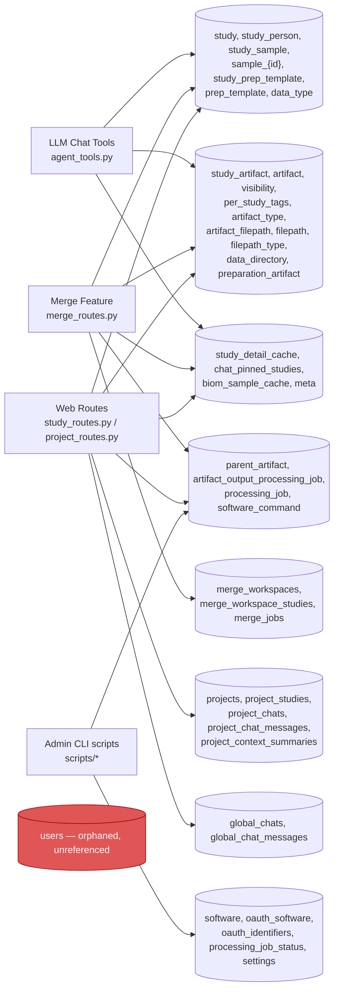
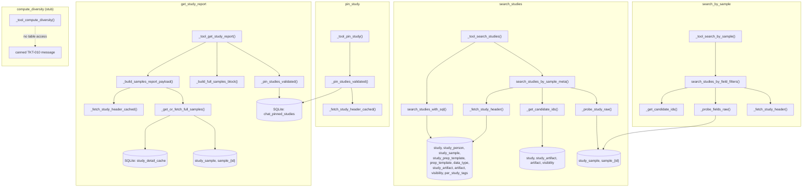
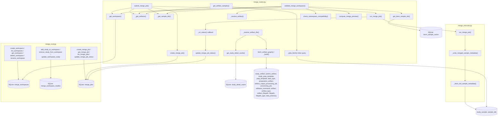

# Qiita-Web Table Usage — Function-Indexed

Verified 2026-07-01, branch UI/UX-improvements, against current repo state
(`git ls-files` scope; excludes untracked `src/qiita-spots/` reference clone).

## 1. All tables used

### Qiita PostgreSQL (via `qiita_db.sql_connection.TRN` or raw `psycopg2`) — read-only

| Table | Touched by (function — file) |
|---|---|
| `qiita.study` | `first_studies()` — qiita_fetch.py:51; `_fetch_study_header()` — qiita_fetch.py:415; `search_studies_with_sql()` — study_service.py:148; `_get_candidate_ids()` — sample_search.py:31. *SQL-fragment builders referencing this table (no execution of their own):* `build_where_from_plan()` — study_service.py:107; `build_relevance_score()` — study_service.py:125 |
| `qiita.study_person` | `first_studies()`; `_fetch_study_header()`; `search_studies_with_sql()`. *Fragment builders:* `build_where_from_plan()`; `build_relevance_score()` |
| `qiita.study_sample` | `first_studies()`; `_fetch_study_header()`; `_fetch_study_samples()` — qiita_fetch.py:145; `_fetch_sample_context_text()` — qiita_fetch.py:207; `_fetch_full_sample_metadata()` — qiita_fetch.py:232; `search_studies_with_sql()`; `_get_candidate_ids()`; `_probe_study_raw()` — sample_search.py:66; `_probe_fields_raw()` — sample_search.py:104; `_enrich_study_in_project()` — project_routes.py:26 |
| `qiita.sample_{study_id}` (dynamic per-study) | `_fetch_study_samples()`; `_fetch_sample_context_text()`; `_fetch_full_sample_metadata()`; `_probe_study_raw()`; `_probe_fields_raw()`; `api_sample_detail()` — study_routes.py:98; `fetch_metadata_for_ids()` — merge_samples.py:11; `get_artifact_samples()` — merge_routes.py:442 |
| `qiita.study_prep_template` | `first_studies()`; `_fetch_study_header()`; `_fetch_study_detail_from_qiita()` — qiita_fetch.py:460; `_build()` — artifact_graph.py:33; `fetch_fastq_artifacts()` — qiita_fastq_prep.py:18. *Fragment builder:* `build_data_type_filter()` — study_service.py:85 |
| `qiita.prep_template` | same set as `study_prep_template` above (all joins are 1:1 in these queries) |
| `qiita.data_type` | same set as `study_prep_template` above |
| `qiita.prep_template_sample` | `_fetch_prep_metadata_summary()` — qiita_fetch.py:180 |
| `qiita.prep_{prep_template_id}` (dynamic) | `_fetch_prep_metadata_summary()`; `fetch_prep_samples()` — qiita_fastq_prep.py:50 |
| `qiita.study_artifact` | `first_studies()`; `is_study_public()` — qiita_fetch.py:132; `search_studies_with_sql()`; `_get_candidate_ids()`; `_build()` — artifact_graph.py:33 (line 45) |
| `qiita.artifact` | `first_studies()`; `is_study_public()`; `search_studies_with_sql()`; `_get_candidate_ids()`; `_fetch_study_detail_from_qiita()`; `_build()` (line 111) |
| `qiita.visibility` | `first_studies()`; `is_study_public()`; `search_studies_with_sql()`; `_get_candidate_ids()` |
| `qiita.per_study_tags` | `first_studies()` (GOLD filter); `search_studies_with_sql()` (gold_only branch + is_gold SELECT) |
| `qiita.artifact_type` | `_fetch_study_detail_from_qiita()`; `_build()` (line 112); `fetch_fastq_artifacts()` (line 32) |
| `qiita.artifact_filepath` | `_fetch_study_detail_from_qiita()`; `_build()` (line 113); `fetch_fastq_artifacts()` (line 33) |
| `qiita.filepath` | `_fetch_study_detail_from_qiita()`; `_build()` (line 114); `fetch_fastq_artifacts()` (line 34) |
| `qiita.filepath_type` | `_build()` (line 115); `fetch_fastq_artifacts()` (line 35) |
| `qiita.data_directory` | `_fetch_study_detail_from_qiita()`; `_build()` (line 116); `fetch_fastq_artifacts()` (line 36) |
| `qiita.preparation_artifact` | `_fetch_study_detail_from_qiita()`; `_build()` (line 70); `fetch_fastq_artifacts()` (line 30) |
| `qiita.parent_artifact` | `_build()` — artifact_graph.py (line 55) |
| `qiita.artifact_output_processing_job` | `_build()` (line 87) |
| `qiita.processing_job` | `_build()` (line 88). *Outside ezredbiom, admin script only:* top-level code in `scripts/qiita-recover-jobs` |
| `qiita.software_command` | `_build()` (line 89) |

Admin-CLI-only tables (not reachable from the ezredbiom app at all — standalone scripts at repo root, no enclosing `def`, just module-level code): `qiita.software`, `qiita.oauth_software`, `qiita.oauth_identifiers` (`scripts/qiita-test-install`); `qiita.processing_job_status` (`scripts/qiita-recover-jobs`); `settings` (`scripts/qiita-test-install`).

### Local SQLite (`ezredbiom/backend/store/`) — schema in `db.py:_create_schema()`

| Table | Touched by (function — file) |
|---|---|
| `meta` | `get_setting()` — crud.py:9; `set_setting()` — crud.py:15; `_should_migrate()` — db.py:238; `_mark_migration()` — db.py:232; `_bootstrap()` — db.py:361 |
| `projects` | `_project_exists()` — crud.py:24; `list_projects()` — crud.py:32; `create_project()` — crud.py:118; `get_project()` — crud.py:135; `update_project()` — crud.py:161; `delete_project()` — crud.py:181; `add_study_to_project()` — crud.py:192; `remove_study_from_project()` — crud.py:239; `get_project_studies_only()` — crud.py:260; `create_chat()` — crud.py:319; `append_chat_messages()` — crud.py:369; `delete_chat()` — crud.py:405; `_insert_project_doc()` — db.py:246 (migration only) |
| `project_studies` | `list_projects()` (count subquery); `_load_project_studies()` — crud.py:51; `add_study_to_project()`; `remove_study_from_project()`; `get_chat()` — crud.py:294 (count check); `upsert_project_study_summary()` — cache.py:15; `update_project_study_data()` — cache.py:65; `_insert_project_doc()` (migration) |
| `project_chats` | `list_projects()` (count subquery); `_load_project_chats()` — crud.py:88; `list_chats()` — crud.py:274; `get_chat()`; `create_chat()`; `append_chat_messages()`; `delete_chat()`; `_insert_project_doc()` (migration) |
| `project_chat_messages` | `_load_project_chat_messages()` — crud.py:75; `_insert_chat_message_pair()` — crud.py:342 (invoked by `append_chat_messages()` with table name `"project_chat_messages"`); `_insert_project_doc()` (migration) |
| `project_context_summaries` | `add_study_to_project()` (invalidates cache); `remove_study_from_project()` (invalidates cache); `get_project_context_summary()` — cache.py:32; `upsert_project_context_summary()` — cache.py:44 |
| `global_chats` | `list_global_chats()` — crud.py:420; `get_global_chat()` — crud.py:446; `create_global_chat()` — crud.py:462; `append_global_chat_messages()` — crud.py:476; `delete_global_chat()` — crud.py:507; `_insert_global_bucket()` — db.py:317 (migration only) |
| `global_chat_messages` | `_load_global_messages()` — crud.py:438; `_insert_chat_message_pair()` (invoked by `append_global_chat_messages()` with table name `"global_chat_messages"`); `_insert_global_bucket()` (migration) |
| `study_detail_cache` | `get_study_detail_cache()` — cache.py:92; `upsert_study_detail_cache()` — cache.py:112 |
| `chat_pinned_studies` | `_load_pinned_studies()` — cache.py:171; `pin_study_to_chat()` — cache.py:179 (calls `_load_pinned_studies()` internally, then INSERTs); `unpin_study_from_chat()` — cache.py:199; `list_pinned_studies()` — cache.py:209 |
| `merge_workspaces` | `create_workspace()` — merge_crud.py:30; `list_workspaces()` — merge_crud.py:43; `get_workspace()` — merge_crud.py:52; `delete_workspace()` — merge_crud.py:69; `rename_workspace()` — merge_crud.py:79; `add_study_to_workspace()` — merge_crud.py:88 (updated_at bump); `remove_study_from_workspace()` — merge_crud.py:118 (updated_at bump); `update_workspace_study()` — merge_crud.py:137 (updated_at bump) |
| `merge_workspace_studies` | `get_workspace()`; `add_study_to_workspace()` (COUNT + `INSERT OR IGNORE` + SELECT); `remove_study_from_workspace()` (DELETE + SELECT); `update_workspace_study()` (UPDATE + SELECT) |
| `merge_jobs` | `create_merge_job()` — merge_crud.py:171; `get_merge_job()` — merge_crud.py:187; `list_merge_jobs()` — merge_crud.py:193; `update_merge_job_status()` — merge_crud.py:202 |
| `biom_sample_cache` | `get_biom_sample_cache()` — cache.py:140; `upsert_biom_sample_cache()` — cache.py:149 (both invoked from `get_biom_sample_ids()` — biom_samples.py:30) |
| `users` *(orphaned)* | **No function in the current codebase reads or writes this table.** It exists only in the git-tracked binary `ezredbiom/backend/data/projects.db`, absent from `db.py`'s `_create_schema()`. See flagged finding in project memory `project_committed_projects_db.md`. |

---

## 2. Tables used by the LLM, per tool

All 5 tools are declared in `TOOL_SCHEMAS` (agent_tools.py:22-245) and dispatched from `execute_tool()` (agent_tools.py:283-300).

### `search_studies`
Dispatch: `_tool_search_studies()` — agent_tools.py:303
Call chain → tables:
1. `_collect_terms()` — agent_tools.py:256 (no DB)
2. `expand_keyword_variants()` — study_service.py:20 (no DB)
3. `detect_data_types()` — study_service.py:73 (no DB)
4. `build_where_from_plan()` — study_service.py:107 (fragment builder, no execution)
5. `search_studies_with_sql()` — study_service.py:148 → **`qiita.study`, `qiita.study_person`, `qiita.study_sample`, `qiita.study_prep_template`, `qiita.prep_template`, `qiita.data_type`, `qiita.study_artifact`, `qiita.artifact`, `qiita.visibility`, `qiita.per_study_tags`** (internally uses fragment builders `build_relevance_score()` and `build_data_type_filter()`, study_service.py:125,85)
6. `search_studies_by_sample_meta()` — sample_search.py:209
   - `_get_candidate_ids()` — sample_search.py:31 → **`qiita.study`, `qiita.study_artifact`, `qiita.artifact`, `qiita.visibility`**
   - `_probe_study_raw()` — sample_search.py:66 → **`qiita.study_sample`, `qiita.sample_{id}`** (host-identity fields only)
   - `_fetch_study_header()` — qiita_fetch.py:415 → **`qiita.study`, `qiita.study_person`, `qiita.study_sample`, `qiita.study_prep_template`, `qiita.prep_template`, `qiita.data_type`** (per matched study, for the returned header)
7. `_format_discovery_study_list()` / `_study_discovery_compact_block()` — llm_helpers.py:186,158 (text formatting, no DB)

### `get_study_report`
Dispatch: `_tool_get_study_report()` — agent_tools.py:421
Call chain → tables:
1. `_build_samples_report_payload()` — qiita_fetch.py:370
   - `_fetch_study_header_cached()` — qiita_fetch.py:274 → `_fetch_study_header()` (on TTL miss) → same 6 tables as above
   - `_get_or_fetch_full_samples()` — qiita_fetch.py:251 → SQLite `study_detail_cache` (`get_study_detail_cache()`/`upsert_study_detail_cache()`, cache.py:92/112) on hit; `_fetch_full_sample_metadata()` — qiita_fetch.py:232 → **`qiita.study_sample`, `qiita.sample_{id}`** on miss
2. `_build_full_samples_block()` — qiita_fetch.py:286 (reuses the two functions above — same tables)
3. `_pin_studies_validated()` — qiita_fetch.py:347 → `pin_study_to_chat()` / `list_pinned_studies()` (cache.py:179,209) → SQLite `chat_pinned_studies`

### `pin_study`
Dispatch: `_tool_pin_study()` — agent_tools.py:445
Call chain → tables:
1. `_pin_studies_validated()` — qiita_fetch.py:347
   - `_fetch_study_header_cached()` → `_fetch_study_header()` (validity check per ID) → same 6 Postgres tables as above
   - `pin_study_to_chat()` — cache.py:179 → SQLite `chat_pinned_studies` (SELECT via `_load_pinned_studies()` + INSERT)
   - `list_pinned_studies()` — cache.py:209 → SQLite `chat_pinned_studies`
2. Downstream, on every later turn in the same chat (not this call): `_build_pinned_reports_context()` — qiita_fetch.py:328 → `_build_full_samples_block()` per pinned ID → same tables as `get_study_report`

### `search_by_sample`
Dispatch: `_tool_search_by_sample()` — agent_tools.py:478
Call chain → tables:
1. `search_studies_by_field_filters()` — sample_search.py:144
   - `_get_candidate_ids()` → **`qiita.study`, `qiita.study_artifact`, `qiita.artifact`, `qiita.visibility`** (+ `build_data_type_filter()` fragment)
   - `_probe_fields_raw()` — sample_search.py:104 → **`qiita.study_sample`, `qiita.sample_{id}`** (arbitrary `field`/`value` pairs or free-text keywords against the JSONB)
   - `_fetch_study_header()` → same 6 tables, per matched study

### `compute_diversity` — SPECIAL CASE, not a normal entry
Dispatch: `_tool_compute_diversity()` — agent_tools.py:538
Call chain: **none.** The function ignores its `_args` parameter and immediately returns a canned `ToolResult` ("Diversity analysis is not yet available... TKT-010"). **Zero tables touched, Postgres or SQLite.** It is fully wired into `TOOL_SCHEMAS` (agent_tools.py:220-244) and `execute_tool()`'s dispatch (agent_tools.py:294-295) — the LLM can call it and gets a real response — but there is no data access behind it at all. This is a stub, not a partial implementation.

---

## 3. Tables used by merge functionality

### `store/merge_crud.py` (see table-by-function list in Section 1 above — repeated here for completeness)
`create_workspace()`, `list_workspaces()`, `get_workspace()`, `delete_workspace()`, `rename_workspace()`, `add_study_to_workspace()`, `remove_study_from_workspace()`, `update_workspace_study()` → `merge_workspaces` (+`merge_workspace_studies` where noted above).
`create_merge_job()`, `get_merge_job()`, `list_merge_jobs()`, `update_merge_job_status()` → `merge_jobs`.

### `helpers/merge_executor.py`
- `_write_merged_sample_metadata()` — merge_executor.py:33 → imports and calls `_fetch_full_sample_metadata()` (qiita_fetch.py:232) → **`qiita.study_sample`, `qiita.sample_{id}`**
- `run_merge_job()` — merge_executor.py:71 → no direct table access itself (filesystem + `subprocess`); calls `_write_merged_sample_metadata()` and invokes the `on_status` callback passed in by the caller — the callback (defined in `merge_routes.py`, see below) is what actually writes `merge_jobs`

### `routes/merge_routes.py`
- `_resolve_artifact_file()` — merge_routes.py:37 → `get_study_detail_cache()` (SQLite `study_detail_cache`); on miss, `fetch_artifact_graph()` → `_build()` (artifact_graph.py:33) → **`qiita.study_artifact`, `qiita.parent_artifact`, `qiita.study_prep_template`, `qiita.prep_template`, `qiita.data_type`, `qiita.preparation_artifact`, `qiita.artifact_output_processing_job`, `qiita.processing_job`, `qiita.software_command`, `qiita.artifact`, `qiita.artifact_type`, `qiita.artifact_filepath`, `qiita.filepath`, `qiita.filepath_type`, `qiita.data_directory`**
- `_get_artifacts()` — merge_routes.py:71 → `get_study_detail_cache()`/`upsert_study_detail_cache()` (SQLite `study_detail_cache`); on miss, `_fetch_study_detail_from_qiita()` (qiita_fetch.py:460) → **`qiita.study_prep_template`, `qiita.prep_template`, `qiita.data_type`, `qiita.preparation_artifact`, `qiita.artifact`, `qiita.artifact_type`, `qiita.artifact_filepath`, `qiita.filepath`, `qiita.data_directory`**
- `_get_sample_ids()` — merge_routes.py:99 → `get_study_detail_cache()` only (SQLite `study_detail_cache`, reads cached `full_samples_json`)
- `_resolve_artifact()` — merge_routes.py:89 → no table access (pure dict selection over already-fetched artifact list)
- `list_merge_workspaces()`(:114)/`create_merge_workspace()`(:120)/`get_merge_workspace()`(:129)/`delete_merge_workspace()`(:138)/`patch_merge_workspace()`(:147)/`add_study_to_merge_workspace()`(:159)/`remove_study_from_merge_workspace()`(:176)/`update_merge_workspace_study()`(:182) → thin wrappers over the matching `merge_crud.py` functions listed above
- `validate_merge_workspace()` — merge_routes.py:197 → `get_workspace()`, `_get_artifacts()`, `_resolve_artifact()`, `get_biom_sample_ids()` (biom_samples.py:30 → SQLite `biom_sample_cache` cache-through + `.biom` file read), `_get_sample_ids()`, `check_namespace_compatibility()` (biom_autopick.py:97, no table access), `compute_merge_preview()` (biom_samples.py:44, no table access)
- `get_workspace_samples()` — merge_routes.py:286 → same set as above
- `get_workspace_study_samples()` — merge_routes.py:311 → `get_workspace()`, `_get_artifacts()`, `_resolve_artifact()`, `build_sample_page()` (merge_samples.py:22, see below)
- `submit_merge_job()` — merge_routes.py:343 → `get_workspace()`, `_get_artifacts()`, `_get_sample_ids()`, `create_merge_job()` (SQLite `merge_jobs`); schedules `run_merge_job()` in background whose nested `_on_status()` (merge_routes.py:418) calls `update_merge_job_status()` (SQLite `merge_jobs`)
- `get_workspace_jobs()`(:427) → `list_merge_jobs()` (SQLite `merge_jobs`); `poll_merge_job()`(:432) → `get_merge_job()` (SQLite `merge_jobs`)
- `get_artifact_samples()` — merge_routes.py:442 → `_get_artifacts()` + inline query via `_qiita_fetch()` (qiita_fetch.py:121) → **`qiita.sample_{study_id}`**
- `get_artifact_sample_counts()` — merge_routes.py:476 → `_get_artifacts()`, `get_biom_sample_ids()` (SQLite `biom_sample_cache` + `.biom` file only — no Postgres sample table)
- `download_artifact_file()`(:502) → `_resolve_artifact_file()` (as above), then filesystem only; `download_merge_result()`(:514) → filesystem only, no DB

### `helpers/merge_samples.py` — confirmed part of the merge feature (imported by `merge_routes.py:29`, `build_sample_page` called at `merge_routes.py:333`)
- `fetch_metadata_for_ids()` — merge_samples.py:11 → **`qiita.sample_{study_id}`** (via `_qiita_fetch()`)
- `build_sample_page()` — merge_samples.py:22 → calls `get_biom_sample_ids()` (SQLite `biom_sample_cache` + `.biom` file) and `fetch_metadata_for_ids()` above; no direct table access of its own

### `helpers/biom_samples.py` and `helpers/biom_autopick.py` (supporting the merge feature, for completeness)
- `get_biom_sample_ids()` — biom_samples.py:30 → `get_biom_sample_cache()`/`upsert_biom_sample_cache()` (cache.py:140/149) → SQLite `biom_sample_cache`
- `read_biom_sample_ids()` — biom_samples.py:18 → no table, reads `.biom` HDF5 file directly
- `compute_merge_preview()` — biom_samples.py:44 → no table, pure set arithmetic
- `autopick_artifact()`, `autopick_reason()`, `check_namespace_compatibility()`, `studies_type_intersection()` (biom_autopick.py) → no table access at all; operate only on artifact dicts already fetched by `_get_artifacts()`

---

## 4. Diagrams

### 4.1 Overview — who reads/writes which tables

### 4.2 LLM tool call chains → tables

### 4.3 Merge feature call chains → tables

